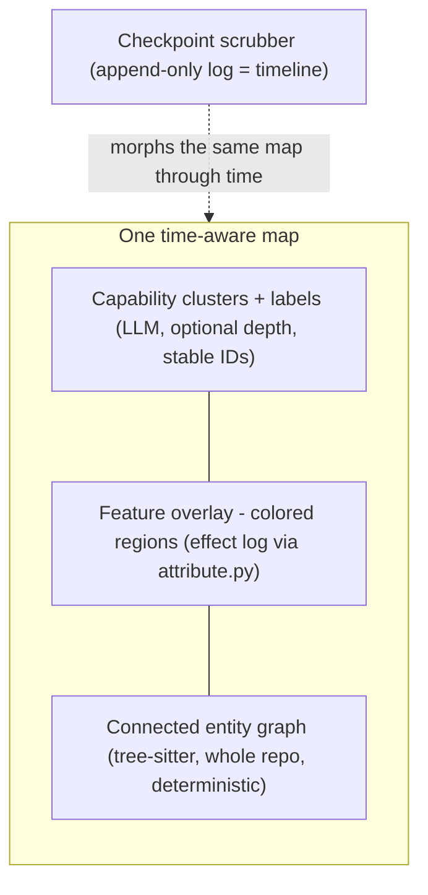

# Time-Aware Semantic Map

## Summary

Re-found the `sgt` view on a deterministic, whole-codebase entity graph (tree-sitter)
that is always connected, paint tracked features onto it as colored regions, cluster and
label entities into capability areas, and add a **checkpoint scrubber** that morphs the
*same* map through time. Comprehension ("what my codebase is now") and version control
("how it became this") collapse into one time-aware surface, so the tool reads as one
codebase developing rather than a bag of independent feature-chunks.

## Problem Frame

Today the thing you look at is a **feature DAG whose only edges are code dependencies**
(calls + imports). Features that don't call each other have no edge, so the graph is a
forest — and `FINDINGS.md` confirms this is by design: `sgt` even detects the components
(union-find) and draws dividers to *mark* the disconnection as informative ("these
features are genuinely independent").

The cost lands at the moment of *looking*. The view is a spatial dependency graph laid out
in timeline-shaped rows, so it reads as neither a clean map of the codebase nor a clean
history of it. It feels like maintaining a pile of toggleable feature-chunks, not
developing one codebase or recording its versions — which is "probably something else than
what we wanted." The root cause is a conflation: the current view mixes a *re-representation
of the codebase* (a spatial question) with *version control* (a temporal question), and
serves neither cleanly. The entity-level substrate that would make the map honestly
connected already exists latently inside `sgt` (effect targets are scope-qualified code
entities; `attribute.py` already maps every line to its owning feature) — it is just never
surfaced as a connected graph.

## Key Decisions

- **Entity-first foundation, features as overlay.** The graph is built bottom-up from
  deterministic code entities, not top-down from authored intent. Features become a
  clustering/labeling overlay over entities, not the primary nodes. Intent-first
  organization is what made it a bag of chunks.

- **Whole-codebase scope.** The entity layer parses everything tree-sitter sees — all
  files, tracked or not — so the map reflects the *actual* codebase. Tracked features are
  a colored overlay over part of it; untracked code is honest dim structure. A
  managed-only scope was rejected because the bag-of-chunks feeling would persist for
  anything not run through `sgt`.

- **Comprehension-first audience.** The surface exists for a human to understand their
  evolving codebase, not as a queryable planning substrate for the coding agent (the
  RPG/CoderMind purpose). This lowers the stakes of the LLM layer: the deterministic
  connected spine is the core deliverable; clustering is depth.

- **One time-aware map, not two graphs.** A single clustered entity map with a checkpoint
  scrubber, rather than a separate spatial graph and temporal graph. Time becomes a
  dimension *on* the map. This removes the two-surface coherence tax and makes the
  morph-over-time itself the "one codebase developing" experience.

- **Checkpoint is the unit of version.** Scrubbing moves checkpoint by checkpoint (`sgt`'s
  append-only log is already the timeline). Cluster-lineage and cluster-lanes were
  considered and rejected as the version unit.

- **Historically accurate frames via git.** Scrubbing into the past rewinds the whole map —
  untracked structure included — by reading git commits near the scrubbed checkpoint, not
  just animating tracked clusters. Every frame is a true snapshot, at the cost of
  reconciling the git-commit timeline against the checkpoint timeline; the `Sgt-Node-Id`
  commit trailers bridge them.

- **v1 covers Python and TypeScript.** Tree-sitter is adopted as the parser; Python (core)
  and TypeScript (the VS Code extension) ship in v1, with more grammars staged after.

- **Deterministic guarantee, LLM as optional depth.** Parsing and the entity graph are
  fully deterministic with no LLM. Clustering/labeling is presentation-only and degrades
  gracefully offline — consistent with `sgt`'s existing no-API-key principle.

- **Stable cluster identity.** Clusters anchor to `sgt`'s persistent node IDs; the LLM
  labels/groups/refines existing clusters but never re-derives ephemeral groupings
  run-to-run. Without this, the scrub jitters and the temporal axis can't cohere.

## The layered model

Canonical-source split: **disk is canonical for structure** (the entity graph is parsed
from the real tree); **effects are canonical for attribution + versioning** (which feature
owns an entity, what revert/switch remove). The two reconcile through the existing drift
guard.

## Requirements

**Deterministic entity layer (the guaranteed foundation)**

- R1. Parse the whole repo on disk into a connected entity graph: functions, classes, and
  methods as entities; edges are containment plus calls/imports/type-references. Coverage
  is the real code, tracked or not.
- R2. The entity layer is fully deterministic — same tree yields the same graph, with no
  LLM in this layer.
- R3. Entity extraction uses tree-sitter, covering Python (core) and TypeScript (the
  extension) in v1 — the languages this repo uses — with additional grammars staged later.
  This is a reach expansion beyond today's Python-AST-only model.

**Feature overlay (attribution)**

- R4. Tracked features render as colored regions over the entity graph, recovered from the
  effect log via the existing semantic blame path (line/entity to owning feature). A
  feature's hue remains its identity per the existing color contract; status stays a glyph,
  never a hue.
- R5. Untracked code renders as honest dim, unattributed structure — never hidden and never
  shown as feature-owned.

**Clustering and labeling (optional depth)**

- R6. Entities group and label into higher-level capability areas for navigation.
  Clustering is presentation-only and degrades to a deterministic fallback with no API key.
- R7. Clusters carry stable identity anchored to persistent node IDs; the LLM labels,
  groups, and refines existing clusters and never re-derives ephemeral groupings between
  runs.

**Time-aware scrubber (version control on the map)**

- R8. A checkpoint scrubber moves along the timeline and morphs the same map — entities and
  clusters appear, grow, light up, and revert — one checkpoint at a time.
- R9. The scrubber is a projection of the existing append-only effect log; it introduces no
  new versioning machinery.
- R10. The map's "now" frame is the current real/materialized state; scrubbing backward
  reconstructs prior frames from the log.

**Coherence with the existing core**

- R11. Disk is canonical for structure and effects are canonical for attribution and
  versioning; the two reconcile through the existing drift guard, and drift is surfaced
  honestly on the map (a stale or edited overlay is marked, not hidden).
- R12. Revert and switch remain sound and are reflected on the map: removing a feature's
  effects re-materializes, the tree is rewritten, and the map re-parses to show the region
  gone. `sgt` still never authors code — this is reading and reorganizing only.

## Key Flows

- F1. Scrub the timeline
  - **Trigger:** User drags the checkpoint scrubber backward/forward.
  - **Steps:** The map reconstructs the frame at the selected checkpoint from the log;
    tracked clusters/entities animate to that state; the feature coloring updates to who
    owned what then.
  - **Outcome:** The user watches the codebase develop as one connected whole.
  - **Covered by:** R8, R9, R10.

- F2. Watch the agent work the map (live present)
  - **Trigger:** The coding agent edits files; uncommitted drift exists.
  - **Steps:** Drift resolves to owning clusters/entities and is marked on the map; on
    checkpoint, the new state lands and the affected region updates.
  - **Outcome:** The "now" frame stays honest about in-flight, un-checkpointed work.
  - **Covered by:** R5, R11.

## Acceptance Examples

- AE1. **Covers R5, R8.** Given a repo where half the files were never run through `sgt`,
  when the map renders, then untracked entities appear as dim connected structure; and when
  the user scrubs into the past, untracked structure rewinds to its git state at that point
  (a true historical snapshot) while tracked clusters animate via the log.
- AE2. **Covers R7, R8.** Given capability cluster "RAG" exists at checkpoint 3 and again at
  checkpoint 10, when the user scrubs between them, then it is rendered as the *same*
  cluster (stable ID) growing — not two differently-labeled groups flickering.
- AE3. **Covers R11, R12.** Given a feature is reverted, when the map refreshes, then its
  colored region disappears, the entity graph re-parses from the rewritten tree, and the
  remaining structure stays connected and valid.
- AE4. **Covers R2, R6.** Given no API key is configured, when the map loads, then the
  deterministic entity graph and feature coloring render fully; only the higher-level
  cluster labels fall back to deterministic grouping.

## Scope Boundaries

**Deferred for later**

- Split/merge cluster-event animation over time. "Appear / grow / revert" are cheap and
  ship first; detecting that a cluster reorganized (split or merged) across checkpoints is
  the hard part of the morph.
- An agent-facing, queryable version of the entity/cluster graph (the RPG/CoderMind
  planning-substrate use). Comprehension-first now; agent use can layer on later.

**Outside this product's identity**

- Two separate graphs (a spatial map plus a distinct temporal graph), and cluster-lineage
  or cluster-lanes as the version unit — explicitly rejected for the single
  checkpoint-scrubbed map.
- Code authoring of any kind. The one rule holds: `sgt` plans, records, reorganizes the
  graph, and reconstructs the tree; it never writes code.

## Dependencies / Assumptions

- Adopting tree-sitter for whole-repo, multi-language entity extraction is a foundation
  expansion from the current Python-AST path. The external reference tool `sem`
  (at `eico/references/sem`) already implements this model — entities plus a connected
  cross-file dependency graph — and is the closest prior art for the deterministic layer.
- Reuses existing `sgt` assets rather than rebuilding: `sgt/effects/attribute.py` (semantic
  blame for the feature overlay), `sgt/api.py` (the single JSON projection every surface
  reads), the GitLens-style row-graph rendering already built, and the OKLCH color contract
  mirrored across `editor/vscode/src/color.ts`, `editor/vscode/media/graph.js`, and
  `sgt/tui/color.py`.
- Assumes the append-only effect log remains the temporal source of truth, so the scrubber
  is a projection, not new state.
- External references for the clustering/labeling layer: `CodeNav` (feature tree with stable
  IDs and code-to-feature bindings) and Microsoft's RPG-ZeroRepo / CoderMind (the
  repository-planning-graph idea — mapping capabilities to code structure).

## Outstanding Questions

No blocking questions remain — both prior `Resolve before planning` items (untracked-code
timeline behavior and v1 language coverage) are resolved in Key Decisions above.

**Deferred to planning**

- Reconciling the git-commit timeline with the checkpoint timeline for scrub positioning,
  since commits are not 1:1 with checkpoints (the `Sgt-Node-Id` trailers are the bridge).
- How cluster-level events are derived from entity-level effects (grow/appear/revert are
  straightforward; split/merge are not).
- How clusters concretely anchor to persistent node IDs to guarantee stable identity across
  re-clustering.
- Build sequencing within the one-map target (deterministic connected spine, then
  clustering, then scrubber), architected so each layers on without rework.
- Staging tree-sitter grammars beyond Python and TypeScript.
- Performance and incremental re-parse of whole-repo tree-sitter on large repos.

## Sources / Research

- `FINDINGS.md` — the forest-by-design behavior, union-find component detection and dividers,
  and the note that a disconnected `main` may be a planning signal.
- `sgt/api.py`, `sgt/effects/attribute.py`, `CLAUDE.md` (the one rule, the color contract,
  the one-projection-many-clients invariant).
- External: `sem` (`eico/references/sem`) — deterministic entity graph + connected
  dependency graph, the model for the guaranteed parsing layer.
- External: `CodeNav` and RPG-ZeroRepo / CoderMind — clustering/labeling code entities into a
  stable, connected capability structure.
</content>
</invoke>
