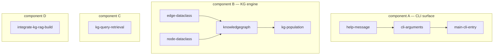
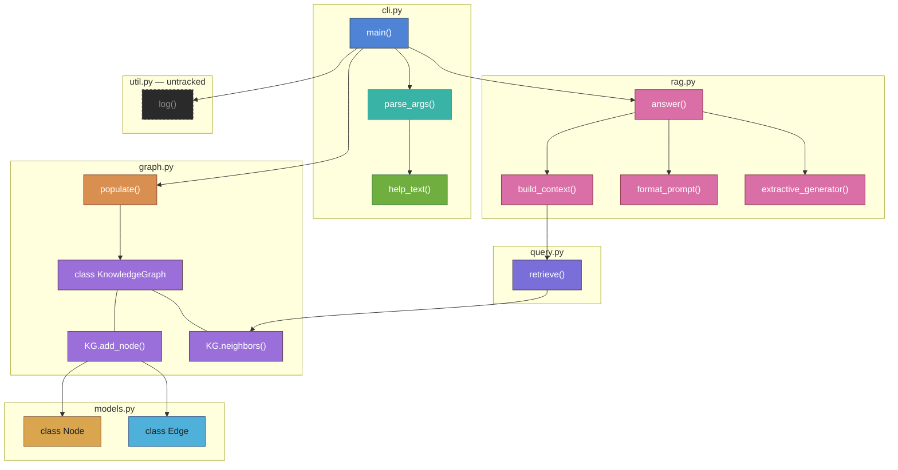
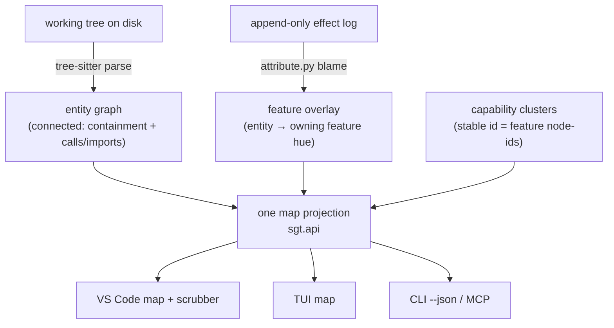
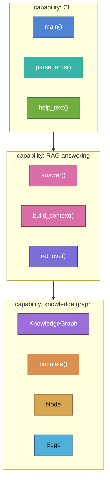
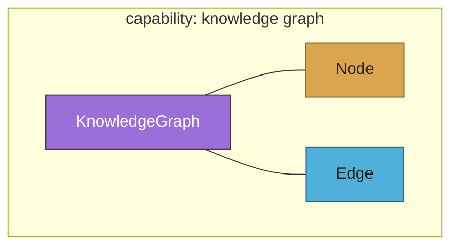
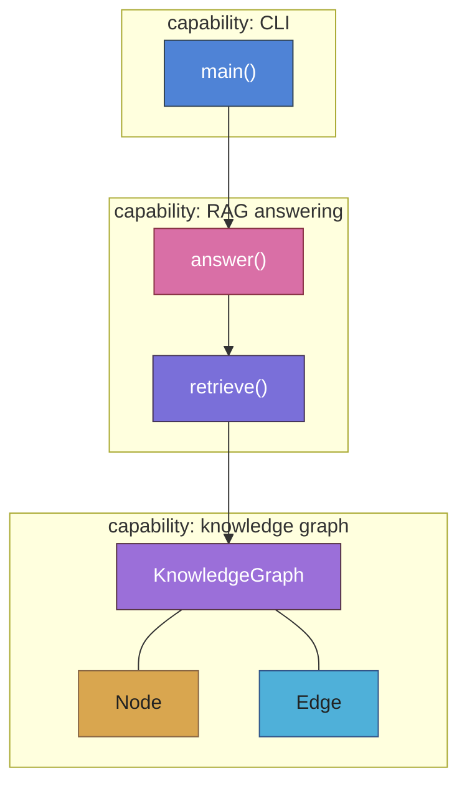
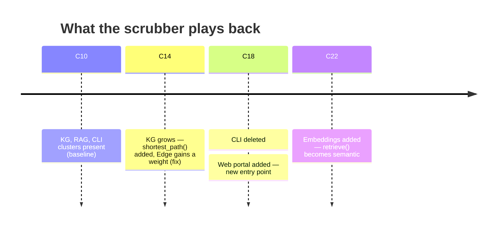
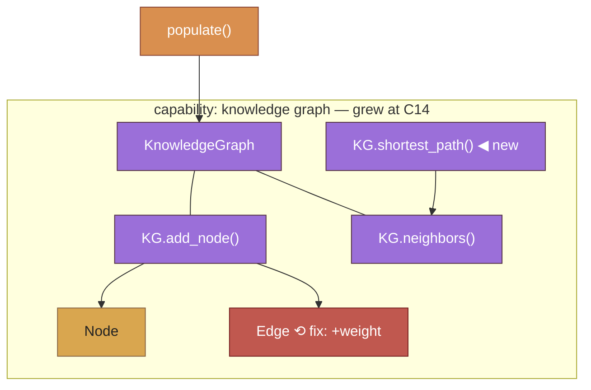
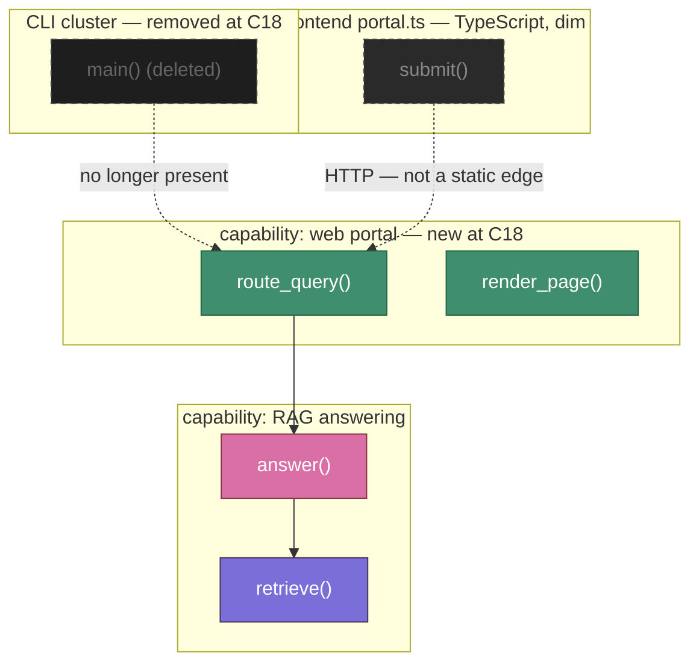
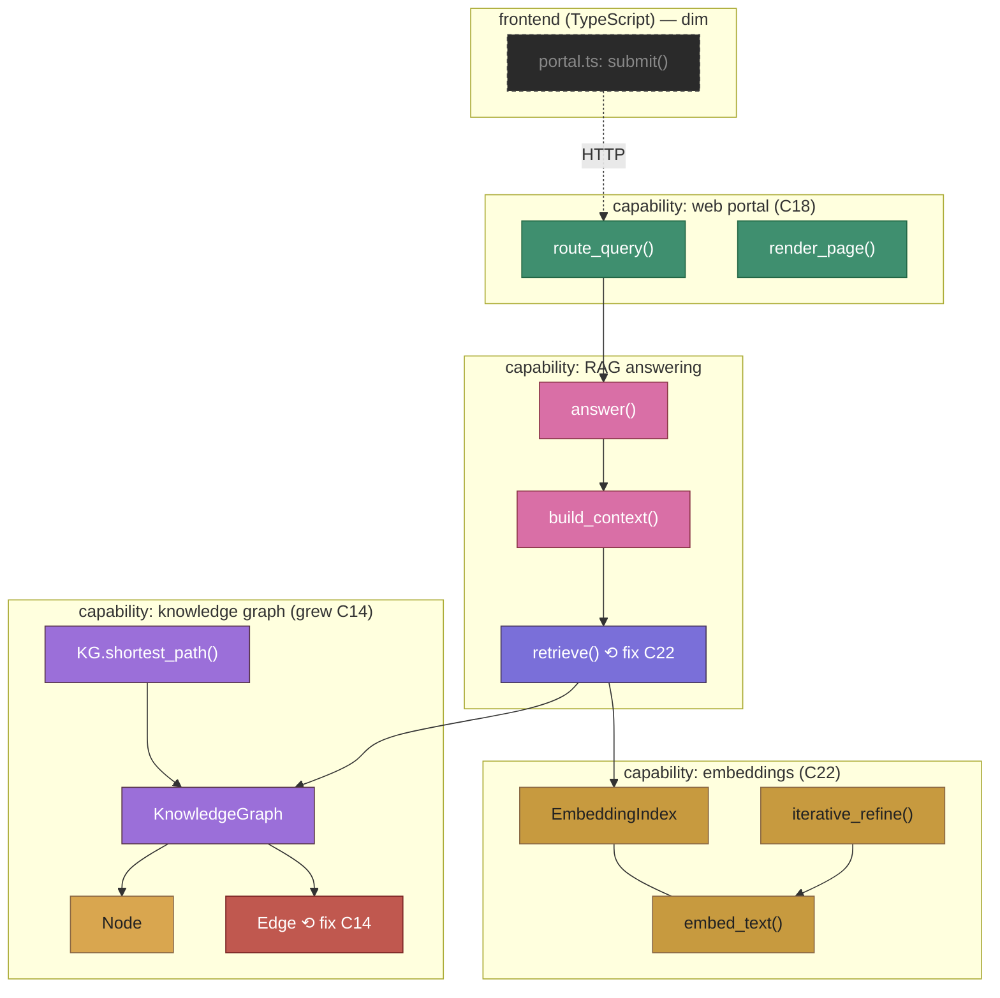

# What the semantic tree becomes — graph shapes after the time-aware map

Companion to `docs/plans/2026-06-22-001-feat-time-aware-semantic-map-plan.md`. This is an
illustration of how the structure you *look at* changes once the plan lands. It uses the
KG-RAG CLI example from the Feature Graph screenshot throughout, so the before/after is
directly comparable.

Colors below are illustrative stand-ins for the real OKLCH golden-angle feature hues
(a feature's hue is its identity). Status would render as a glyph (`● ○ ◐ ⚠`), never hue.

---

## The shift in one line

Today a **node = a feature** and the **only edge = `depends_on`**, so independent features
are disconnected → a forest. After the plan, a **node = a code entity** (function / class /
method) and **edges = containment + calls/imports**, so the graph is connected wherever the
*code* is connected; features become a **color overlay**, capabilities become **clusters**,
and **time becomes a scrubber** over the same map.

| | Today (feature DAG) | After (time-aware entity map) |
|---|---|---|
| Node | a feature (`capability`/`concept`/…) | a code entity (func/class/method) |
| Edge | `depends_on` only (call/import between features) | containment + calls/imports/type-refs |
| Connectivity | forest (independent features float) | connected wherever code is |
| Feature | the node itself | a **color overlay** on entities (via blame) |
| Capability area | — (none) | a **cluster** (labeled grouping) |
| Untracked / TS code | invisible | visible, **dim** (structure-only) |
| Time | implicit (current state only) | **scrubber** — morph the same map per checkpoint |
| Source of truth | log (effects) for everything | **disk** for structure, **log** for attribution |

---

## 1. Today — the feature DAG is a forest

`sgt graph` on the KG-RAG repo. Edges are `depends_on` only; the CLI group, the KG-engine
group, and two lone capabilities have no edges between them, so they read as separate
islands even though they live in one codebase.



Each arrow reads **"depends_on"** (dependent → dependency). Four disconnected components.
This is the "bag of chunks" feeling — the graph never shows that the CLI actually *calls*
the KG engine, because feature-dependency edges were never drawn between those features.

---

## 2. After — the entity graph spine, feature-colored

Same repo, parsed by tree-sitter into entities. Now `main()` → `answer()` → `build_context()`
→ `retrieve()` → `KnowledgeGraph.neighbors()` → `Node` is **one connected chain** — because
that is how the code actually flows. Boxes are entities; each is colored by its **owning
feature** (recovered from semantic blame); subgraphs are files (containment). The same eight
features from Flow 1 are still here — they are now *paint*, not nodes.



Solid `-->` = calls/imports; `---` = containment (class holds method). `util.py:log()` is
**untracked** (or it could be TypeScript) — it shows as honest **dim** structure with no
feature color, because it never flowed through `sgt` (and TS has no blame path at all).

The forest is gone: the map is connected because the *code* is connected. Features didn't
disappear — they became regions of color over the real structure.

---

## 3. How the map is composed — two sources, one projection

The connectivity comes from **disk** (parsed structure); the colors come from the **log**
(attribution). They are reconciled by the existing drift guard and merged into one `sgt.api`
projection every surface reads.



**Disk is canonical for structure; the log is canonical for attribution + versioning.**
That split is the whole reason untracked/TS code can appear (structure) while only tracked
code gets colored (attribution).

---

## 4. Clusters — capability areas over the entities

The LLM (offline-degrading) groups entities into labeled **capability areas** with identity
anchored to the underlying feature node-ids, so the grouping is stable across time. This is
the navigable, higher-level read of the same connected graph.



Zoomed out, the codebase reads as three capabilities that depend on each other in a clean
line — the comprehension view. Zoom in and you are back at the entity graph in §2.

---

## 5. Time — the scrubber morphs the same map

The map is not a static snapshot; a checkpoint scrubber rewinds it. The same connected map
*grows* as you drag from an early checkpoint to a late one — tracked clusters animate via
log-replay, untracked structure rewinds via the git tree at that commit.

**Frame @ checkpoint 3** — only the KG core exists yet:



**Frame @ checkpoint 10** — RAG and CLI capabilities have grown on top of it:



The KG capability keeps the **same identity** between the two frames (stable cluster id) —
it grows, it does not flicker into a different group. Scrubbing forward plays the codebase
developing as one connected thing; that is the "recording a version" feeling the brainstorm
was after.

---

## Honest edges of this picture

- **TypeScript and untracked Python** appear as dim structure only — no feature color, no
  blame, and (for TS) no drift reconciliation. The map shows them; it does not pretend to
  own them.
- **Reconstructing an *intermediate* frame** (the §5 morph) is the load-bearing hard part —
  the plan's U8/KTD4 has to define how a checkpoint maps to exactly which effects existed
  then. This illustration assumes that is solved; the plan flags it as the top risk.
- The colors here are hand-picked; the real ones come from the single OKLCH generator shared
  across the TUI, the extension, and Python.

---

## 6. A longer story — four changes over time

Start from the baseline map in §2/§4 (call it checkpoint **C10**). Then the user makes three
edits: **(1)** grows the knowledge graph, **(2)** deletes the CLI and replaces it with a web
portal, **(3)** adds iterative-embedding code. Here is what the map becomes at each step, and
what the scrubber lets you replay.

The headline contrast: in the **old feature-DAG**, each of these edits just adds or removes a
floating island — delete CLI leaves a hole, add web + embeddings adds two more disconnected
components, and the forest gets *more* fragmented. In the **entity map**, the graph stays one
connected thing that visibly *restructures* — a region is removed, a new region takes its
structural role, and later growth wires into the existing spine.

### Scrubber positions (checkpoints) and the cluster-level events at each



Checkpoint is the unit you scrub to (not cluster lanes); the events above are what *changed*
between adjacent frames.

### Change 1 — the KG grows (frame C14)

The user adds `KnowledgeGraph.shortest_path()` and puts a `weight` on `Edge`. In `sgt` terms
this is a `checkpoint` that **extends** the KG work: `shortest_path` is a new entity, and the
`Edge` body change lands as its **own `fix` node** that `depends_on` the KG capability (so
revert stays sound). On the map the **KG cluster keeps its identity and grows** — a new
entity appears, and `Edge` now carries a fix-overlay (its changed lines attribute to the fix
node, so a heavily-edited entity can read a slightly different hue than its neighbors —
ownership is many-to-one and log-derived).



### Change 2 — delete the CLI, add a web portal (frame C18)

Two moves in one frame:

- **Delete CLI.** `revert` (or a checkpoint of the deletion) removes `main()`, `parse_args()`,
  `help_text()`. The **CLI cluster is retired** — a distinct identity that ends, *not* a
  morph into the web portal. Its entities vanish from the live frame; the graph re-parses.
  Because `main()` was the entry point, the RAG→KG spine loses its caller but stays internally
  connected (`answer → build_context → retrieve → KG`).
- **Add a web portal.** A new Python backend (`server.py`: `app`, `route_query`, `render_page`)
  becomes a **new cluster** that takes over the entry-point role — `route_query → answer`
  wires it straight into the existing RAG spine. A TypeScript frontend (`portal.ts`) shows as
  **dim, structure-only** (no blame path for TS), and its call to the backend is a runtime
  HTTP hop, **not** a static edge — so it sits as its own dim component (an honest gap, not a
  hidden link).



`main()` is drawn dashed only to show the delta — in the live C18 frame it is simply gone.
Scrub back to C10 and it reappears (git tree at that commit + log replay).

### Change 3 — add iterative embeddings (frame C22)

A new `embed.py` (`embed_text`, `EmbeddingIndex`, `iterative_refine`) lands as a fresh
**embeddings cluster**, and `retrieve()` is modified to call into it (its own `fix` overlay).
The new cluster wires into the existing spine through `retrieve → EmbeddingIndex`. Here is the
**full live map at C22** — CLI gone, web portal as entry, KG grown, embeddings added:



One connected backend graph (web → RAG → {KG, embeddings}), plus a dim TS frontend hanging
off a non-static HTTP edge. The codebase reorganized around a new entry point and grew a new
capability, and the map shows it as *restructuring*, not as new floating islands.

### What structurally happened (user action → `sgt` verbs → graph delta)

| User action | `sgt` mechanics | Entity-map delta | Cluster identity |
|---|---|---|---|
| Grow the KG (C14) | `checkpoint` — extend + a `fix` node `depends_on` KG | `shortest_path` entity added; `Edge` gains fix-overlay | KG cluster **persists**, grows |
| Delete the CLI (C18) | `revert` CLI / checkpoint the deletion (`remove_def`); closure removes dependents (none — CLI was the top) | CLI entities removed; spine re-parses; entry point lost | CLI cluster **retired** (distinct id ends) |
| Add web portal (C18) | `plan` + `checkpoint` | new backend cluster becomes entry (`route_query → answer`); TS frontend dim | Web portal is a **new** cluster id |
| Add embeddings (C22) | `plan` + `checkpoint`; modify `retrieve` (fix) | embeddings cluster wired via `retrieve → EmbeddingIndex` | Embeddings is a **new** cluster id |

### What the scrubber shows

Dragging the scrubber back through C22 → C18 → C14 → C10 plays the codebase in reverse:
embeddings retract, the web portal disappears and the CLI grows back, `shortest_path` and the
`Edge` weight un-apply, until C10's baseline. Forward, you watch it develop. The KG cluster
holds **one identity** across the whole range (it only grows) — exactly the no-flicker
guarantee; the CLI and web-portal clusters have **disjoint** lifespans (one ends, one begins),
which the map honestly renders as a region leaving and a different region arriving.

### Honest edges of this story (the hard parts the plan flags)

- **Replacement ≠ rename.** CLI → web portal is two distinct clusters, so the map shows
  *disappear + appear*. If the user had instead **moved** `main()`'s logic into `route_query`
  (a cross-scope move), today's distiller reads it as delete+add too — so it would *also* read
  as a region leaving and arriving rather than one entity migrating. That is the
  refactor/rename limitation and the deferred split/merge-animation work, surfacing exactly
  here.
- **Reconstructing the C10 frame** after all this churn — KG in its pre-`shortest_path` form,
  CLI present, embeddings absent — is the U8/KTD4 historical-materialization problem. The KG
  was *extended* at C14, so the frame at C10 must replay only the KG effects that existed by
  C10, not its final form. That intermediate-state reconstruction is the plan's top risk, and
  this story is precisely the case that exercises it.
- **The TS frontend never gets a color** and its HTTP call to the backend is never a static
  edge — so the web "capability" is really a colored Python backend plus a dim, separate
  frontend. The map is honest about the language and runtime boundary rather than faking a
  link across it.
```
