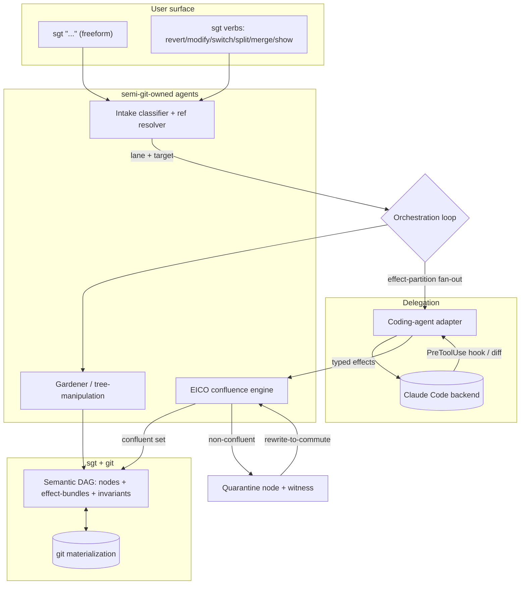
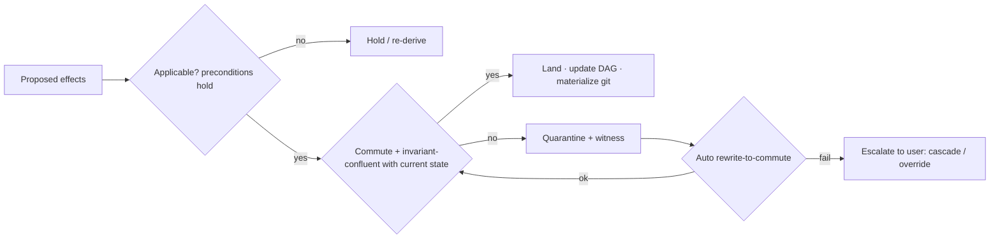

# feat: semi-git core — semantic feature-level version control

## Summary

Build the v1 core of `sgt`: a CLI that versions a codebase by **features and concepts** rather than diffs. A developer works through a freeform prompt stream plus explicit graph verbs; semi-git distills that into a living semantic DAG (`.sgt`), delegates code-writing to an external coding agent (Claude Code first) through a pluggable adapter, and runs every mutation through the **EICO confluence gate** so nothing lands unless it commutes and preserves invariants. v1 targets a single language (Python) for the real-code effect model.

## Problem Frame

Version control operates at the line/commit level; the unit people think in — a feature or concept — is not a first-class versioned object. Removing a feature or toggling a concept means manual dependency archaeology, and revert risks silent downstream breakage. Existing tools stop short: Graphite stacks branches (no feature-revert), jj's "feature" is a transient query, Darcs/Pijul commute patches at the line level with no grouping, FOSD/flags live at build/runtime not VCS, and agentic coders merge "by hope" (CodeCRDT: 100% syntactic convergence, 5–80% semantic conflict). The author's EICO engine drives semantic-error to 0 by construction on a structured language and Python AST. This plan turns that engine into a usable semantic-VC product. See origin: `docs/brainstorms/2026-06-17-semi-git-requirements.md`.

---

## Key Technical Decisions

- KTD1. **Intent-first, effect-bundle as the versioned object; git is the materialization.** Each node owns intent + a typed effect-bundle; code is derived. This is what makes revert/iterate/toggle operate on features, not diffs. (origin Key Decisions)
- KTD2. **EICO is the universal mutation gate.** New feature, fix, re-garden, iterate, and revert all pass through one commutativity + invariant-confluence check; the maximal confluent set lands, the rest quarantines. No second merge path exists.
- KTD3. **v1 real-code effect model is single-language (Python AST), reusing EICO's proven core.** EICO is verified on a structured config language + Python AST; broad real-code coverage is the open thesis risk. Narrowing v1 to Python keeps confluence a guarantee, not a heuristic. Implement semi-git in **Python** to reuse the EICO core directly and to have `ast`/tree-sitter/Agent-SDK access.
- KTD4. **Coding is delegated via headless subprocess, not MCP.** The coding CLIs are MCP *hosts* and cannot be driven via `tools/call`; dispatch is out-of-band subprocess invocation. The adapter is a JDBC-driver-style `Protocol` (OpenAI-Agents-SDK `Model`-style). MCP is reserved for semi-git later exposing *its own* ops as a server. `codex mcp-server` is a noted future exception.
- KTD5. **Claude Code is the v1 backend because its `PreToolUse` hook yields typed effects with preconditions before mutation.** The hook payload `{file_path, old_string, new_string}` maps onto EICO's (target, precondition, effect) shape with zero extra LLM cost. Codex (`exec --output-schema`) is the natural second backend, deferred.
- KTD6. **Effect-extraction tiers, degrading gracefully.** (1) Claude Code `PreToolUse` hook capture (primary); (2) post-hoc AST-diff via tree-sitter `changed_ranges()` / GumTree, normalized to an LSP-`TextEdit`-shaped effect schema; (3) when neither parses, treat the whole diff as one **opaque effect**, gated conservatively (never silently dropped).
- KTD7. **Routing is deterministic with an LLM override; low-confidence classification asks.** Avoids LLM-router oscillation (AutoGen Selector failure mode). The classifier/gardener/EICO-planner policies are architected RL-ready (Maestro/Router-R1 reward shape: correctness + cost), but RL training is deferred.
- KTD8. **Graph corrections re-derive under the confluence gate.** Re-gardening may recompile from intent, but working code changes only if the new derivation is invariant-confluent; otherwise it quarantines and offers cascade/override.

---

## High-Level Technical Design

Component topology and the single mutation pipeline every operation flows through.



The mutation gate (KTD2) applied to any operation:



---

## Output Structure

```
semi-git/
  sgt/
    __init__.py
    cli.py                 # U10 — argparse/click entry; freeform + verbs
    store/                 # U1 — .sgt persistence + git binding
      graph.py             #      node/edge/DAG model
      gitbind.py           #      commit<->node mapping, out-of-band detection
    effects/               # U2 — typed effect model + invariants (Python AST)
      model.py
      invariants.py
    engine/                # U3 — EICO confluence gate (adapts eico core)
      confluence.py
      closure.py
    adapter/               # U4/U5/U6 — coding-agent delegation
      base.py              #      CodingAgentAdapter Protocol + AgentResult
      claude_code.py       #      headless subprocess + PreToolUse hook
      extract.py           #      hook→effects; AST-diff fallback; opaque
    agents/                # U7/U8 — owned policies
      classifier.py        #      lane routing + ref resolver
      gardener.py          #      distill/split/merge/relabel
    orchestrate/           # U9 — the spine
      loop.py
      quarantine.py
    lifecycle/             # U11 — revert/modify/switch algebra
      algebra.py
  tests/
    ...                    # mirrors sgt/ per-unit
  .sgt/                    # created at runtime by `sgt init`
```

The per-unit `**Files:**` lists remain authoritative; the implementer may adjust layout.

---

## Requirements

Carried from origin and grouped by concern. Units trace to these R-IDs.

**Semantic model & store**
- R1. `.sgt` holds nodes (with kind), edges, per-node intent + effect-bundle, and the invariant set; the graph stays a DAG.
- R2. Each node maps to its materializing git commit(s) with a persistent identity surviving rebase/amend.
- R3. Revert/toggle operate at the effect level, so entangled commits can still be cleanly removed by re-materializing the remainder.
- R4. Out-of-band git changes are detected and reconciled (distilled or flagged); the graph never silently drifts from git.

**Command surface**
- R5. A freeform `sgt "..."` front door routes through the classifier; explicit verbs declare the operation directly.
- R6. A node-ref resolves fuzzy→name→exact-id; multi-match disambiguates, zero-match offers to create or asks; exact-id bypasses the classifier.

**Intake & distillation**
- R7. Each prompt routes to one lane (capability / refine / fix / infra / explore / question); prompts are not 1:1 with nodes.
- R8. Low-confidence or ambiguous classification asks rather than guessing.
- R9. The gardener maintains the graph (split/merge/relabel); the feature set expands on demand.

**Execution & merge**
- R10. Work fans out by effect-partition into coordination-free sets.
- R11. Returned edits co-apply only when they commute and preserve invariants; the maximal confluent set lands.
- R12. Held-back conflicts become durable `unmergeable` nodes with a witness; an auto rewrite-to-commute is attempted before escalation.
- R13. Every mutation passes the same confluence gate.

**Lifecycle algebra**
- R14. `revert` removes by dependency closure + reference-counted GC.
- R15. `modify` amends intent and re-derives the confluent delta; mid-derivation dependencies spawn new nodes.
- R16. `switch on|off` suspends/restores without deleting; the graph is append-only.
- R17. Correction-triggered re-derivation is confluence-gated (working code changes only if confluent).

**Coding-agent delegation**
- R18. A `CodingAgentAdapter` contract dispatches a scoped task and returns normalized work across backends.
- R19. v1 wires one backend (Claude Code) via headless subprocess; the backend set is pluggable.
- R20. The adapter extracts typed effects (hook → AST-diff → opaque), so EICO always has effects to reason over.
- R21. The adapter detects out-of-assigned-region edits (scope violation) and quarantines/rejects them.
- R22. Backend failures (timeout, partial, malformed) are handled gracefully — retry, mark incomplete, or quarantine; never a corrupt land.
- R23. Classifier, gardener, and planner policies are architected to be RL-trainable later; v1 uses LLM/deterministic baselines.

---

## Implementation Units

### Phase A — Semantic core

### U1. `.sgt` store, semantic graph model, and git binding
- **Goal:** Persistent semantic DAG + the `sgt init` binding to a git repo, plus out-of-band-change detection.
- **Requirements:** R1, R2, R4
- **Dependencies:** none
- **Files:** `sgt/store/graph.py`, `sgt/store/gitbind.py`, `tests/store/test_graph.py`, `tests/store/test_gitbind.py`
- **Approach:** Node = (id, kind, intent, effect_bundle_ref, invariant_refs, commit_ids). Edges typed (depends-on, revises, derives-from). Enforce acyclicity on every edge insert. `gitbind` maps node↔commit and persists node identity in commit trailers (Change-Id style) so identity survives amend/rebase. Out-of-band detection compares git HEAD/log against the graph's known commit set.
- **Patterns to follow:** Gerrit Change-Id trailer convention for persistent identity.
- **Test scenarios:**
  - Happy: init creates `.sgt/` + binds repo; adding a node persists and reloads identically.
  - Edge: inserting an edge that would create a cycle is rejected with a clear error.
  - Edge: node identity is stable across a simulated commit amend (trailer preserved).
  - Integration: a commit made directly via git (outside sgt) is detected as orphan on next inspection.
  - `Covers AE7.` orphan commit surfaces for distillation/flagging rather than silent inconsistency.

### U2. Typed effect model + invariant set (Python v1)
- **Goal:** The typed-effect vocabulary and the four invariants for real Python code.
- **Requirements:** R1, R3
- **Dependencies:** U1
- **Files:** `sgt/effects/model.py`, `sgt/effects/invariants.py`, `tests/effects/test_model.py`, `tests/effects/test_invariants.py`
- **Approach:** Effect = (target selector, op, refupdate, precondition) over Python AST, ported/reduced from the EICO core. Invariants: type/parse-validity, reference integrity, uniqueness (no duplicate defs in scope), value-consistency. An effect-bundle is an ordered set of effects with a node identity.
- **Patterns to follow:** EICO `eico/` effect + invariant definitions (external dependency, see Sources).
- **Test scenarios:**
  - Happy: applying an effect-bundle to a parsed module yields the expected AST.
  - Edge: a precondition that no longer holds (target renamed) makes the effect non-applicable.
  - Error: reference-integrity invariant catches a body that calls a removed symbol.
  - Error: uniqueness invariant catches two effects defining the same symbol in one scope.
  - `Covers AE2.` reference-integrity is the check that makes closure-aware revert sound.

### U3. EICO confluence engine integration
- **Goal:** The confluence gate: commutativity test, invariant-confluence over a batch, dependency closure, max-coordination-free-batch.
- **Requirements:** R10, R11, R13
- **Dependencies:** U2
- **Files:** `sgt/engine/confluence.py`, `sgt/engine/closure.py`, `tests/engine/test_confluence.py`, `tests/engine/test_closure.py`
- **Approach:** Adapt the EICO decision procedure: pairwise commute (selector-overlap + op-table, verified by both-orders application), batch invariant-confluence, and the max coordination-free batch selection. `closure.py` computes a node's transitive dependency/reference closure for revert/GC.
- **Execution note:** Add the exhaustive order-permutation certification test (EICO's `certify_order_independence`) before relying on the batch selector — it is the soundness guarantee against a leaky gate.
- **Patterns to follow:** EICO `engine` + soundness certification (external dependency).
- **Test scenarios:**
  - Happy: two disjoint-region effects commute and co-apply; result is order-independent.
  - Edge: two effects on the same node that don't commute are not both admitted.
  - Edge: closure of a node with no dependents is just itself; with dependents, includes them.
  - Integration: exhaustive permutation certifies every emitted batch is order-independent + invariant-valid (the anti-leak gate).

### Phase B — Coding-agent delegation

### U4. Coding-agent adapter contract + result schema
- **Goal:** The backend-agnostic dispatch interface and normalized result/effect schema.
- **Requirements:** R18, R22
- **Dependencies:** U2
- **Files:** `sgt/adapter/base.py`, `tests/adapter/test_base.py`
- **Approach:** `CodingAgentAdapter` Protocol — `name`, `description`, `execute_task(prompt, working_dir, scope, timeout_s, context) -> AgentResult`, `health_check()`, `cancel(task_id)`. `AgentResult` carries normalized effects in an LSP-`TextEdit`-shaped schema plus status (ok / partial / failed / scope-violation). Working-dir isolation per task to prevent state leakage.
- **Technical design (directional, not spec):**
  ```python
  class CodingAgentAdapter(Protocol):
      name: str
      description: str
      async def execute_task(self, prompt: str, working_dir: str,
                             scope: EffectRegion, timeout_s: int = 300,
                             context: dict = {}) -> AgentResult: ...
      async def health_check(self) -> bool: ...
      async def cancel(self, task_id: str) -> None: ...
  ```
- **Patterns to follow:** JDBC/ODBC driver model; OpenAI Agents SDK `Model` protocol; LSP `TextEdit`.
- **Test scenarios:**
  - Happy: a stub adapter returns an `AgentResult` with normalized effects that validate against the schema.
  - Error: a `partial`/`failed` status is representable and distinguishable from `ok`.
  - Edge: a `scope-violation` status carries the offending out-of-region edits.

### U5. Claude Code backend adapter
- **Goal:** Drive Claude Code headless and capture typed effects with preconditions.
- **Requirements:** R19, R21, R22
- **Dependencies:** U4
- **Files:** `sgt/adapter/claude_code.py`, `tests/adapter/test_claude_code.py`
- **Approach:** Subprocess `claude -p --output-format json` (or the Python Agent SDK `query()`), scoped working dir, `--allowedTools`/`--permission-mode` constrained to the assigned region. Register a `PreToolUse` hook capturing `{file_path, old_string, new_string, replace_all}` as the typed-effect-with-precondition stream. Detect edits whose `file_path`/region falls outside the assigned `scope` → mark scope-violation. Handle timeout/partial/malformed → `failed`/`partial`.
- **Test scenarios:**
  - Happy: a scoped task returns effects derived from captured hook events (mock the hook stream).
  - `Covers AE6.` an edit outside the assigned region is flagged scope-violation, not landed.
  - Error: subprocess timeout yields `failed` with no partial land.
  - Error: malformed/empty output yields `failed` rather than an exception.

### U6. Effect extraction + graceful fallback
- **Goal:** Turn returned work into typed effects across capability tiers.
- **Requirements:** R20
- **Dependencies:** U2, U5
- **Files:** `sgt/adapter/extract.py`, `tests/adapter/test_extract.py`
- **Approach:** Tier 1 = PreToolUse hook events → effects (from U5). Tier 2 = post-hoc AST-diff (tree-sitter `changed_ranges()` / GumTree) of before/after, normalized to the effect schema. Tier 3 = when neither parses, emit one **opaque effect** spanning the touched files, flagged for conservative (whole-region) gating.
- **Test scenarios:**
  - Happy: hook events convert to effects matching a known edit.
  - Edge: a diff with no hook data is AST-diffed into node-level effects.
  - `Covers AE5.` an unparseable hunk becomes one opaque effect (conservatively gated), never dropped.
  - Edge: opaque effects force conservative gating in U3 (whole-region overlap blocks co-apply).

### Phase C — Distillation & graph control

### U7. Intake classifier + node-ref resolver
- **Goal:** Route prompts into lanes and resolve fuzzy-to-exact node refs.
- **Requirements:** R5, R6, R7, R8, R23
- **Dependencies:** U1
- **Files:** `sgt/agents/classifier.py`, `tests/agents/test_classifier.py`
- **Approach:** LLM-prompted classifier returning a lane + confidence + (for verbs/refs) a resolved target. Deterministic-first ref resolution (exact id → name → fuzzy match over node intents); multi-match disambiguates, zero-match offers create/ask. Low confidence → ask. Policy interface shaped for later RL (features in, action out).
- **Test scenarios:**
  - Happy: "add rate limiting" → capability lane; "actually use base62" → refine lane on the target.
  - `Covers AE1.` fuzzy ref matching two nodes triggers disambiguation, not a guess.
  - Edge: exact-id ref bypasses fuzzy matching entirely.
  - Edge: a pure question routes to the not-versioned lane.
  - Error: low-confidence classification asks the user rather than committing a lane.

### U8. Gardener / tree-manipulation agent
- **Goal:** Maintain the living graph — distill effects into nodes, split/merge/relabel, keep refcounts.
- **Requirements:** R9, R3
- **Dependencies:** U1, U3
- **Files:** `sgt/agents/gardener.py`, `tests/agents/test_gardener.py`
- **Approach:** Distill an accumulating effect set into kinded nodes; expose split/merge/relabel that re-partition effect-bundles while preserving the DAG and reference counts. All structural changes route through the U9 gate (KTD8). Policy shaped for later RL.
- **Test scenarios:**
  - Happy: splitting a node partitions its effect-bundle into two valid nodes; refcounts updated.
  - Edge: merging two nodes preserves the union of dependents and stays a DAG.
  - Edge: a relabel that would orphan a dependency is rejected.
  - Integration: a re-garden whose re-derivation is non-confluent is quarantined (via U9), not applied.

### Phase D — Orchestration & surface

### U9. Orchestration loop + quarantine/reconciliation
- **Goal:** The spine tying classify → fan-out → dispatch → extract → gate → land/quarantine → update graph+git.
- **Requirements:** R10, R11, R12, R13, R17, R21
- **Dependencies:** U3, U6, U7, U8
- **Files:** `sgt/orchestrate/loop.py`, `sgt/orchestrate/quarantine.py`, `tests/orchestrate/test_loop.py`, `tests/orchestrate/test_quarantine.py`
- **Approach:** Effect-partition the planned work into coordination-free sets (U3), dispatch each to the adapter (U4/U5), extract effects (U6), run the confluence gate (U3), land the confluent set + update graph (U1) + materialize git (U1), and route the rest to quarantine. Quarantine nodes are durable, carry a human-readable witness, and trigger an auto rewrite-to-commute (re-dispatch the later effect against post-land state) before escalating with cascade/override options.
- **Test scenarios:**
  - Happy: two commuting partitions both land in one pass with zero conflicts.
  - `Covers AE3.` two order-sensitive wrappers: commuting parts land, the ordering conflict quarantines with a witness, and rewrite-to-commute is attempted before escalation.
  - Edge: a scope-violation result from the adapter quarantines that portion.
  - Error: a failed backend task leaves the graph unchanged (no partial land).
  - Integration: landing updates both the DAG and the git materialization atomically.

### U10. CLI command surface
- **Goal:** The two-tier surface — freeform front door + explicit verbs.
- **Requirements:** R5, R6
- **Dependencies:** U7, U9, U11
- **Files:** `sgt/cli.py`, `tests/test_cli.py`
- **Approach:** `sgt init`; `sgt "<freeform>"` → classifier → orchestration loop; verbs `revert`/`modify`/`switch`/`split`/`merge`/`show`/`graph` → resolver → lifecycle ops (U11) / gardener (U8), all through the U9 gate. Exact-id flags (`--to <id>`) bypass resolution.
- **Test scenarios:**
  - Happy: `sgt "add X"` runs end-to-end on a stubbed adapter and creates a node.
  - Happy: `sgt graph` / `sgt show <ref>` render the current DAG / a node.
  - Edge: `sgt revert --to <id>` resolves deterministically with no classifier call.
  - Error: an unknown verb / unresolvable ref returns a clear, actionable message.

### U11. Lifecycle algebra
- **Goal:** Revert-by-closure, modify/iterate re-derive, switch suspend/restore — all gated.
- **Requirements:** R14, R15, R16, R17
- **Dependencies:** U3, U9
- **Files:** `sgt/lifecycle/algebra.py`, `tests/lifecycle/test_algebra.py`
- **Approach:** `revert` computes the closure (U3), GCs refcount-0 dependencies, removes the node's effects, re-materializes the remainder, and verifies invariant-validity before finalizing. `modify` amends intent, re-dispatches via the adapter, and gates the re-derived delta; missing dependencies spawn new concept nodes mid-flight. `switch` flips a node active/suspended (relaxing/reinstating invariants, recomputing dependents) without deletion.
- **Test scenarios:**
  - `Covers AE2.` reverting rate-limit GCs api-keys when unreferenced; retains it when a dashboard also uses it.
  - Happy: `modify` re-derives only the confluent delta and lands it.
  - Edge: `modify` whose re-derivation needs a missing concept spawns that node and reshapes the DAG.
  - `Covers AE4.` a re-derivation that is non-confluent quarantines and offers cascade/override rather than altering working code.
  - Edge: `switch off` then `switch on` restores the node and its dependents without data loss (append-only).

---

## Scope Boundaries

### Deferred for later (eventually, not v1)
- Adopting an existing repo (reverse-distilling intent from code).
- Multiverse / explore-with-a-measure (scored superposition, collapse-not-merge); the explore lane exists but scoring/collapse is later.
- The compounding confluence corpus (learned per-repo commute/dependency priors).
- RL training of classifier/gardener/planner policies (architecture is RL-ready; training is later).
- Additional backends: Codex (`exec --output-schema`, `app-server stdio://`) and Gemini CLI.
- Multi-developer / collaborative concurrent use.

### Outside this product's identity
- Being a code-writing agent itself — semi-git orchestrates and gates; it does not author code.
- Replacing git — git remains the materialization beneath `.sgt`.
- A runtime feature-flag system — toggling is a VCS-level operation, not a runtime `if`.

### Deferred to follow-up work (plan-local sequencing)
- Language coverage beyond Python for the effect model.
- semi-git exposing its own ops as an MCP server (the reverse MCP direction).

---

## Risks & Dependencies

- **Primary risk (thesis-level): effect-extraction coverage on real code.** If typed effects can't be extracted richly enough, confluence degrades to a heuristic. Mitigation: KTD3 narrows v1 to Python; KTD6's opaque-effect tier keeps the system sound (conservative) even when extraction fails.
- **Dependency: the EICO engine** (external repo at `/Users/ryanyen2/repos/ml-intern/eico`) supplies the effect/invariant/confluence core; v1 reuses a reduced subset. Treat as a vendored/imported dependency, not a network service.
- **Dependency: Claude Code headless + `PreToolUse` hook** behavior (flags, hook payload shape) — pin the version; the hook contract is the load-bearing integration point.
- **Risk: non-deterministic re-derivation.** A coding agent may produce different code on re-derive. Mitigation: materialized commits are pinned; re-derivation only on explicit `modify`, gated and reviewable.
- **Risk: invariant insufficiency.** Some semantic bugs pass all four invariants (CodeCRDT's residual). Honest posture: invariants reduce, not eliminate; executable tests supplement and are out of v1's confluence guarantee.

---

## Open Questions (deferred to implementation)

- Exact `.sgt` on-disk format (single JSON graph vs. per-node files) and the commit-trailer identity scheme — settle against U1.
- The minimal effect-op set for v1 Python coverage, and the precise opaque-effect gating granularity (file vs. region) — settle against U2/U6.
- Whether the orchestration loop is async/concurrent across partitions in v1 or sequential-first — settle against U9.
- Final verb names and disambiguation UX copy — settle against U10.

---

## Sources / Research

- Origin requirements: `docs/brainstorms/2026-06-17-semi-git-requirements.md`; ideation: `docs/ideation/2026-06-17-semi-git-ideation.md`.
- EICO engine + findings (external repo): `eico/DESIGN.md`, `eico/FINDINGS.md` at `/Users/ryanyen2/repos/ml-intern/eico` — effect model, invariants, confluence decision procedure, soundness certification.
- MCP architecture (host/client/server; no `agent/invoke`; subprocess dispatch correct direction): modelcontextprotocol.io.
- Claude Code headless (`-p`, `--output-format json`, `--allowedTools`, `--permission-mode`) + `PreToolUse` hook (`{file_path, old_string, new_string}`) + Agent SDK `query()`: code.claude.com/docs.
- Codex CLI (`exec --output-schema`, `app-server --listen stdio://`, `codex mcp-server`) — second-backend reference: developers.openai.com/codex.
- Effect extraction: GumTree (`github.com/GumTreeDiff/gumtree`), tree-sitter `changed_ranges()`, LSP `TextEdit` schema.
- Multi-backend adapter prior art: OpenAI Agents SDK `Model` protocol, LiteLLM Router, AutoGen Selector (oscillation caution).
- RL-on-routing prior art (deferred): Maestro (arXiv:2605.22177), Router-R1 (arXiv:2506.09033), xRouter (arXiv:2510.08439), GraphPlanner (arXiv:2604.23626); CodeCRDT (arXiv:2510.18893).
