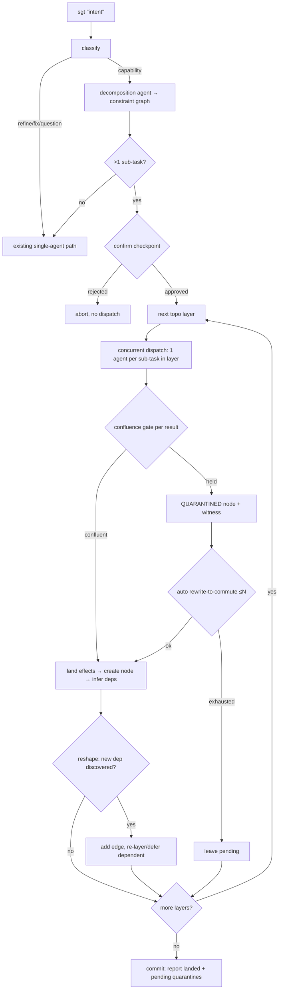

# feat: parallel fan-out + continuous confluence (semi-git #2/#3)

## Summary

Add the parallel execution path the v1 build skipped. Today `sgt "intent"` is a serial
stream: one prompt → one coding-agent call → one node. This plan makes a single intent
**decompose into a transient constraint graph of sub-tasks**, dispatch independent
layers **concurrently**, and land the maximal confluent set — with a **checkpoint**
before fan-out. It also makes the confluence gate's conflict path real: held effects
become durable **`QUARANTINED`** nodes carrying a **witness**, and the system attempts a
**bounded, non-blocking auto rewrite-to-commute** against post-land state. This is where
the EICO gate finally earns its keep — on simultaneous edits — instead of sitting idle.

Implements R28–R35 from the 2026-06-18 refresh (see origin:
`docs/brainstorms/2026-06-17-semi-git-requirements.md`).

---

## Problem Frame

Ideas #2 (plan-as-constraint-graph) and #3 (no-merge / continuous confluence) were
written for a parallel fan-out model the v1 build dropped for a serial stream. As a
result: there is no decomposition of one intent into many tasks; dependencies are
discovered (call-graph inference) rather than declared; and the confluence gate, though
universal, almost never sees two simultaneous edits, so quarantine and rewrite-to-commute
were never built — `max_coordination_free_batch` returns `(admitted, held)` and the held
effects are merely printed in the orchestrator's `Report`, never made durable.

The differentiator was never the parallelism — it is the semantic substrate + clean
revert. But resurrecting fan-out is what exercises the gate, and the quarantine safety
net pays off even in the stream model (a `modify`/`replace_def`/re-garden can produce
non-commuting effects today and they vanish into a printed "held" list). This plan builds
both, with the explicit defenses #2 demanded against confidently-wrong decomposition.

---

## Key Technical Decisions

- **KTD1. The constraint graph is transient execution scaffolding, a distinct type from
  `SemanticGraph`.** Sub-tasks (intent + declared interface + depends-on) drive dispatch
  ordering and concurrency, then are discarded. Durable semantic nodes are created from
  *landed* effects, not from the plan. Keeps "the plan is replayable/ephemeral, the DAG is
  durable" honest. (origin D1, D6)
- **KTD2. Concurrency is a bounded `ThreadPoolExecutor`, not asyncio.** The OpenAI client
  and the `CodingAgentAdapter.execute_task` contract are synchronous and blocking-I/O
  bound; a thread pool parallelizes layer dispatch without rewriting the adapter contract
  or coloring the codebase async. (origin: concurrency note)
- **KTD3. Quarantine reuses the node + bundle store; `QUARANTINED` status excludes from
  materialization.** `Project.active_effects()` already replays only `ACTIVE` nodes, so a
  quarantined node's effects are held simply by status. The witness is stored alongside
  the bundle. Reconcile flips the node to `ACTIVE` with (possibly rewritten) effects.
  Avoids a parallel quarantine store and makes closure (R35) free. (origin D5, R32)
- **KTD4. The confluence engine returns structured per-candidate hold reasons; the witness
  is built from them — no separate diagnosis pass.** A held candidate carries why
  (precondition failed / non-commuting with a named effect / batch invariant violated).
  (origin R32)
- **KTD5. The checkpoint is an injected `confirm` callback on the orchestrator.** The
  fan-out loop calls `confirm(plan) -> bool` before dispatching; the CLI supplies an
  interactive prompt, tests/headless supply auto-confirm. A plan with ≤1 sub-task skips
  the callback entirely and runs inline (degenerates to today's stream). (origin D3, R29)
- **KTD6. Reshape-on-discovery is bounded and gate-backed.** After a layer lands, existing
  dependency inference re-runs; a newly discovered cross-task dependency adds an edge and
  defers/re-dispatches the dependent task. A wrong split surfaces as a quarantine, never a
  corrupt land. (origin D2, R31)
- **KTD7. Rewrite-to-commute is bounded (default 2 attempts) and non-blocking.** On success
  the quarantine flips `ACTIVE`; on exhaustion it stays pending and the run completes. The
  run never hard-fails on a conflict. On-demand reconcile (`sgt reconcile`) is deferred.
  (origin D5, R33)
- **KTD8. One landed sub-task = one semantic node; gardener distillation is deferred.**
  Dependencies between the resulting nodes are inferred from the call graph (existing
  `_infer_dependencies`). Merging sub-task nodes into one capability + concept deps is
  follow-up work. (plan decision; origin R34 partially)

---

## High-Level Technical Design

### The fan-out run (one intent → layered concurrent dispatch → land/quarantine)



### Quarantine lifecycle (status on the existing node store)

```mermaid
stateDiagram-v2
  [*] --> Held: gate holds effects
  Held --> QUARANTINED: create node (status) + witness
  QUARANTINED --> Rewriting: auto rewrite-to-commute
  Rewriting --> ACTIVE: re-dispatched effects pass the gate
  Rewriting --> QUARANTINED: still conflicting (attempt < N)
  Rewriting --> Pending: attempts exhausted (non-blocking)
  Pending --> [*]: run completes; node persists QUARANTINED
  ACTIVE --> [*]: effects join the active replay
```



---

## Output Structure

```
sgt/
  agents/
    planner.py          # U5 — decomposition agent: intent → constraint graph (LLM)
  orchestrate/
    constraint.py       # U3 — ConstraintGraph model + topo-layering (pure)
    dispatch.py         # U4 — concurrent layer dispatch (ThreadPoolExecutor)
    quarantine.py       # U7 — witness model + bounded rewrite-to-commute
    loop.py             # U6 — Orchestrator extended with the fan-out path
  engine/
    confluence.py       # U1 — per-candidate hold reasons
  store/
    graph.py            # U2 — NodeStatus.QUARANTINED
  project.py            # U2 — witness storage; quarantine helpers
scripts/
  e2e_fanout.py         # U9 — live OpenAI fan-out verification
tests/
  engine/test_confluence.py
  store/test_graph.py
  orchestrate/test_constraint.py
  orchestrate/test_dispatch.py
  orchestrate/test_loop.py
  orchestrate/test_quarantine.py
  agents/test_planner.py
```

Per-unit `**Files:**` lists are authoritative; the implementer may adjust layout.

---

## Requirements

Carried from the origin 2026-06-18 refresh.

- R28. `sgt "X"` runs a decomposition agent emitting a transient constraint graph of
  sub-tasks (intent + declared interface + depends-on); revisable, not the semantic DAG.
- R29. A plan with >1 sub-task is shown and confirmed once before dispatch; a ≤1-task plan
  runs inline without a checkpoint.
- R30. Sub-tasks are topologically layered; each independent layer dispatches concurrently;
  a dependent task is dispatched only after its prerequisites land (sees their code).
- R31. Returned effects revealing a missed dependency reshape the graph (add edge,
  re-layer, re-dispatch) rather than failing.
- R32. A held conflict becomes a durable `QUARANTINED` node, excluded from materialization,
  carrying a witness (held effects + specific reason). The engine reports per-candidate
  hold reasons.
- R33. Bounded auto rewrite-to-commute against post-land state; success flips the node
  `ACTIVE`; failure leaves it pending and the run still completes (non-blocking).
- R34. Landed effects of a fan-out run become durable semantic nodes (one node per
  sub-task in this plan; gardener distillation deferred).
- R35. Quarantine nodes participate in dependency closure: reverting the nodes a quarantine
  was meant to integrate with GCs the quarantine too.

---

## Implementation Units

### Phase A — Engine & store foundations (deterministic, no LLM)

### U1. Confluence engine reports per-candidate hold reasons
- **Goal:** Enrich the gate so a held effect carries *why* it was held — the witness substrate.
- **Requirements:** R32
- **Dependencies:** none
- **Files:** `sgt/engine/confluence.py`, `tests/engine/test_confluence.py`
- **Approach:** Add a structured result for the greedy selection: alongside `(admitted, held)`, return a per-held-effect reason tagged as one of `precondition_failed`, `non_commuting_with:<target/eid>`, or `invariant_violated`. Determine the reason by re-checking the failing candidate against the current admitted set (precondition first, then pairwise commute naming the first conflicting admitted effect, else the batch invariant). Keep the existing `max_coordination_free_batch` tuple signature working (back-compat) and add a `max_coordination_free_batch_explained` (or a `reasons` return) the orchestrator consumes. No behavior change to *which* effects land.
- **Patterns to follow:** existing `is_invariant_confluent` / `commute` / `precondition_holds` in `sgt/engine/confluence.py`.
- **Test scenarios:**
  - Happy: a fully confluent batch yields all admitted, empty reasons.
  - Edge: a duplicate-name `add_def` is held with reason `non_commuting_with` naming the admitted effect (or `precondition_failed` when applied after the first lands).
  - Edge: an effect whose application makes the codebase invalid is held with `invariant_violated`.
  - Edge: a held effect's reason references a real, identifiable counterpart (not an opaque flag).
  - `Covers AE3.` order-sensitive wrappers: the commuting part admits, the conflicting part is held with a human-readable witness reason.

### U2. `QUARANTINED` node status + witness storage + closure participation
- **Goal:** A durable representation for held work that is excluded from materialization but visible in the graph and closure.
- **Requirements:** R32, R35
- **Dependencies:** U1
- **Files:** `sgt/store/graph.py`, `sgt/project.py`, `tests/store/test_graph.py`, `tests/test_project.py`
- **Approach:** Add `NodeStatus.QUARANTINED`. Confirm `Project.active_effects()` (already `ACTIVE`-only) excludes it — add a regression test. Store the witness per node: extend the persisted `effects.json` with a `witnesses: {node_id -> {reason, held: [effect descs], against: [node_ids]}}` map (or a sibling `quarantine.json`); add `Project.quarantine(node, effects, witness, against)` and `Project.resolve_quarantine(node_id, effects)` helpers. A quarantined node's effects live in `bundles[nid]` (held by status), so reverting/closing over the nodes it depends on GCs it via the existing `revert_set`. Add edges `DEPENDS_ON` from the quarantine node to the `against` nodes so closure (R35) and acyclicity hold.
- **Patterns to follow:** `NodeStatus` + `Node.to_dict/from_dict` in `sgt/store/graph.py`; `Project.save/open` round-trip and `add_feature` edge-wiring in `sgt/project.py`.
- **Test scenarios:**
  - Happy: a quarantined node persists and reloads with its witness intact.
  - Happy: quarantined effects are absent from `materialize()`; flipping to `ACTIVE` includes them.
  - `Covers AE2-style closure.` reverting an `against` node removes the quarantine that depended on it.
  - Edge: a quarantine→against edge that would cycle is rejected (reuse `would_create_cycle`).
  - Edge: `resolve_quarantine` replaces the held effects and flips status `ACTIVE`; codebase stays invariant-valid.

### Phase B — Decomposition & concurrency

### U3. Constraint-graph model + topological layering (pure)
- **Goal:** The transient execution scaffolding: sub-tasks, declared interfaces, depends-on, and a layering function.
- **Requirements:** R28, R30
- **Dependencies:** none
- **Files:** `sgt/orchestrate/constraint.py`, `tests/orchestrate/test_constraint.py`
- **Approach:** A `SubTask` dataclass (`key`, `intent`, `provides: list[str]`, `needs: list[str]`, `depends_on: list[str]`). A `ConstraintGraph` holding sub-tasks with `add`, `layers() -> list[list[SubTask]]` (Kahn-style: each layer is the set of tasks whose `depends_on` are all in earlier layers), cycle detection, and `add_dependency(a, b)` for reshape (R31). Pure data + algorithm; no LLM, no git. `depends_on` may be seeded from declared `needs`↔`provides` matching when the planner omits explicit edges.
- **Patterns to follow:** acyclicity + `topo_order` style in `sgt/store/graph.py` (mirror the reachability/cycle approach; do not reuse `SemanticGraph` — this is a separate transient type per KTD1).
- **Test scenarios:**
  - Happy: three tasks A←B←C layer as `[[A],[B],[C]]`; two independent tasks share a layer.
  - Happy: `needs`/`provides` matching infers a depends-on edge when none is declared.
  - Edge: a single task yields one layer of one (the ≤1 inline case feeds R29).
  - Edge: a dependency cycle is detected and surfaced, not silently dropped.
  - Edge: `add_dependency` after construction re-layers correctly (supports reshape).

### U4. Concurrent layer dispatch primitive
- **Goal:** Run all sub-tasks in one layer through the adapter concurrently and collect normalized results.
- **Requirements:** R30
- **Dependencies:** none (depends on the existing `CodingAgentAdapter` contract)
- **Files:** `sgt/orchestrate/dispatch.py`, `tests/orchestrate/test_dispatch.py`
- **Approach:** `dispatch_layer(adapter, tasks, codebase, max_workers) -> list[(SubTask, AgentResult)]` using `concurrent.futures.ThreadPoolExecutor`. Each worker calls `adapter.execute_task(intent, codebase, allowed_files)` (blocking I/O → threads are the right tool, KTD2). Results are collected in task order regardless of completion order. A worker exception is captured as an `AgentResult(status=FAILED, error=...)`, never propagated to kill the layer (mirrors the adapter's own failure contract). Bound `max_workers` (default small, e.g. 4).
- **Patterns to follow:** `AgentResult`/`AgentStatus` in `sgt/adapter/base.py`; the FAILED-not-raise posture in `sgt/adapter/openai_agent.py`.
- **Test scenarios:**
  - Happy: a layer of 3 stub adapters returns 3 results in task order.
  - Edge: a stub that raises is captured as a `FAILED` result; sibling tasks still return.
  - Edge: a stub returning `scope_violation` is passed through unchanged.
  - Integration: results from concurrent stubs are deterministic in order (order-independence of collection).

### U5. Decomposition (planner) agent
- **Goal:** Turn one capability intent + current codebase into a constraint graph via structured output.
- **Requirements:** R28
- **Dependencies:** U3
- **Files:** `sgt/agents/planner.py`, `tests/agents/test_planner.py`
- **Approach:** `decompose(intent, codebase, repo_path, model) -> ConstraintGraph`. LLM call with a strict JSON schema: a list of sub-tasks each `{key, intent, provides[], needs[], depends_on[]}`. System prompt instructs: decompose only when genuinely separable; declare the interface each task provides and needs; keep tasks coordination-free where possible; return a single task when the intent is atomic. Map the payload into `ConstraintGraph` (U3), seeding edges from explicit `depends_on` and from `needs`↔`provides` matching. Mirrors the structured-output style already used by the classifier and OpenAI backend.
- **Patterns to follow:** `sgt/agents/classifier.py` (schema + `get_client`/`get_model` + `temperature=0`) and `RESULT_JSON_SCHEMA` in `sgt/adapter/base.py`.
- **Test scenarios:**
  - Happy (mocked client): a multi-part intent yields >1 sub-task with sane provides/needs.
  - Happy (mocked client): an atomic intent yields exactly one sub-task (inline path).
  - Edge: declared `needs` with no matching `provides` is left as an external/builtin assumption, not a phantom edge.
  - Error: a malformed/empty model payload raises a clear, catchable error (the loop degrades to single-agent).
  - Test expectation: client is mocked; no live network call in unit tests.

### Phase C — Fan-out orchestration

### U6. Fan-out orchestration loop (checkpoint + layered dispatch + reshape)
- **Goal:** The spine: classify → decompose → checkpoint → run layers concurrently → gate → land, with reshape-on-discovery.
- **Requirements:** R29, R30, R31, R34
- **Dependencies:** U1, U3, U4, U5, U2
- **Files:** `sgt/orchestrate/loop.py`, `tests/orchestrate/test_loop.py`
- **Approach:** Extend `Orchestrator`. For the capability lane, call `decompose` (U5). If ≤1 sub-task → existing single-agent `_add` path (no checkpoint, R29). Else call the injected `confirm(plan) -> bool` (KTD5); on reject, abort with a clear report and no dispatch. On approve, walk `ConstraintGraph.layers()`: for each layer, `dispatch_layer` (U4) against the *current* `project.materialize()` (so dependents see landed code, R30); gate each result via U1; land the confluent set as a node per sub-task (`add_feature`, deps inferred, KTD8); route held effects to U7. After a layer lands, re-run dependency inference; if a later sub-task now depends on a just-landed node not in its `depends_on`, `add_dependency` and re-layer the remainder (R31, bounded to avoid loops). Commit once at the end with a summary report (landed nodes + pending quarantines).
- **Patterns to follow:** existing `Orchestrator.ingest/_add/_extend` and `Report` in `sgt/orchestrate/loop.py`; `Project.add_feature`/`commit`/`materialize`.
- **Test scenarios:** (stub adapter + stub planner + auto-confirm)
  - Happy: a 2-independent-task plan lands both nodes in one layer; both materialize; codebase valid.
  - Happy: a 2-layer plan (B needs A) dispatches A first, then B against A's landed code; B's dep edge exists.
  - `Covers R29.` a 1-task plan runs inline and never calls `confirm`.
  - `Covers R29.` a >1-task plan calls `confirm`; a rejecting `confirm` aborts with zero nodes added.
  - `Covers R31.` a sub-task whose returned effects call an unforeseen sibling triggers an added edge + re-layer (or quarantine if same-layer), never an invalid land.
  - Error: a `FAILED` sub-task result leaves the rest of the run intact (no partial corrupt land).
  - Integration: end-of-run commit reflects exactly the landed nodes; git head trailer maps to the last node.

### U7. Quarantine creation + bounded auto rewrite-to-commute
- **Goal:** Held effects become durable `QUARANTINED` nodes with a witness, and a bounded non-blocking reconcile attempt.
- **Requirements:** R32, R33, R35
- **Dependencies:** U2, U6
- **Files:** `sgt/orchestrate/quarantine.py`, `sgt/orchestrate/loop.py`, `tests/orchestrate/test_quarantine.py`
- **Approach:** When a layer holds effects, build a witness from U1's reasons and create a `QUARANTINED` node via `Project.quarantine` (U2), with `against` = the nodes it was meant to integrate with (the just-landed layer + its inferred deps). Then attempt rewrite-to-commute up to `N` (default 2, KTD7): re-dispatch the sub-task via the adapter against the *post-land* `materialize()` (now containing the winner's code), re-gate; on success `resolve_quarantine` → land + flip `ACTIVE`; on exhaustion leave the node `QUARANTINED` (pending) and continue. The run never raises on a conflict. Reconcile is automatic only — `sgt reconcile` is deferred.
- **Patterns to follow:** `Project.quarantine/resolve_quarantine` (U2); `_run_agent` dispatch in `sgt/orchestrate/loop.py`.
- **Test scenarios:** (stub adapter scripted to conflict then commute)
  - Happy: a held effect creates a `QUARANTINED` node + witness; it is excluded from `materialize()`.
  - Happy: rewrite-to-commute succeeds on attempt ≤N → node flips `ACTIVE`, effects land, codebase valid.
  - Edge: rewrite never commutes → node stays pending after N attempts; the run still completes ok.
  - `Covers R35.` reverting the `against` node GCs the pending quarantine too.
  - Edge: a witness names the conflicting counterpart and the reason (from U1), not an opaque flag.
  - Error: a `FAILED` re-dispatch counts as a failed attempt, not a crash.

### Phase D — Surface & verification

### U8. CLI surface: checkpoint prompt + quarantine visibility
- **Goal:** Wire the checkpoint to an interactive confirm, preview the plan, and surface quarantines in inspection.
- **Requirements:** R29
- **Dependencies:** U6, U7
- **Files:** `sgt/cli.py`, `tests/test_cli.py`
- **Approach:** Inject a `confirm` callback into `Orchestrator` that prints the proposed sub-task plan (keys, intents, layers) and reads a y/n (default-safe, non-interactive/`--yes` auto-confirms for scripts). Extend `sgt graph`/`sgt show` to render `QUARANTINED` nodes distinctly with their witness reason. The ≤1-task path prints nothing extra (inline). No new verbs (`sgt reconcile` deferred).
- **Patterns to follow:** argv dispatch + `do/graph/show` handlers in `sgt/cli.py`.
- **Test scenarios:**
  - Happy: a multi-task plan prints the preview and proceeds on "y" (feed a scripted stdin / inject confirm).
  - Edge: "n" aborts with a clear message and no changes.
  - Edge: `--yes` / non-interactive skips the prompt and proceeds.
  - Happy: `sgt graph` shows a quarantined node flagged with its witness reason.
  - Error: unknown args still produce the existing actionable help (no regression).

### U9. Live end-to-end fan-out verification
- **Goal:** Prove the path against the real OpenAI backend — not just that tests pass, but that the model's decomposition and code align with intent (standing project directive).
- **Requirements:** R28–R34 (integration)
- **Dependencies:** U6, U7, U8
- **Files:** `scripts/e2e_fanout.py`
- **Approach:** Mirror `scripts/e2e_smoke.py` / `scripts/e2e_modify.py`. Fire one multi-part intent that genuinely decomposes (e.g., "add `validate(email)` and `normalize(email)` and a `register(email)` that uses both" → 2 independent + 1 dependent). Auto-confirm the checkpoint. Assert: >1 sub-task planned; independent tasks land; the dependent task sees and calls the others (dep edge inferred); codebase invariant-valid and runnable; behavior matches intent. If a quarantine arises, assert it carries a witness and the run still completes. Print the plan, the materialized code, and the graph.
- **Patterns to follow:** `scripts/e2e_smoke.py` (banner/check/report helpers, `load_env`, `tempfile` workdir).
- **Test expectation:** live script, not a unit test; uses `.env`. Run manually via `uv run python scripts/e2e_fanout.py`.

---

## Scope Boundaries

### Deferred to follow-up work (plan-local sequencing)
- On-demand `sgt reconcile <ref>` verb (auto-reconcile ships here; manual retry of a pending quarantine is follow-up).
- Gardener distillation: merging sub-task nodes into one capability + concept deps (this plan lands one node per sub-task).
- Cross-file fan-out beyond the per-file invariant model (reference integrity stays per-file, inherited from v1 KTD3).

### Deferred for later (origin, not this plan)
- Multiverse / explore-with-a-measure (#5); the compounding confluence corpus (#6); RL-trained decomposition/gardener policies; additional backends (Codex, Gemini); multi-developer concurrency.

### Outside this product's identity (origin)
- Being a code-writing agent itself; replacing git; a runtime feature-flag system.

---

## Risks & Dependencies

- **Risk: the planner over- or under-decomposes.** Over-serialization loses parallelism but stays correct; under-serialization (missed dep) surfaces as a same-layer collision or name-resolution failure → quarantine + reshape (R31), not a corrupt land. The gate is the backstop. A confluence corpus (#6, deferred) could later prune false edges.
- **Risk: wrong declared interface** (planner says A provides `f(x)`, A ships `f(x, y)`): the dependent fails the arity/name invariant → quarantine → rewrite-to-commute against A's *actual* code. Safe, not free — costs a wasted dispatch + one reconcile round.
- **Risk: rewrite-to-commute non-determinism / thrash.** Each attempt is re-gated; bounded attempts (KTD7) cap it; a pending quarantine is the floor, never an infinite loop.
- **Risk: thread-pool + git index contention.** Concurrency is confined to *dispatch* (read-only `materialize()` handed to each worker); landing/commit happens serially on the main thread after a layer returns. No concurrent git writes.
- **Dependency:** the v1 core (graph, effects, confluence gate, project, adapter, classifier) — all present and green (56 tests). EICO remains the vendored substrate.
- **Dependency:** `OPENAI_API_KEY` in `.env` for U9 only.

---

## Open Questions (deferred to implementation)

- The exact "worth decomposing" boundary inside the planner prompt — settle against U5/U6 (default: always call the planner; a 1-task result is the inline signal).
- The default rewrite-to-commute attempt count (start at 2) and whether it should scale with layer size — settle against U7.
- Witness on-disk shape (inline in `effects.json` vs. sibling `quarantine.json`) — settle against U2.
- Whether reshape-on-discovery should re-dispatch the dependent immediately or defer it to a synthetic trailing layer — settle against U6 (default: defer to keep layer semantics simple).

---

## Sources / Research

- Origin requirements + 2026-06-18 refresh: `docs/brainstorms/2026-06-17-semi-git-requirements.md`.
- v1 plan (built): `docs/plans/2026-06-17-001-feat-semi-git-core-plan.md`; findings: `FINDINGS.md`.
- EICO engine (vendored substrate): `/Users/ryanyen2/repos/ml-intern/eico` (`DESIGN.md`, `FINDINGS.md`).
- Current code touched: `sgt/engine/confluence.py`, `sgt/store/graph.py`, `sgt/project.py`,
  `sgt/orchestrate/loop.py`, `sgt/agents/classifier.py`, `sgt/adapter/base.py`.
- Prior art (ideation): CodeCRDT (arXiv:2510.18893), Pijul/Darcs closure, jj first-class conflicts.
