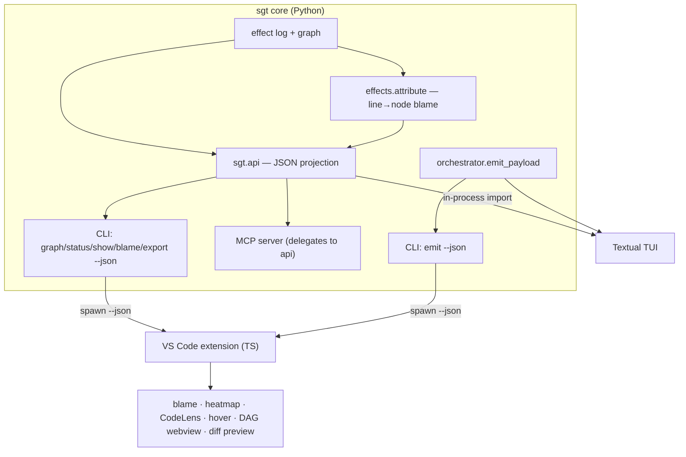

# feat: sgt visual surfaces — VS Code extension, TUI, and user docs

## Summary

Give `sgt` the visual surfaces a feature-level VCS needs: a GitLens-style **VS Code extension**,
a **terminal UI**, and **user docs** — all reading from one machine-readable projection of the
semantic tree. The keystone is a shared **JSON projection** (`sgt … --json`) and a line-level
**semantic blame** capability in core, so both UIs (and MCP) consume one schema and can't drift.
Everything is in-situ: color and shape carry status and ownership; labels are the exception.

This plan was implemented in one pass. It records the as-built design.

## Problem Frame

`sgt` versions code by features, not diffs — but until now the only views were human-text CLI
output and the MCP server. There was no way to *see* which feature owns a line, to navigate the
DAG, or to preview a plug-out as a diff. GitLens proves the in-editor patterns (blame, CodeLens,
hovers, commit graph, revision navigation); the gap was mapping them from *commits* to *semantic
nodes*, which required core support that did not exist (machine-readable output + line→node
attribution).

## Key Technical Decisions

- KTD1 — **One JSON projection, many clients** (`sgt/api.py`). The CLI `--json` mode, MCP, the
  extension, and the TUI all render the same dicts. The MCP read tools were refactored to
  delegate to `sgt.api`, so the surfaces are provably identical. Rationale: the original MCP
  server already defined the canonical node projection; unifying prevents schema drift (the
  single highest-leverage move, per research).
- KTD2 — **Line-level semantic blame from the log, not a text diff** (`sgt/effects/attribute.py`).
  Attribution is recovered from the effect log: each effect's `eid` binds to a node; each
  statement slot carries the `(author, counter)` of its last edit; seed statements fall back to
  the function's definer. Computed against the same `materialize()` text the editor shows, via
  the same `build_statement_seq` reconstruction materialization uses — so blame and the rendered
  tree can never disagree. Degrades gracefully to whole-unit blame for class methods / reorders.
- KTD3 — **Extension drives the CLI via `--json`** (chosen over a persistent MCP client or a
  daemon). Stateless, mirrors the CLI, no new long-lived surface. The extension shells out with
  `execFile` and caches per `.sgt` change.
- KTD4 — **`sgt emit … --json` for revision navigation**. The orchestrator already computed
  before/after on a throwaway sandbox for `--emit`; `emit_payload` returns the per-file
  before/after so a UI can render a real diff and a refusal witness, writing nothing.
- KTD5 — **TUI on Textual, behind an optional `[tui]` extra**, lazily imported. Keeps the core
  install dependency-light (the project's stated value); the TUI imports `sgt.api` in-process.
- KTD6 — **Deterministic color from node id** (golden-angle hue hash) generated in **OKLCH**,
  computed identically in the extension (TS), the webview (JS), and the TUI (Python) so a feature
  reads the *same* color everywhere (verified byte-for-byte). OKLCH (not HSL/HSV) gives every hue
  the same perceived lightness, so contrast is hue-independent and theme-aware (lighter L on dark
  themes, darker on light) to clear the WCAG 1.4.11 3:1 floor. **Hue is identity only**; status is
  carried by a glyph + dim on every surface — the two never share the hue channel.

## High-Level Technical Design



The working tree is a replay of active effects; blame attributes the *replayed* text. Reads are
offline; mutations go through the existing drift guard + confluence gate unchanged.

## Output Structure

```
sgt/
  api.py                     # KTD1 — canonical JSON projection
  effects/attribute.py       # KTD2 — line-level semantic blame
  tui/{__init__,app}.py      # KTD5 — Textual TUI
editor/vscode/
  package.json esbuild.js tsconfig.json
  src/{extension,sgt,store,types,color,blame,codelens,hover,tree,graphPanel,preview,commands}.ts
  media/{graph.js,graph.css,sgt.svg}
docs/guide/
  README.md getting-started.md the-semantic-tree.md vscode-extension.md tui.md
```

## Implementation Units

### U1. Shared JSON projection (`sgt/api.py`) + MCP unification

- Goal: one schema for graph/node/show/status/conflicts/blame/export; refactor MCP read tools to
  delegate.
- Files: `sgt/api.py`, `sgt/mcp/server.py`, `tests/test_api.py`, `tests/mcp/test_server.py`.
- Test scenarios: graph_view carries nodes + typed edges + inferred `depends_on`; show_view
  resolves a fuzzy ref and lists effects; missing ref → error; status_view shape (files, drift
  dict); export_view carries per-node effects. MCP tests updated to the structured `drift`/
  `effects` shapes. Verification: `tests/test_api.py` + `tests/mcp` green.

### U2. Line-level semantic blame (`sgt/effects/attribute.py`)

- Goal: per-file line spans → owning node, statement-exact where the data supports it.
- Files: `sgt/effects/attribute.py`, `tests/effects/test_attribute.py`.
- Approach: re-parse the materialized file; attribute units (innermost wins), statement slots
  (via `build_statement_seq`), and module-level imports/consts; coalesce into spans; unattributed
  separator lines stay `None`.
- Test scenarios: two defs attribute to their nodes; import/const attribution; stable across
  calls; a reverted node drops out. Statement-level verified live (`scripts/e2e_ui_surfaces.py`):
  an edited statement belongs to its fix node while neighbors keep their owner.

### U3. CLI `--json` + `blame` / `export` / `emit` / `tui` verbs

- Goal: expose the projection and previews on the CLI; add the TUI entrypoint.
- Files: `sgt/cli.py`, `sgt/orchestrate/loop.py` (`emit_payload`), `tests/test_cli.py`.
- Test scenarios: `graph --json` machine-readable; `blame --json` maps lines to nodes; `export`
  dumps the graph; human-readable `blame`; help lists the new verbs. Verification: `tests/test_cli.py` green.

### U4. VS Code extension (`editor/vscode/`)

- Goal: semantic blame (current-line + status bar), feature heatmap (gutter + overview ruler),
  CodeLens, rich hovers with command links, DAG tree + webview, diff-based revision navigation,
  graph-op commands.
- Files: the `editor/vscode/` tree (see Output Structure).
- Approach: a `Store` caches graph + per-file blame and broadcasts refreshes; all surfaces listen.
  Reads via `execFile sgt … --json`; a `.sgt/*.json` watcher invalidates. Diff preview uses a
  virtual `sgt-preview:` content provider + `vscode.diff`.
- Verification: `npm run compile` (tsc `--noEmit` + esbuild bundle) succeeds; activates on
  `workspaceContains:**/.sgt/graph.json`.
- Test expectation: none in CI (no VS Code host); type-check + bundle is the gate. Manual smoke
  via F5 Extension Development Host.

### U5. Textual TUI (`sgt/tui/`)

- Goal: browse the DAG, inspect a node, preview a plug-out, apply graph ops — keyboard-driven.
- Files: `sgt/tui/__init__.py`, `sgt/tui/app.py`, `pyproject.toml` (`[tui]` extra),
  `tests/tui/test_app.py`.
- Approach: in-process over `sgt.api` + orchestrator; status by glyph+color, detail pane, confirm
  modal for mutations, toast for dry-run previews.
- Test scenarios: boots against a real project, lists the graph, a preview action does not mutate
  (Textual `run_test` harness, skipped if Textual absent).

### U6. User docs (`docs/guide/`)

- Goal: mental model + getting started + both UI guides; linked from README.
- Files: `docs/guide/{README,getting-started,the-semantic-tree,vscode-extension,tui}.md`, `README.md`.
- Test expectation: none — prose. Verified by review against the as-built verbs/behavior.

## Scope Boundaries

In scope: the surfaces above. Not in scope (and unchanged): the engine's semantics, code
authoring, remote/collaboration UI.

### Deferred to Follow-Up Work

- Blame **stability across re-materialization** via Myers-diff line carry-over + content-similarity
  move detection (git `-M`/`-C` analog). Not needed today: attribution is deterministic from the
  log and computed against the on-disk replay, so decorations are stable while the file matches;
  drift is surfaced. Becomes valuable once cross-checkpoint flicker matters.
- Statement-granular blame **inside class methods** (distill is top-level-function-only today;
  methods attribute at whole-unit). Tracked by the existing distill limitation.
- A VS Code integration-test harness (`@vscode/test-electron`) running in CI.

## Risks & Notes

- Reverting a node whose statement was later edited by a separate fix node can be refused
  ("would leave the codebase invalid") when the fix is not in the revert closure — surfaced
  correctly as a witness by `emit`. This is pre-existing engine closure behavior, now visible;
  worth revisiting in the lifecycle algebra, out of scope here.

## Review hardening (2026-06-20)

A post-build pass by a simplicity reviewer and a senior UI/UX design reviewer drove these changes:

- **Color unified in OKLCH (KTD6).** The extension (HSV) and webview (HSL) previously produced
  *different* colors for the same feature; now all three surfaces share one OKLCH→sRGB generator
  (TS / JS / Python), theme-aware and contrast-floored, and the TUI no longer double-books hue
  for status. Identity colors verified byte-identical across JS and Python.
- **Graph layout at scale.** Within-layer ordering moved from alphabetical to a median/barycenter
  crossing-reduction sweep; long edges route around intervening nodes via dummy nodes. The webview
  gained pan / wheel-zoom / **Fit**, a viewport `<g>` transform (canvas no longer an unbounded
  scroll plane), filter debounce + dim-in-place (no relayout), and keyed node reconciliation so
  `plan`/`reconcile` animates nodes to new positions (CSS transitions — no JS animation dep — with
  a `prefers-reduced-motion` guard).
- **Accessibility & affordances.** Graph nodes are focusable with arrow-key navigation, ARIA
  labels, and a focus ring; the hidden destructive double-click was removed (single-click inspects;
  the inspector hosts the preview/apply actions); the conflict ⚠ and the current-line `◆` now carry
  semantic/identity color.
- **TUI responsiveness.** Width-derived intent column, a `/` filter, a narrow-mode (< 100 cols)
  that folds the detail pane into a modal, and uppercase apply-keys (`X`/`O`/`U`) to separate
  mutations from the safe lowercase previews.
- **Simplicity cuts.** Removed dead `Sgt.graph()` and the unused `EmitView.refused`; de-duplicated
  `ownerAt`/`truncate` into `util.ts`; hoisted `attribute.py` imports and corrected a type
  annotation. Kept the three annotation toggles and `retainContextWhenHidden` deliberately — the
  former map to an explicit GitLens-parity requirement, the latter now preserves pan/zoom state.

## Sources & Research

- VS Code API (decorations, CodeLens, hovers with trusted `command:` links, TreeView vs webview,
  virtual documents + `vscode.diff`, esbuild bundling) — official docs, current through 1.90+.
- Semantic blame technique (AST re-parse + lockstep, `end_lineno` optional, UTF-8 col offsets),
  GitLens progressive-disclosure + median-normalized heatmap, golden-angle color — Python docs,
  LibCST, GitLens docs, Ankerl.
- Institutional: unify the projection (MCP is the canonical surface); anchor blame to units +
  PosIds; respect the drift-guarded mutate sequence; keep Textual optional and cores pure.
