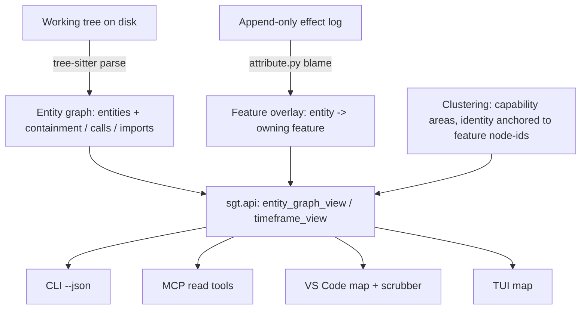
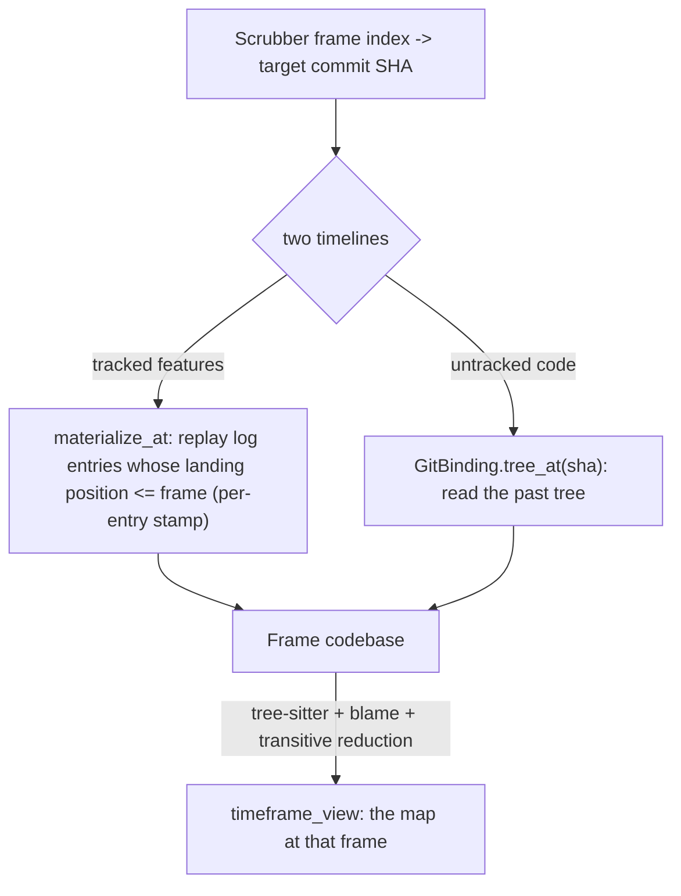

# feat: Time-Aware Semantic Map

## Summary

Re-found the `sgt` view on a deterministic, whole-repo entity graph (tree-sitter, Python + TypeScript), painted with tracked features as colored regions, clustered into capability areas, and scrubbable through time. The entity graph (always connected) becomes the spine; features become an overlay recovered from the existing semantic blame; the append-only log becomes a checkpoint scrubber that morphs the same map through history. Built in dependency order — entity foundation, feature overlay, the connected "now" map across surfaces, optional clustering, then the time axis — all as new views on `sgt.api`, with `sgt` still never authoring code.

---

## Problem Frame

Today the only edges in the feature graph are code dependencies (calls + imports), so independent features form disconnected components — a forest by design, with union-find dividers marking the gaps (see origin: Problem Frame). When the user looks at it, it reads as a bag of toggleable feature-chunks, not one codebase evolving. The root cause is a conflation: the view mixes a *spatial re-representation* of the code with *version control*, serving neither cleanly.

The fix re-anchors structure to the real code. The deterministic substrate is partly latent already — effect targets are scope-qualified entities, and `attribute.py` maps every materialized line to its owning feature — but it is never surfaced as a connected entity graph, and it covers only what flowed through `sgt`. This plan surfaces that graph, parses the *whole* repo (not just tracked code), and adds a time axis so the map reads as one codebase developing.

---

## High-Level Technical Design

The architecture keeps the canonical-source split load-bearing: disk is canonical for **structure** (the entity graph is parsed from the real tree), the effect log stays canonical for **attribution + versioning** (which feature owns an entity, what revert/switch remove). Both feed one projection that every surface consumes.



The scrubber reconstructs a past frame from two reconciled timelines — tracked features by replaying log entries up to the frame's landing position, untracked code by reading the git tree at that commit — with the `Sgt-Node-Id` trailer relating commits and checkpoints.



---

## Output Structure

New deterministic-entity module and the new map surface; everything else extends existing files.

```text
sgt/
  entities/
    __init__.py
    extract.py        # tree-sitter parse -> entities (Python + TS)
    graph.py          # entity graph: nodes + containment/calls/imports edges, components
    cluster.py        # capability clustering + labeling (LLM, offline fallback)
editor/vscode/
  src/mapView.ts      # new WebviewViewProvider for the time-aware map
  media/map.js        # entity-graph renderer + scrubber control
  media/map.css
tests/
  entities/
    test_extract.py
    test_graph.py
    test_cluster.py
  test_color_parity.py  # JS<->Python OKLCH parity (see KTD3)
```

---

## Requirements

**Entity foundation**

- R1. The whole repo parses via tree-sitter into a connected entity graph — functions, classes, and methods as entities; edges are containment plus calls/imports (plus TS type-refs) — for Python and TypeScript in v1, deterministically and offline (see origin: R1, R2, R3).

**Feature overlay**

- R2. Tracked features render as colored regions over entities, recovered from the existing semantic blame (`attribute.py` spans); a feature's hue is its identity and status is a glyph, never a hue (see origin: R4).
- R3. Entities with no owning feature — module-level Python the distiller cannot attribute, all TypeScript, and untracked code — render as honest dim, unattributed structure (see origin: R5).

**Clustering**

- R4. Entities group and label into higher-level capability areas with stable identity anchored to feature node IDs; the LLM labels/groups/refines and degrades to deterministic grouping with no API key (see origin: R6, R7).

**Time axis**

- R5. A checkpoint scrubber morphs the same map through time; the timeline is a projection of the append-only effect log and introduces no new versioning machinery (see origin: R8, R9, R10).
- R6. Scrubbing into the past rewinds tracked clusters by log-replay and untracked structure by git commits, bridged by the `Sgt-Node-Id` trailer, so every past frame is a true snapshot (see origin: R8, R10).

**Coherence with the core**

- R7. Disk is canonical for structure and effects canonical for attribution + versioning. For tracked Python, the two reconcile through the existing drift guard and drift is surfaced honestly on the map. TypeScript and untracked code are structure-only — there is no effects side to reconcile — and are marked as such, never implied stable (see origin: R11).
- R8. Revert and switch stay sound and are reflected on the map (re-materialize, re-parse, region gone); `sgt` never authors code (see origin: R12).

**Surfaces**

- R9. The entity-graph and time-frame views live in `sgt/api.py` and every surface (CLI `--json`, MCP, VS Code, TUI) consumes them — no per-surface entity computation.
- R10. VS Code is the primary comprehension surface and renders the connected map plus scrubber; the TUI renders the connected map.

**Layout and evolution legibility**

- R11. The map renders the transitive reduction of the entity DAG — edges implied by a longer path are dropped before layout (containment edges and any cycle edges kept intact) — so only direct relationships show and the map stays legible as the codebase grows. The full edge set stays in the projection for queries.
- R12. Scrubbing makes change legible: between adjacent frames, born / grown / retired / reverted regions are visually distinguished, so the user sees how the codebase evolved rather than two unrelated snapshots.
- R13. The VS Code extension reads the latest `sgt.api` projection endpoints (the `map` and `timeframe` `--json` verbs) through its single CLI seam, and that wiring is updated whenever the projection endpoints change — no surface drifts from the projection.

---

## Key Technical Decisions

- KTD1. Canonical-source split. The entity graph is parsed from the on-disk tree (disk canonical for structure); the effect log stays canonical for attribution and versioning. This is a genuine architectural addition — today disk is a pure replay of effects — so the drift guard is the reconciliation point, not a new sync path.
- KTD2. Entity granularity and edges. Entities are functions/classes/methods (def-level), mirroring the existing `units()` address space and `sem`'s model; edges are containment + calls/imports (+ TS type-refs). Sub-statement structure is out of scope for entities (blame still colors at statement level inside a function).
- KTD3. Feature coloring keys to the owning feature's node ID via `attribute.py` spans; entities with no owner render neutral dim. Reuse the OKLCH golden-angle generator already mirrored in `sgt/tui/color.py`, `editor/vscode/src/color.ts`, and `editor/vscode/media/graph.js` — extend, do not fork, and add the JS↔Python parity test the color contract assumes (research found it may not actually exist).
- KTD4. Historical frames replay the log by per-entry landing position, not by node. Each log entry records the checkpoint at which it landed (a small append-only stamp on existing entries — metadata, not new versioning machinery), and a frame replays entries whose landing position ≤ the frame in `order_key` order; untracked code rewinds via a new `GitBinding.tree_at(sha)`. Per-node gating ("nodes landed at/before commit N") was rejected: a node accretes entries across checkpoints (extend/fix), and one `sync` commit lands many nodes under a single `Sgt-Node-Id` trailer, so node-granular replay cannot reconstruct a node's intermediate state (the exact growth case in AE2/AE5). Caveat: `reconcile` rewrites a node's entries in place, erasing pre-reconcile history; U8 decides between accepting node-granular accuracy past a reconcile or moving reconcile to append-supersede.
- KTD5. Cluster identity is a persisted id keyed to a stable seed (in `.sgt/`), not to any single member feature node, with membership recomputed each pass. So reverting or reconciling a member — which tombstones or replaces that node id — does not flip or vanish the cluster (the AE2 no-flicker and AE5 retire/replace cases). The LLM labels and groups; it never re-derives identity, and degrades to deterministic grouping offline (mirror `_default_clusterer` in `sgt/orchestrate/sync.py`).
- KTD6. One projection, many clients. `entity_graph_view` and `timeframe_view` are pure-over-`Project` functions in `sgt/api.py`; surfaces never compute the entity graph themselves. This is the highest-leverage anti-drift move (see origin: Dependencies / Assumptions).
- KTD7. Scrub-frame previews reuse the sandbox dry-run pattern (`emit_payload` / throwaway `Project.open`) — read-only, offline, never mutating.
- KTD8. The displayed graph is the transitive reduction of the calls/imports edges, computed over the acyclic portion (cycles such as mutual recursion or circular imports are collapsed and their edges kept intact); containment edges are always kept. Reduction runs in the projection so every surface shows the same de-cluttered structure, and the full edge set is retained alongside the reduced one for queries and blast-radius reasoning.

---

## Implementation Units

### Phase 1 — Deterministic entity foundation

### U1. Tree-sitter entity extraction (Python + TypeScript)

- **Goal:** Parse a `Codebase` (path -> source) into entities — functions/classes/methods with file, scope-qualified name, and line range — for Python and TypeScript.
- **Requirements:** R1.
- **Dependencies:** none.
- **Files:** `sgt/entities/__init__.py`, `sgt/entities/extract.py`, `tests/entities/test_extract.py`, `pyproject.toml` (add `tree-sitter`, `tree-sitter-python`, `tree-sitter-typescript` under an `entities` extra).
- **Approach:** A language-keyed extractor maps tree-sitter node types to entities; emit scope-qualified names aligned with the existing `units()` address space (`Class.method`) so Python entities line up with effect targets and blame spans. Run over the same materialized `Codebase` that `attribute()` consumes so line numbers agree (research flag: keep the entity graph a consumer of the materialized source, not an independent parse). Deterministic, no LLM, no network.
- **Patterns to follow:** `sgt/effects/model.py` `units(tree)` for scope-qualified naming; `Span` line-range conventions in `sgt/effects/attribute.py`.
- **Test scenarios:**
  - Happy path: a Python file with a top-level function, a class, and a nested method yields three entities with correct scope-qualified names and line ranges.
  - Happy path: a TypeScript file with a function, a class, and a method yields entities with correct names/ranges.
  - Edge: empty file, comment-only file, and syntactically-broken file each degrade to zero entities without raising.
  - Edge: nested/async functions and methods resolve to the right parent scope.
  - Determinism: parsing the same source twice yields byte-identical entity lists.
- **Verification:** Entities extracted for both languages with stable scope-qualified IDs; line ranges match the source; malformed input never raises.

### U2. Entity graph assembly + `entity_graph_view` projection

- **Goal:** Assemble entities into a connected graph (containment + calls/imports + TS type-refs) and expose it as a projection.
- **Requirements:** R1, R9, R11.
- **Dependencies:** U1.
- **Files:** `sgt/entities/graph.py`, `sgt/api.py`, `tests/entities/test_graph.py`, `tests/test_api.py`.
- **Approach:** Build containment edges from scope nesting and reference edges by resolving identifier uses to defining entities (file-aware, mirroring the existing file-aware dependency inference so cross-file edges follow imports). Detect weakly-connected components (union-find) as the existing graph layout already does. Compute the transitive reduction of the calls/imports edges over the acyclic portion (collapse cycles via SCC, keep their internal edges; keep containment edges intact) per KTD8. Add `entity_graph_view(project)` returning `{entities:[{id, name, file, kind, lines, container, depends_on}], edges:[{src,dst,type}], reduced_edges:[…], components, count}` — `reduced_edges` drives layout, `edges` is the full set — pure over a freshly-opened `Project`, no LLM/network.
- **Patterns to follow:** `sgt/api.py` `graph_view`/`export_view` shapes; file-aware reference resolution in `sgt/effects/` dependency inference; union-find component detection in `editor/vscode/media/graph.js`.
- **Test scenarios:**
  - Happy path: a caller and callee in the same file produce a calls edge; a containment edge links method to class.
  - Happy path: a cross-file import + use produces an import/calls edge between the two entities.
  - Transitive reduction: given A→B→C and a direct A→C, `reduced_edges` omits A→C while `edges` keeps it.
  - Edge: a cycle (A→B→A) is preserved in `reduced_edges` (reduction is only applied to the acyclic condensation), not dropped.
  - Edge: an unresolved reference (third-party or dynamic) produces no false edge.
  - Edge: two independent entity clusters report as two components.
  - Projection shape: `entity_graph_view` returns the documented keys and is stable across two calls on an unchanged project.
- **Verification:** The graph is connected wherever the code is; `entity_graph_view` round-trips through `--json` with a stable shape.

### Phase 2 — Feature overlay

### U3. Feature-color overlay over entities

- **Goal:** Attribute each entity to its owning feature via blame and color it by that feature's identity; leave unowned entities dim.
- **Requirements:** R2, R3, R7.
- **Dependencies:** U2.
- **Files:** `sgt/api.py`, `sgt/effects/attribute.py` (read-only use), `sgt/tui/color.py`, `editor/vscode/src/color.ts`, `editor/vscode/media/graph.js`, `tests/test_color_parity.py`, `tests/test_api.py`.
- **Approach:** Map `attribute()` spans onto entity line ranges to compute each entity's owning feature node ID (innermost-unit-wins, consistent with blame); attach `node_id` (nullable) and a color key to each entity in `entity_graph_view`. Ownership is many-to-one and log-derived (a single entity may be owned across fix-nodes) — take the blame owner, never a fresh diff. Entities with no span owner (module-level Python the distiller can't attribute, all TS, untracked) carry `node_id: null` and render neutral dim. Color keys reuse the existing OKLCH generator; add the JS↔Python parity test the contract assumes.
- **Patterns to follow:** `sgt/effects/attribute.py` `attribute()`/`Span`; `blame_view` in `sgt/api.py`; the three mirrored color implementations.
- **Test scenarios:**
  - Covers AE2 (the stable owning node-id it depends on; cross-frame no-flicker is verified in U9). Happy path: an entity fully owned by feature X reports `node_id` = X and X's hue.
  - Edge: a module-level Python statement the distiller cannot attribute reports `node_id: null` (dim).
  - Edge: a TypeScript entity always reports `node_id: null` (structure-only, no blame path).
  - Edge: an entity spanning two owners resolves to the innermost-unit owner, matching `attribute()`.
  - Parity: the OKLCH generator produces identical output in Python and JS for a fixed set of node IDs (new `test_color_parity.py`).
- **Verification:** Tracked entities are colored by feature identity; unowned/TS/untracked entities are dim; the parity test passes.

### Phase 3 — Render the connected "now" map

### U4. CLI verb + MCP read-tool parity

- **Goal:** Expose the new projection through `sgt … --json` and the MCP read tools.
- **Requirements:** R9.
- **Dependencies:** U2, U3.
- **Files:** `sgt/cli.py`, `sgt/mcp/server.py`, `tests/test_cli.py`, `tests/mcp/` (mirror existing MCP tests).
- **Approach:** Add a `map` (entity-graph) read verb with `--json` delegating to `entity_graph_view`, and a matching MCP read tool, exactly as existing read verbs delegate to `sgt.api`. Reads are offline; no key required.
- **Patterns to follow:** existing `graph`/`blame`/`export` `--json` verbs in `sgt/cli.py`; MCP read tools delegating to `sgt.api` in `sgt/mcp/server.py`.
- **Test scenarios:**
  - Happy path: `sgt map --json` emits the `entity_graph_view` payload.
  - Parity: the MCP read tool returns the same dict as the CLI for the same project.
  - Edge: a repo with no `.sgt` or an empty graph returns a well-formed empty payload, not an error.
- **Verification:** Both surfaces emit the identical projection.

### U5. VS Code time-aware map view

- **Goal:** Render the connected, feature-colored entity map in a VS Code webview (the "now" frame, no scrubber yet).
- **Requirements:** R2, R3, R10, R11, R13.
- **Dependencies:** U4.
- **Files:** `editor/vscode/src/mapView.ts`, `editor/vscode/media/map.js`, `editor/vscode/media/map.css`, `editor/vscode/src/sgt.ts`, `editor/vscode/src/store.ts`, `editor/vscode/dev/preview.html`.
- **Approach:** Update the single CLI seam (`sgt.ts`) with the new `map --json` endpoint so the extension reads the latest projection (R13), then add a `WebviewViewProvider` reading it via the `Store` cache and refreshing on `onDidChange`. Layout consumes `reduced_edges` (transitive reduction, R11) over containment nesting + calls edges — a new layout pass, since the existing `graph.js` layout is keyed on feature `depends_on`. Color entities by the overlay; dim unowned/TS/untracked entities; mark drift with a non-hue treatment (glyph/outline, never a hue, per the color contract). Verify headless via `dev/preview.html` + Chrome screenshot before shipping.
- **Patterns to follow:** `editor/vscode/src/graphView.ts` provider + message protocol; `editor/vscode/src/sgt.ts` `execFile`/`--json` seam; `editor/vscode/media/graph.js` lane/bezier/minimap rendering and `colorFor`; the existing dev-preview screenshot workflow.
- **Test scenarios:**
  - `Test expectation: none -- webview rendering; verified via dev/preview.html headless screenshot (no unit-test host in editor/).`
  - Manual: the map renders connected with the reduced edge set (no redundant transitive edges); tracked regions are colored by feature; untracked/TS entities are dim; a drift state marks the affected region with a non-hue indicator.
- **Verification:** A screenshot of `dev/preview.html` shows a connected, transitive-reduced, feature-colored entity map; the view refreshes after a mutation; `sgt.ts` calls the new endpoint.

### U6. TUI connected-map view

- **Goal:** Render the connected entity map in the terminal UI.
- **Requirements:** R10, R9.
- **Dependencies:** U4.
- **Files:** `sgt/tui/` (new map widget/screen), `tests/tui/test_app.py`.
- **Approach:** Add a map view consuming `entity_graph_view` in-process via `sgt.api`, coloring by feature identity with status as glyph, mirroring the existing TUI graph view's column/color conventions. Scrubber parity in the TUI is deferred to follow-up (see Scope Boundaries).
- **Patterns to follow:** existing TUI views and `sgt/tui/color.py`; width-derived columns and filter conventions already in the TUI.
- **Test scenarios:**
  - Happy path: the map view lists entities grouped/colored by owning feature.
  - Edge: an empty graph renders an empty-state without raising.
  - Edge: narrow-width rendering degrades columns gracefully.
- **Verification:** `sgt tui` shows the connected entity map with feature coloring.

### Phase 4 — Clustering depth

### U7. Capability clustering + labeling

- **Goal:** Group entities into higher-level capability areas with stable identity, labeled by the LLM with a deterministic offline fallback.
- **Requirements:** R4.
- **Dependencies:** U2, U3.
- **Files:** `sgt/entities/cluster.py`, `sgt/api.py`, `sgt/project.py` (load/save the persisted cluster store), `tests/entities/test_cluster.py`.
- **Approach:** A cluster has a persisted id keyed to a stable seed (stored in `.sgt/`, loaded by `Project.open`), with membership recomputed each pass — identity does not ride on any single member node, so reverting/reconciling a member does not flip or vanish the cluster (KTD5). The LLM proposes labels and groupings over feature node IDs; offline it falls back to deterministic grouping (mirror `_default_clusterer`). Extend the projection with `{cluster_id, label, members:[feature_node_id]}`. Cluster split/merge *events over time* are deferred (see Scope Boundaries).
- **Patterns to follow:** `_default_clusterer` offline fallback in `sgt/orchestrate/sync.py`; graph-reasoning agent pattern in `sgt/agents/` (degrades offline); `to_dict`/`from_dict` + `.sgt/` persistence pattern in `sgt/store/`.
- **Test scenarios:**
  - Happy path: features owning related entities group under one labeled capability area.
  - Stability: the same project clusters to the same cluster IDs across runs.
  - Identity across revert: a cluster whose member feature is reverted keeps a defined id (persists or is defined-gone), never flips to a different id (the AE2/AE5 case).
  - Offline: with no API key, clustering returns deterministic groups and labels, no network call.
  - Edge: a feature owning no entities (e.g., PLANNED) is handled without error.
- **Verification:** Stable, labeled capability areas appear in the projection; cluster ids survive member revert/reconcile; offline mode is deterministic.

### Phase 5 — Time axis (the scrubber)

### U8. Historical frame reconstruction infrastructure

- **Goal:** Reconstruct the codebase at a past checkpoint — tracked features by per-entry log-replay, untracked code by reading the git tree at that commit.
- **Requirements:** R5, R6, R7.
- **Dependencies:** U2.
- **Files:** `sgt/store/oplog.py`, `sgt/store/gitbind.py`, `sgt/project.py`, `tests/store/test_oplog.py`, `tests/store/test_gitbind.py`, `tests/test_project.py`.
- **Approach:** Stamp each `LogEntry` with the checkpoint at which it landed (a monotonic landing index appended to existing entries — metadata, not new versioning machinery, per KTD4). Add `materialize_at(frame)` that replays entries whose landing index ≤ the frame, in `order_key` order — per-entry, not per-node, so a node extended across checkpoints shows only the effects that existed at the frame. Add `GitBinding.tree_at(sha)`/`file_at(sha, path)` via `git show`/`cat-file` (new — `GitBinding` reads only HEAD today). The frame codebase is the tracked replay merged with the untracked git tree. Riskiest unit: reuse the sandbox-materialize pattern and the same `build_statement_seq` path so historical frames cannot disagree with the live tree. Decide here whether `reconcile` keeps rewriting entries in place (accepting that frames before a reconcile lose the pre-reconcile form) or moves to append-supersede so pre-reconcile frames stay reconstructable.
- **Execution note:** Add characterization coverage for current `materialize()` output before introducing the landing stamp or `materialize_at`, so the live path is provably unchanged.
- **Patterns to follow:** `materialize()` and `build_statement_seq()` in `sgt/effects/model.py`; `order_key` and `LogEntry` in `sgt/store/oplog.py`; the `Sgt-Node-Id` trailer helpers in `sgt/store/gitbind.py`; the sandbox dry-run in `emit_payload`.
- **Test scenarios:**
  - Happy path: `materialize_at(HEAD)` equals current `materialize()`.
  - Happy path: a node extended across two checkpoints shows only its first-checkpoint effects at the first-checkpoint frame (the AE2/AE5 growth case the per-node approach failed).
  - Happy path: `tree_at(sha)` returns the file contents recorded at that commit; `file_at` returns one file.
  - Edge: a `sync` commit landing several nodes is replayed correctly per-entry, not gated to the single trailer node.
  - Edge: a commit with no `Sgt-Node-Id` trailer (fan-out / out-of-band) maps to a frame per the documented rule, not silently mis-attributed.
  - Edge: a frame before any feature landed yields only untracked structure.
  - Determinism: reconstructing the same frame twice is identical.
- **Verification:** Any past frame reconstructs deterministically; HEAD frame matches the live tree exactly; an extended node's intermediate state is correct at its intermediate frame.

### U9. `timeframe_view` projection + scrubber control

- **Goal:** Project the map at a past frame, drive it from a scrubber in the VS Code map view, and make per-frame change legible.
- **Requirements:** R5, R6, R8, R9, R12, R13.
- **Dependencies:** U8, U5.
- **Files:** `sgt/api.py`, `sgt/cli.py`, `editor/vscode/src/sgt.ts`, `editor/vscode/src/mapView.ts`, `editor/vscode/media/map.js`, `tests/test_api.py`.
- **Approach:** Add `timeframe_view(project, checkpoint_ref)` — run U1/U2/U3 (including transitive reduction) over the U8 frame codebase to produce the map at that frame — and a `timeframe --json` verb; update the `sgt.ts` seam to it (R13). In the webview, a scrubber posts a frame ref, re-requests the projection, and morphs the layout with CSS transitions (reduced-motion guarded). Make change legible (R12): diff the new frame against the previous one and visually distinguish born / grown / retired / reverted regions during the morph, so the user reads the evolution (e.g., the CLI region retiring as a distinct web-portal region arrives), not two unrelated snapshots. Untracked structure rewinds with the frame; tracked clusters animate via the replayed overlay.
- **Patterns to follow:** `entity_graph_view` (U2) as the per-frame builder; `editor/vscode/src/sgt.ts` `--json` seam; CSS-transition layout animation already in `editor/vscode/media/graph.js`; the dev-preview screenshot workflow.
- **Test scenarios:**
  - Covers AE1. Happy path: at a past frame, untracked entities reflect the git tree at that commit while tracked clusters reflect the replayed overlay.
  - Covers AE2. Stability: a cluster present at two frames keeps the same identity/label (no flicker).
  - Covers AE3. A reverted feature's region is absent from the post-revert frame and the graph stays connected.
  - Covers AE5. Scrubbing across a replace (CLI removed, web portal added) marks the CLI region retired and the web-portal region born as distinct deltas, not a silent swap.
  - Projection shape: `timeframe_view` matches `entity_graph_view`'s shape (including `reduced_edges`) plus a frame ref.
  - Manual: scrubbing the webview morphs the same map smoothly with per-frame deltas highlighted; reduced-motion disables animation.
- **Verification:** Scrubbing reproduces accurate historical frames, morphs the map in place with legible deltas, and `sgt.ts` calls the new endpoint; the projection shape is stable.

---

## Acceptance Examples

- AE1. Covers R3, R6. Given a repo where half the files were never run through `sgt`, the map shows untracked entities as dim connected structure; scrubbing into the past rewinds untracked structure to its git state at that commit while tracked clusters animate via the log.
- AE2. Covers R4, R5. Given capability cluster "RAG" exists at checkpoint 3 and checkpoint 10, scrubbing between them renders the same cluster (stable ID) growing, not two relabeled groups flickering.
- AE3. Covers R8. Given a feature is reverted, the map refreshes with its region gone, the entity graph re-parses from the rewritten tree, and remaining structure stays connected and valid.
- AE4. Covers R1, R4. Given no API key, the deterministic entity graph and feature coloring render fully; only the higher-level cluster labels fall back to deterministic grouping.
- AE5. Covers R8, R11, R12. Given the evolution story — grow the KG, then delete the CLI and add a web portal, then add iterative embeddings — scrubbing forward shows the KG region growing under one identity, the CLI region retiring as a distinct web-portal region arrives as the new entry point, and the embeddings region appearing wired into `retrieve`; each frame is laid out as a transitive reduction with per-frame deltas highlighted.

---

## Scope Boundaries

### Deferred for later (from origin)

- Split/merge cluster-event animation over time. Appear/grow/revert ship first; detecting cluster reorganization across checkpoints is the hard part of the morph. The cross-scope move limitation (function → method reads as disappear + reappear) is a known animation rough edge tied to this.
- An agent-facing, queryable version of the entity/cluster graph (the RPG/CoderMind planning-substrate use). Comprehension-first now.
- Tree-sitter grammars beyond Python and TypeScript.

### Outside this product's identity (from origin)

- Two separate graphs (a spatial map plus a distinct temporal graph), and cluster-lineage or cluster-lanes as the version unit — rejected for the single checkpoint-scrubbed map.
- Code authoring of any kind. The map reads, reorganizes, and reconstructs; it never writes code.

### Deferred to Follow-Up Work (plan-local)

- TUI scrubber parity (U6 ships the connected map; the time axis in the TUI follows VS Code).
- Whole-repo parse performance and incremental re-parse tuning on large repos.
- Feature-coloring TypeScript entities (would require a TS effects/blame path — a large effort; v1 shows TS as dim structure).

---

## Risks & Dependencies

- Historical frame reconstruction (U8) is net-new and the riskiest unit. The log carries no per-commit boundary today, so frames depend on the new per-entry landing stamp (KTD4) — a node accreting effects across checkpoints and multi-node `sync` commits both broke the simpler per-node approach. Mitigation: stamp entries, characterization-cover live `materialize()` first, and reuse `build_statement_seq` so frames can't disagree with the tree.
- `reconcile` rewrites a node's entries in place, so a frame before a reconcile cannot show that node's pre-reconcile form unless reconcile moves to append-supersede — an explicit U8 decision (Open Questions).
- The color parity test the contract assumes may not actually exist (research could not find it). Mitigation: add `test_color_parity.py` in U3 before adding any color consumer.
- TypeScript has no effects/blame path, so TS entities cannot be feature-colored and the drift guard cannot reconcile them — surfaced as dim, structure-only (R3, R7), not hidden.
- New dependency: tree-sitter Python bindings + Python and TypeScript grammars. Adds a build/runtime dependency to a previously stdlib-only core; isolate under an extra.
- Transitive reduction is only well-defined on a DAG; cyclic call/import edges (mutual recursion, circular imports) are kept intact via SCC collapse (KTD8), not dropped — test the cycle path so no real edge is lost.
- Whole-repo tree-sitter parsing on every refresh (and per scrub frame) could be slow on large repos; incremental re-parse is deferred but flagged.

---

## Open Questions

Deferred to implementation:

- Whether the VS Code map is a second panel view or a mode toggle on the existing Feature Graph (decide when wiring U5 against the current panel layout).
- Whether `reconcile` keeps rewriting node entries in place (frames before a reconcile lose the pre-reconcile form) or moves to append-supersede so those frames stay reconstructable (decide in U8 against the recovery story).

---

## Sources & Research

- Origin requirements: `docs/brainstorms/2026-06-22-time-aware-semantic-map-requirements.md`.
- One-projection invariant, color contract, blame-from-log invariant: `CLAUDE.md`; `sgt/api.py`; `sgt/effects/attribute.py`.
- Timeline substrate and commit↔node bridge: `sgt/store/oplog.py` (`order_key`), `sgt/store/gitbind.py` (`Sgt-Node-Id` trailer, `node_id_for_commit`).
- Existing graph rendering to mirror/extend: `editor/vscode/src/graphView.ts`, `editor/vscode/media/graph.js` (lane allocation, components, minimap, CSS-transition animation).
- Offline-degradation pattern for the LLM layer: `_default_clusterer` in `sgt/orchestrate/sync.py`.
- External prior art (named by the user): `sem` (`eico/references/sem`) — deterministic entity graph + connected dependency graph, the model for the parsing layer; `CodeNav` and RPG-ZeroRepo / CoderMind — clustering/labeling entities into a stable capability structure.
- Worked evolution example: `docs/design/2026-06-22-time-aware-map-graph-shape.md` — the four-change story (grow KG → delete CLI + add web portal → add embeddings) that drives AE5 and the legibility requirements.
</content>
