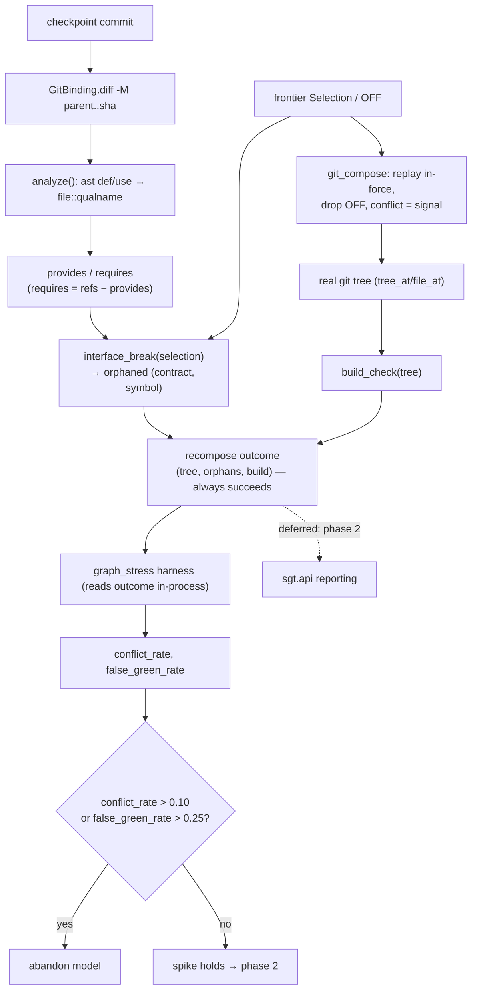

# feat: Contracts-over-git-substrate validation spike (§10.1)

## Summary

Build the additive §10.1 spike that measures whether the contracts-over-git model is worth committing to, before any machinery is deleted. It derives `provides`/`requires` interfaces from each commit's git diff, adds a deterministic `interface_break` gate that reports (never vetoes), composes an in-force subset by rebase-style replay, and runs a harness over the existing multi-project corpus to produce two numbers against a pre-committed kill criterion: compose-conflict rate and interface-gate false-green rate. Nothing in the current store is removed — the spike runs alongside it.

---

## Problem Frame

The design (`docs/design/2026-06-30-contracts-over-git-substrate.md`) rests on two claims and one bet: operations can be total with validity merely reported (design R2); a cheap symbol-level interface gate predicts the breaks we care about (design R5/R6); and an arbitrary in-force subset composes by cherry-pick/replay without frequent conflict (RISK-2). RISK-2 is the same mechanism that killed the predecessor `git-as-substrate` direction one day earlier (`memory/git-substrate-shelved-span-log.md`) — full-tree snapshots conflict whenever two decisions touch one function. The spike exists to get a **number** on that bet, not to make compose work. If the numbers fail the pre-committed ceiling, the model is abandoned: phase 2 (§10.2 git substrate) and phase 3 (§10.3 deletions) are not pursued. Nothing is deleted either way — deletion is deferred out of this spike regardless of the verdict (see Scope Boundaries).

Requirement IDs in this plan (R1–R8) are plan-local. References to the design ADR's requirements are written `design R<n>`; `RISK-<n>` always refers to the design ADR's risks.

---

## Requirements

### Derivation and gating

- R1. `provides`/`requires` are derived deterministically from a commit's git diff via a fresh `ast` def/use walk, keyed `file::qualname`, with `requires = refs - provides`. No LLM. (design R7, §4)
- R2. Move/rename detection is driven by `git diff -M` rename similarity, so a def moving file or scope keeps a stable symbol rather than reading as delete+add. (design §2.2; `memory/refactor-rename-distill-limitation.md`)
- R3. `interface_break(selection)` is deterministic and language-light: over in-force contracts it returns each `(contract, symbol)` where an in-force `requires` has no in-force `provides`. With no analyzer output it degrades to a no-op gate (design R5/R6, RISK-1).

### Total operations and compose

- R4. A recompose path always succeeds and returns `(tree, orphans, build)` — it never rolls back or refuses on invalidity. This proves R2 by turning the current `project.valid()` veto into a report. (design R2)
- R5. `git_compose` replays the in-force commits in original relative order, dropping OFF contracts (rebase-style, not arbitrary reorder); a git conflict is captured as a signal, not raised. Ground truth is the real git tree, never the effect-log materialization. (design R3, RISK-2; `memory/statement-distill-eid-lww.md`)

### Reporting and measurement

- R6 (deferred to phase 2). Surfacing orphans/build through `sgt.api` is production-surface work the spike does not need to produce its two rates — U6 reads the recompose outcome in-process. Kept as a numbered requirement for traceability; see Scope Boundaries. (CLAUDE.md one-projection rule applies when it lands.)
- R7. A harness over the `scripts/graph_stress/` corpus measures the compose-conflict rate and the interface-gate false-green rate, then evaluates them against the pre-committed ceilings and prints a go/no-go verdict. (design §10.1, §11)

### Boundary

- R8. The spike is additive: it deletes nothing (effect-log replay, `build_statement_seq`, reverse differ, AST blame, EICO gate all stay) and wires no repair hook. It runs alongside the current store. (design §10.1)

---

## Key Technical Decisions

- **A decision lane stands in for a Contract identity.** The spike does not build the full three-axis Contract model. Each existing decision lane (`sgt/decisions/model.py`) is treated as one Contract; `provides`/`requires` accumulate per lane across its commits. The shipped `Selection`/`OFF` frontier (`sgt/decisions/store.py`) is the in-force axis `interface_break` and `git_compose` consume. Wherever this plan says "contract," read "the lane standing in for it." This keeps the spike additive and small.
- **The per-contract `{provides, requires}` mapping is a new spike-local record.** `Frontier.in_force()` returns decision-id *strings*, not objects, so `analyze()` (U1) builds a `dict[in_force_id, ContractInterface]` keyed exactly as `in_force()` returns, and `interface_break` (U2) looks contracts up through it. The mapping is derived, not persisted into the decision store.
- **`analyze()` is a fresh `ast` walk over the git diff, not the effect-log distiller.** Reusing the distiller would inherit the module-level/import def-use constraints (`memory/distill-module-level-and-import-constraints.md`) and the eid/LWW body-materialization bug (`memory/statement-distill-eid-lww.md`). A lightweight diff-scoped walk (in the spirit of `Project._used_names`/`_defines`, `sgt/project.py`) sidesteps both. It reuses the `_is_entity_key` filter and `units()` qualnames so its keys align with the entity graph and lanes.
- **Rename/move detection comes from `git diff -M`, not a reimplemented body-similarity.** The prior top-level-only `_detect_renames` in `sgt/effects/diff.py` explicitly deferred cross-scope moves; git's own `-M` covers cross-file moves, and the harness exercises the deferred move-into-class case rather than hiding it.
- **The report path is additive, parallel to `algebra.apply`.** The veto is `project.valid()` inside `sgt/lifecycle/algebra.py` `apply`. Rather than mutate it, add a new recompose that always persists and returns an outcome carrying `orphans` and `build`. The real verb path stays intact (R8).
- **The harness extends `scripts/graph_stress/`.** It already has the multi-project corpus, the agent-implements-nodes loop, and expectation-capture (`memory/graph-stress-findings.md`). Reuse it; do not build a corpus from scratch.
- **Kill criterion is pre-committed and strict.** `conflict_rate > 0.10` → the compose-any-subset premise is in question; `false_green_rate > 0.25` → the interface gate is not load-bearing and design R5/R6 must be restated to "orphaning only". Either ceiling exceeded → abandon the model. Both use strict `>`: exactly `0.10`/`0.25` is HOLDS. A CRDT-grade tool should compose cleanly; frequent repair signals the wrong substrate.
- **LLM-free spike.** No repair hook (design §8.2 is out of scope and carries an unresolved one-rule tension). The spike reports orphans + build only.

---

## High-Level Technical Design

The spike is a read-side data flow layered over the existing store. A checkpoint commit is analyzed into a symbol interface; the interface feeds the cheap gate; compose runs on the real git tree; the recompose outcome is reported through `sgt.api`; the harness turns many recompose runs into two rates and a verdict.

The false-green rate is the join between the two right-hand branches: for each compose whose `build_check` fails, did `interface_break` predict it? A signature/arity change keeps the qualname, passes the gate, and breaks the build — that is a false green, and the rate of it decides whether the gate earns its place.

---

## Implementation Units

### U1. Diff-driven symbol derivation (`analyze()`)

- **Goal:** Produce `provides`/`requires` symbol sets for a commit from its git diff.
- **Requirements:** R1, R2
- **Dependencies:** none
- **Files:** `sgt/store/gitbind.py` (add a diff/name-status method — none exists today; `GitBinding` only snapshots trees/files), `sgt/contracts/analyze.py` (new), `tests/contracts/test_analyze.py` (new)
- **Approach:** Add `GitBinding.diff_name_and_text(parent, sha, find_renames=True)` parsing `git diff -M parent..sha` (name-status + hunk ranges; no such helper exists today). `analyze(diff)` parses each changed file's full post-commit content with `units()` (`sgt/effects/model.py`) to get the scope-qualified address space (`units()` needs a whole `ast.Module`, so a bare hunk can't be parsed alone), then **intersects each hunk's line range against every unit's `lineno..end_lineno`** to select the qualnames the commit actually touched — `provides` is that touched subset, not every def in the file. Refs (`ImportFrom`, `Call`, `Name`) inside touched units give `requires = refs - provides`. Keys are `f"{file}::{qualname}"`, filtered with `_is_entity_key` (`sgt/decisions/store.py`). Renamed/moved defs adopt the new path from `-M` so their symbol stays stable. `analyze()` accumulates the result into the per-contract `dict[in_force_id, ContractInterface]` record (see KTD) that U2 consumes.
- **Patterns to follow:** `Project._used_names`/`_defines` (`sgt/project.py`) for the ast walk shape; `tree_at`/`file_at` in `sgt/store/gitbind.py` for the subprocess idiom.
- **Test scenarios:**
  - Happy: a diff adding `f()` and calling library `g()` yields `provides={file::f}`, `requires={...::g}`.
  - `requires` excludes symbols the same commit provides (self-reference is not a require).
  - Cross-file move via `-M`: a def moved to another file keeps one stable symbol (no delete+add), so no spurious orphan.
  - Move-into-class (function → `Class.method`): document actual behavior — this is the deferred cross-scope blind spot; the test pins whether the symbol stays stable or splits.
  - Module-level statement / `from __future__` import: analyzer records refs without crashing; note-only cases don't produce phantom provides.
  - No analyzer input (binary/unsupported file): returns empty sets, not an error.

### U2. The `interface_break` gate

- **Goal:** Deterministically report orphaned requires over the in-force selection.
- **Requirements:** R3
- **Dependencies:** U1
- **Files:** `sgt/contracts/gate.py` (new), `tests/contracts/test_gate.py` (new)
- **Approach:** `Frontier.in_force()` returns decision-id *strings*, not objects, so `interface_break(selection)` maps each in-force id through U1's `dict[in_force_id, ContractInterface]` to get its `provides`/`requires`, unions the in-force `provides`, and returns `{(id, s) for id in in_force for s in interface[id].requires if s not in provided}`. Pure set logic over the mapping; no I/O.
- **Patterns to follow:** `frontier.in_force()` and `Selection`/`OFF` (`sgt/decisions/store.py`, `sgt/decisions/model.py`).
- **Test scenarios:**
  - No orphans when every in-force `requires` is satisfied by an in-force `provides`.
  - Turning a provider contract OFF orphans the downstream `requires` that depended on it.
  - Covers false-green measurement: a same-qualname signature change leaves the gate green (documents that the gate cannot see arity/type drift — the quantity U6 measures).
  - Empty `provides`/`requires` across all contracts (no analyzer) → gate returns no orphans (no-op).

### U3. `git_compose` — rebase-style replay

- **Goal:** Compose an in-force subset on the real git tree, capturing conflict as a signal.
- **Requirements:** R5
- **Dependencies:** none (consumes the frontier selection directly)
- **Files:** `sgt/store/gitbind.py` (cherry-pick/replay helpers), `sgt/contracts/compose.py` (new), `tests/contracts/test_compose.py` (new)
- **Approach:** Compose in an **isolated disposable `git worktree`** (or temp clone) per compose — never the live repo, since cherry-pick moves HEAD and the index and U6 runs hundreds of composes. Replay the selected contracts' commits in original relative order onto the base there, dropping OFF contracts. On conflict, `git cherry-pick --abort`, record `conflict=True` with the conflicting paths (do not raise), then discard the worktree. Read composed content via `tree_at`/`file_at` on the worktree — never the effect-log. The corpus repo's HEAD and working tree are never touched.
- **Execution note:** The isolation + cleanup path (create worktree → cherry-pick in order → read tree → drop worktree, with `--abort` on the conflict branch) is the correctness core; get it wrong and a mid-run compose corrupts the corpus and poisons the rates.
- **Patterns to follow:** `commit_shas()`, `tree_at`, `file_at` (`sgt/store/gitbind.py`); test idiom in `tests/store/test_gitbind.py` (real commits against `tmp_path`).
- **Test scenarios:**
  - Clean compose when the dropped contract is a leaf or touches disjoint files.
  - Conflict when the dropped middle contract co-edits a function that a kept later contract also edits (the killer case from `memory/orphan-plan-grounding-and-surfacing.md`).
  - Totality: compose never raises — it returns tree-or-conflict for every selection.
  - Composed tree is byte-faithful to the replayed commits (no `ast.unparse` round-trip drift).

### U4. Report-returning recompose (design R2: total, reported)

- **Goal:** A recompose that always succeeds and returns `(tree, orphans, build)` instead of vetoing.
- **Requirements:** R4 (instantiates design R2 — operations total, validity reported), R8
- **Dependencies:** U2, U3
- **Files:** `sgt/contracts/recompose.py` (new), `sgt/contracts/build.py` (new — the build oracle), `tests/contracts/test_recompose.py` (new), `tests/contracts/test_build.py` (new)
- **Approach:** Mirror the `plan_revert`/`apply` split (`sgt/lifecycle/algebra.py`) but replace `apply`'s `if not project.valid(): rollback; ok=False` with: always persist the selection, compute `orphans = interface_break(selection)` and `build = build_check(compose(selection))`, and return them in a new `ContractRecomposeOutcome` (distinct name — `algebra.py` already defines a `RecomposeOutcome`; do not conflate). **Do not modify `algebra.apply`** (enforces R8 — the recompose is a new independent path). `build_check` (`sgt/contracts/build.py`) writes the composed tree to a temp dir and runs an oracle **strong enough to catch signature/arity breaks** — `py_compile` alone is insufficient because Python is dynamic (a wrong-arity call is a runtime, not compile, error), so the oracle imports each changed module and runs the corpus project's tests (or a smoke import + entry-point call). It returns `{ok, detail}`. The oracle's strength is load-bearing: if it can't catch arity breaks, the false-green rate (U6) silently deflates below its ceiling and yields a false HOLDS.
- **Patterns to follow:** `plan_revert`/`plan_restore`/`apply` in `sgt/lifecycle/algebra.py`; `Orchestrator.revert` in `sgt/orchestrate/loop.py`.
- **Execution note:** Start with a failing test asserting a selection that today trips `project.valid()` now returns an outcome with orphans instead of `ok=False`.
- **Test scenarios:**
  - Covers design R2: a revert that `project.valid()` currently refuses now succeeds and reports the orphaned requires.
  - `build_check` flags a known arity break (call `f(1, 2)` where `f` takes one arg) as `ok=False` — proves the oracle catches what the interface gate misses.
  - Build result is captured on both a passing and a failing composed tree.
  - A git conflict from U3 surfaces inside the outcome, not as an exception.
  - The outcome persists the selection (the in-force axis moved) even when orphans exist.
  - `algebra.apply` is unchanged — the recompose is a separate code path (enforces R8).

### U5. Report through `sgt.api` — deferred to phase 2

Deferred (see Scope Boundaries). The spike verdict (U6) reads the `ContractRecomposeOutcome` in-process, so the spike does not need the shared projection to produce its two rates. Surfacing orphans/build through `sgt.api` extends a contract every client (VS Code, TUI, CLI, MCP) reads and only pays off if the spike holds — moved to phase 2 rather than extending the shared projection for a model that may be abandoned. If a human-inspectable view is wanted during the spike run, the harness prints the outcome; it does not touch `status_view`/`emit_payload`.

### U6. Measurement harness and kill-criterion verdict

- **Goal:** Produce the two rates over the corpus and evaluate them against the pre-committed ceilings.
- **Requirements:** R7
- **Dependencies:** U1, U2, U3, U4
- **Files:** `scripts/graph_stress/` (extend the driver/corpus), `scripts/spike_contracts_rates.py` (new), `tests/contracts/test_rates.py` (new — unit-tests the rate math and verdict, not the live run)
- **Approach:** For each corpus project, build a contract history, then run many mid-history-drop composes (reading each `ContractRecomposeOutcome` in-process) — biased toward co-edited shared functions and cross-file/move cases (the documented conflict and false-green amplifiers). Record: `conflict_rate` = conflicting composes / total composes; `false_green_rate` = build-failing composes the gate reported clean / build-failing composes. **When there are zero build-failing composes the false-green rate is defined as 0** (the gate is trivially accurate; 0/0 is not a failure). Emit a report and a verdict: `conflict_rate > 0.10 or false_green_rate > 0.25` → ABANDON, else HOLDS.
- **Patterns to follow:** `scripts/graph_stress/driver.py`, `projects.py`, `digest.py`; run via `uv run python scripts/...` like the existing e2e scripts.
- **Execution note:** The live harness run is the deliverable and may invoke the LLM to implement corpus nodes (as the existing stress harness does). Unit tests cover only the rate computation and the kill-criterion evaluation on synthetic inputs.
- **Test scenarios:**
  - Rate math: `conflict_rate` and `false_green_rate` compute correctly on hand-built compose-result fixtures.
  - Verdict: `0.11` conflict → ABANDON; `0.26` false-green → ABANDON; both under → HOLDS; exact-ceiling values (`0.10`, `0.25`) resolve to HOLDS per the stated `>` boundary.
  - Zero build-failing composes → `false_green_rate = 0` → not `> 0.25` → HOLDS (no 0/0 crash).
  - The harness records the move-into-class and co-edited-function cases explicitly (they are measured, not skipped).

---

## Scope Boundaries

In scope: the six units above — diff-driven symbol derivation, the interface gate, rebase-style compose, the report-returning recompose, the `sgt.api` report keys, and the measurement harness with its verdict.

### Deferred to Follow-Up Work

- Surfacing orphans/build through `sgt.api` (`status_view`/`emit_payload` — the retired U5). Deferred because U6 reads the recompose outcome in-process; extending the shared projection only pays off if the spike holds.
- The full three-axis `Contract` model and a dedicated `Contract-Id` trailer (the spike reuses existing lanes + the `Sgt-Node-Id` trailer).
- `git_compose` as the production substrate, `switch`-by-version, `rename`, `reduce` (design §10.2 — after the spike holds).
- Deleting the effect-log replay, `build_statement_seq`, reverse differ, AST blame, EICO gate; re-pointing `sgt.api` off them (design §10.3 — the scrubber's `materialize_at` re-derivation is the hard case there).
- Full CRDT collaborative merge, the `merge`/`apply` verb, LWW `Selection` (design §2.4 / R11 — depends on the spike holding).
- The LLM repair hook and its one-rule boundary (design §8.2 — unresolved Open Question in the origin).
- Multi-lens, named capabilities, transfer/regeneration (design §10.4).

---

## Risks & Dependencies

- **RISK-2 realized (the point of the spike).** Co-edited-function composes may exceed the 10% ceiling. That is a finding, not a plan failure — U6 is built to detect exactly it, biasing cases toward the shared-function scenario that shelved the predecessor.
- **`file::qualname` move blind spot inflates both rates.** Mitigated by `-M` (R2) and by including move cases in U6 so they are measured, not hidden. The move-into-class case is a known deferred gap (`memory/refactor-rename-distill-limitation.md`).
- **eid/LWW body-materialization bug could contaminate ground truth.** Mitigated by taking compose/build ground truth from the real git tree, never the effect-log path (KTD; `memory/statement-distill-eid-lww.md`).
- **Corpus generation hits the LLM (nondeterminism).** The stress harness implements nodes via an agent; fix prompts/seeds per the existing harness and sample enough composes that the rates are stable.
- **Trailer survival across rebase (design RISK-4) is inherited-unresolved.** The spike does not need it but must not assume it — it reads commits by sha within a single history, not across rebases.

---

## Open Questions

- **Sample size per project for the rates to be meaningful.** How many mid-history-drop composes per corpus project before `conflict_rate`/`false_green_rate` are trustworthy? Execution-time — decide when U6 runs, from the corpus size and variance observed.
- **Repair-hook boundary (design §8.2).** Out of spike scope, but the report surface (U5) must stop at reporting — no repair wiring — until the origin's Deferred/Open-Questions boundary is resolved.

---

## Sources / Research

- Origin: `docs/design/2026-06-30-contracts-over-git-substrate.md` — §4 (checkpoint algorithm), §5 (the two gates), §10.1 (the spike), §11 (decision + kill criterion).
- `sgt/lifecycle/algebra.py` — `plan_revert`/`apply` and the `project.valid()` veto the recompose path replaces (U4).
- `sgt/store/gitbind.py` — trailer round-trip and `tree_at`/`file_at`; no git-diff helper exists (U1/U3 add it).
- `sgt/decisions/store.py`, `sgt/entities/extract.py` — the `file::qualname` join key and `_is_entity_key` filter (U1).
- `sgt/project.py` — `_used_names`/`_defines` ast idiom (U1); `materialize`/`valid` (U4).
- `sgt/api.py`, `sgt/orchestrate/loop.py` — `status_view`/`emit_payload` shapes (U5, deferred to phase 2).
- `scripts/graph_stress/` — corpus + agent loop the harness extends (U6).
- Institutional learnings: `git-substrate-shelved-span-log.md` (why the predecessor failed on this exact mechanism), `refactor-rename-distill-limitation.md`, `statement-distill-eid-lww.md`, `distill-module-level-and-import-constraints.md`, `orphan-plan-grounding-and-surfacing.md`, `graph-stress-findings.md`, `decision-dag-pivot.md`.
