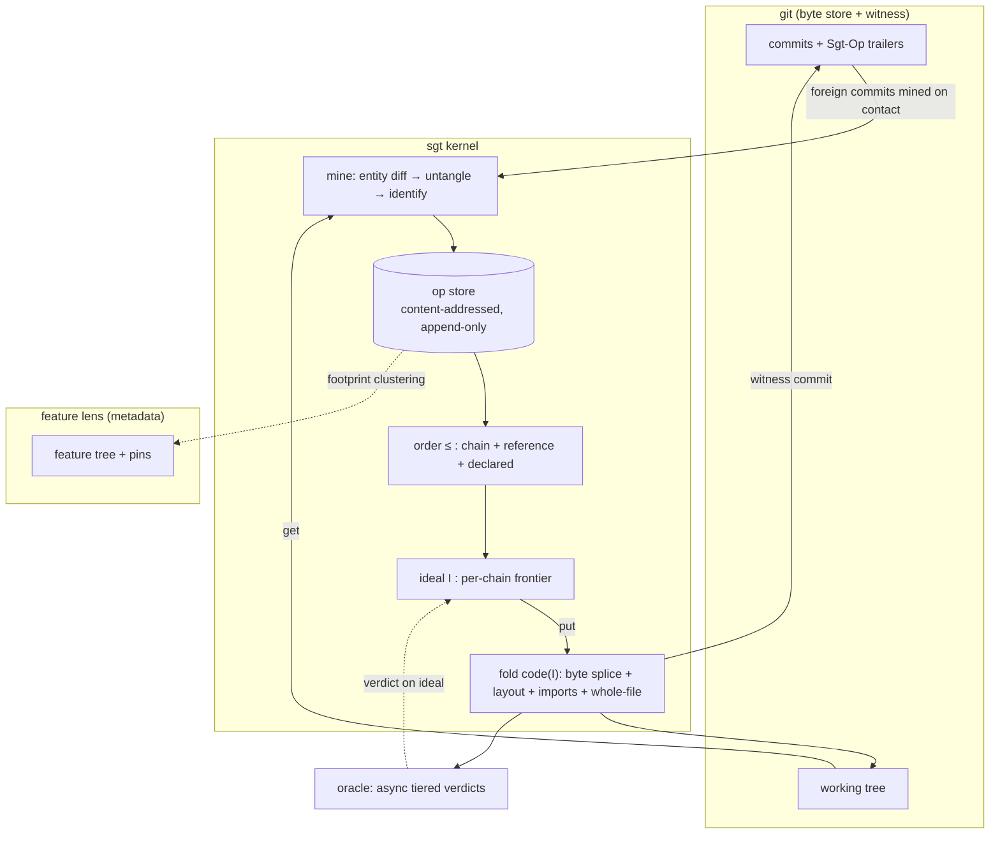
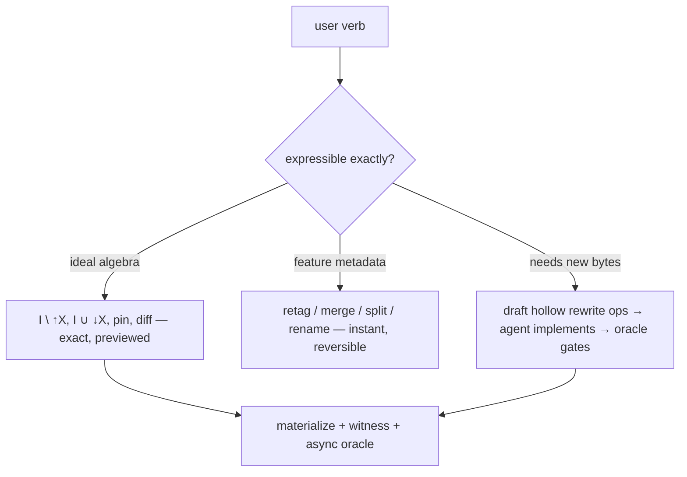

# feat: Implement the operation-ideal kernel

## Summary

Rebuild sgt around one kernel object and one law: history is a mined DAG of semantic operations over stable symbols, and a codebase state is an order ideal of that DAG. Every user verb becomes an exact ideal edit, an exact metadata edit on a hierarchical feature tree, or an explicit agent-authored rewrite op gated by the build/test oracle. The plan covers all six design phases, P0 through P5 (property harness → kernel → verbs + legacy deletion → feature lens → agentic loop → collaboration) and extends the origin ADR with the robustness requirements a corporate git-replacement bar demands: whole-file chains for non-parseable paths, an identification law for squash/rebase workflows, plain-git coexistence, store locking and recovery, an async tiered oracle, and LLM-drafted rewrite verbs where the algebra cannot be exact.

---

## Problem Frame

The corpus converged on the right ingredients — mined symbol patches, a commutation algebra, hierarchical clustering, typed operations — but assembled them as a ladder of fallbacks and a pile of coexisting mechanisms (effect log, Node store, EICO gate, decisions fold, replica merge engine). The 2026-07-06 ADR replaces that mixture with a single kernel from which every verb derives, and shapes the algebra so ill-formed states are unrepresentable rather than gated (see origin, §0–§3).

Flow analysis against real corporate workflows found the ADR as written cannot serve them: non-parseable files (config, lockfiles, docs, binaries) fall outside the state definition entirely; squash merges and rebases — the default GitHub workflow — would fork every touched chain; `git checkout` by a plain-git teammate desynchronizes mining; and the oracle is specified as a synchronous hard gate that no 30-minute corporate suite can live behind. This plan folds the fixes in as first-class requirements (per user decision), keeping the ADR's algebra untouched.

---

## Requirements

### Kernel algebra

- R1. History is an append-only, content-addressed store of operations mined from entity-granularity diffs and untangled by def-use connectivity; each op carries footprint, verbatim after-images, mined `requires`, derived kind, provenance, and optional intent.
- R2. Symbol identity is minted and rename-surviving via the tiered matcher (exact surface → content hash → structural hash → fuzzy with size-ratio guard), with split/merge provenance.
- R3. A codebase state is an order ideal: downward-closed, one maximal op per chain. `code(I)` is total, deterministic, and byte-faithful at entity granularity via raw-byte splicing — never `ast.unparse`.
- R4. The order `≤` is the transitive closure of chain edges, mined reference edges, and user-declared `sgt after` edges.
- R5. `revert` / `restore` / `cherry-pick` / `pin` are exact ideal edits with previews; the only conflict is a chain fork, resolved by a pin or an explicit merge op.
- R6. File layout folds from anchored slot insertions; a file's import block derives from the `requires` of its in-ideal symbols.

### Generality and robustness (the corporate bar)

- R7. Every repository path participates in the state model: paths with no parseable entities become whole-file pseudo-symbols with ordinary chains (binaries store git blob OIDs); `sgt state` surfaces the entity-granularity coverage fraction.
- R8. Identification law: mining a delta that lands a symbol on bytes identical to an existing chain version identifies with that op — never re-mints. Provenance is an appendable witness set tolerant of dangling SHAs. Squash merges and rebases therefore dedupe instead of forking.
- R9. Plain-git coexistence: sgt maintains a git-ref → ideal correspondence; on HEAD movement it re-bases the mining diff target to the new ref's witness commit; every materializing verb mines the dirty working tree first (get before put).
- R10. Adoption on large repos is bounded: `sgt init` accepts a history horizon, pre-horizon content becomes one genesis op per symbol, and deeper history is minable lazily. Ideals are represented as per-chain frontier vectors, not explicit op sets.
- R11. Concurrent processes cannot corrupt the store: single-writer lock plus atomic-rename writes on mutable metadata; `sgt fsck` verifies content addresses, chain linearity, ideal validity, and witness reachability, with re-mining as repair.
- R12. Mining is versioned and bit-deterministic across machines given a fixed (parser version, matcher thresholds); op-derivation caches key on `(commit SHA, miner version)`.

### Oracle

- R13. The oracle is a user-configured tiered command (parse-only → build → test-subset → full suite) with an async verdict model: materialization records `pending / pass / fail` on the ideal rather than blocking; verdicts can be re-run or human-overridden; a missing oracle degrades to the parse guarantee with a loud warning.

### Rewrite verbs (exact by algebra, or explicit by rewrite)

- R14. Where the algebra cannot be exact, the verb drafts hollow rewrite ops for an agent to implement, oracle-gated and attributed: `merge-op` (chain forks), `split-op` (sub-entity cuts), `transplant --onto` (backport onto diverged chains), `revert --keep-dependents` (remove X, rewrite dependents), and `identity split` / `identity join` (correct a wrong identity match, recorded as a matcher constraint).

### Feature lens

- R15. Features form a tree whose leaves partition the operations; each level has 5–9 children via target-arity CPM resolution search; recursion honors the NO-ORPHAN, STOP-SPLIT, and DEDUP rules.
- R16. Feature identity survives re-clustering via member-overlap matching; user curation persists as pins (must-link / cannot-link / assignment) respected on every future run; feature verbs (`merge` / `split` / `rename` / `move`) touch only metadata.
- R17. The LLM is confined to labels, tie-breaks, plan decomposition, and rewrite-op images; every LLM seam has a deterministic offline fallback.

### Agentic loop

- R18. Plan intake drafts hollow ops (predicted footprint, empty images) that live off-chain; checkpoint matching by footprint overlap moves them through an explicit lifecycle (`hollow → partially-matched → fulfilled | abandoned`); unpredicted ops surface as drift, retaggable in one gesture; rationale carries from plan to fulfilled op.

### Collaboration

- R19. Sync is op-store union (content-addressed, replica-free) plus tree reconciliation and per-chain fork surfacing; declared-edge cycles introduced by union are detected and surfaced.

### Quality gates

- R20. The round-trip laws are executable properties written before the kernel: put∘get fixed point, get∘put byte fidelity, idempotence, locality, coverage, every-verb-output-is-a-valid-ideal, squash-remine identification, and double-machine mining determinism. The golden corpus gates the legacy deletion.
- R21. All machine surfaces (CLI `--json`, MCP, TUI, VS Code) read the single `sgt.api` projection; schema changes are additive-only.
- R22. The five bets are measured by the P0 harness before P3 begins: untangling precision (BET-A), reference-edge recall (BET-B), hierarchy quality (BET-C), chain granularity (BET-D), and adoption scale (BET-E, added by this plan).

---

## Key Technical Decisions

- **Byte-splicing materialization.** Op images are verbatim bytes captured at mining; `code(I)` concatenates them. `ast.unparse` is banned from the fold — it loses comments and formatting, the exact bug class the adversarial critique flagged as the highest-value unbuilt fix (see `docs/design/2026-07-01-adversarial-critique-and-verification.md` §C).
- **Whole-file pseudo-symbol chains** are the third file-level fold alongside layout and imports. Any path yielding zero entities (unsupported language, unparseable state, config, docs, binaries) is one symbol whose images are whole-file bytes (blob OID for binaries). Conflicts on such paths degrade honestly to file-granularity chain forks. This makes `code(I)` well-defined for the entire tree and gives unsupported languages graceful file-granularity coverage.
- **Identification law keyed on `(before_version, after-image hash)`.** Mining never re-mints an op whose footprint lands identical bytes on an existing chain version; it appends a witness. This one rule makes squash merges, rebases, and re-mines converge, and doubles as the migration mechanism when the miner algorithm is upgraded.
- **Ideals are per-chain frontier vectors plus exceptions**, not explicit sets. Membership, `↑X` / `↓X`, and diff are computed against chain positions and the reference-edge graph. Chosen now because it is prohibitively expensive to retrofit after P2 writes the store format.
- **Op ids are content-addressed over `(payload, miner-version)`**; derivation caches key on `(commit SHA, parser version)`. This is the honest form of the determinism claim: deterministic set arithmetic given fixed knobs, property-tested on the load-bearing outputs (dependency edges used by revert/cherry-pick).
- **Hollow ops are kernel objects but live off-chain** until fulfilled. They never reserve a `before_version`, so a human editing the same symbol mid-plan cannot create a phantom fork. Fulfillment splices the mined op onto the chain and transfers intent/rationale.
- **Oracle is async and tiered** (R13). Materialization is never blocked on a slow suite; the verdict is state on the ideal. Parseability needs no oracle — it holds by construction.
- **`.sgt/` layout: committed ops, local state separate.** `.sgt/ops/` (one content-addressed file per op) and `.sgt/tree/` + `.sgt/pins/` are committed — append-only one-file-per-op makes push conflicts structurally impossible for ops; tree/pin conflicts route through P5 reconciliation. `.sgt/local/` (ref→ideal table, caches, oracle verdicts) is gitignored. Git remains the transport, so P5 sync needs no new channel.
- **Promote, don't rewrite, the experiment pipeline.** `experiments/patch_clustering/{mine,identity_match,leiden_cluster,hierarchy,operations,label}.py` move under `sgt/` with path shims and `global` mutations removed; `igraph`/`leidenalg` become a declared `[lens]` extra. The tiered identity matcher is kept verbatim — it encodes the name-collision lesson and has standalone tests to port.
- **Legacy deletion is sequenced behind green laws.** The EICO gate, Node store, effect log, replica engine, and decisions fold are deleted only in U10, after the round-trip laws and golden corpus pass on the kernel — the critique's explicit warning against rewriting the store before repair reliability is measured.
- **Language generality lives at the Entity seam.** Everything downstream of `sgt/entities/extract.py` is language-neutral; adding a language is one grammar dep plus registry entries. This plan adds no new grammars; the whole-file fallback covers the rest visibly (R7).
- **Test-first posture for the laws.** The P0 harness is written first and red, per the origin ADR; it is also the de facto CI, since the repo has none.

---

## High-Level Technical Design

The kernel and its lens:



Hollow-op lifecycle (R18):

```mermaid
stateDiagram-v2
  [*] --> hollow: plan intake drafts op (footprint predicted, images empty, off-chain)
  hollow --> partially_matched: checkpoint mines ops overlapping footprint
  partially_matched --> fulfilled: overlap threshold met — mined op splices on-chain, rationale transfers
  hollow --> abandoned: plan abandoned / session sweep
  partially_matched --> abandoned
  fulfilled --> [*]
  note right of partially_matched: n:m matches surface as reviewable suggestions, never silent
```

Verb dispatch — every user action resolves to one of three planes:



---

## Scope Boundaries

### Deferred to Follow-Up Work

- New language grammars beyond Python/TS/TSX (the Entity seam and whole-file fallback make each addition incremental).
- CI-verdict attachment (a pushed witness commit's CI result attaching to its ideal) — the async oracle model leaves the slot open.
- Lockfile "derived file" refinement (regenerate-on-materialize) — whole-file chains ship first.
- Deep-history lazy mining beyond the genesis horizon (the horizon mechanism ships; background back-fill is follow-up).
- Secret purging from the op store (tombstone convention for dropped images) — documented limitation for v1.

### Outside this product's identity

- sgt authors no code; agents do, behind explicit rewrite ops.
- No text CRDT, ever — same-symbol ops chain, they never merge textually.
- Git is not replaced as byte store, transport, or audit log; sgt cannot be locked out of its own repo.
- Side-branch structure of already-squashed merges is not reconstructed (first-parent mining; the identification law absorbs the pain).
- Submodules beyond pointer-as-whole-file-chain.

---

## Implementation Units

### Phase P0 — Freeze the ground

### U1. Round-trip law property harness and golden corpus

- **Goal:** The executable definition of kernel correctness, written first and red.
- **Requirements:** R20, R22
- **Dependencies:** none
- **Files:** `tests/laws/corpus.py`, `tests/laws/test_roundtrip.py`, `tests/laws/test_determinism.py`, `pyproject.toml` (add `hypothesis` to `[dev]`)
- **Approach:** Corpus = this repo's history plus two external repos, one genuinely large (≥50k commits) with wall-clock and store-size budgets as pass/fail (BET-E). Laws as properties over corpus slices: put∘get fixed point, get∘put byte fidelity at entity granularity, mining idempotence, locality, coverage (every path in exactly one symbol's image set — whole-file paths included), verb-output-is-valid-ideal, squash-remine identification, double-mine determinism. Laws that need the kernel are written as failing/skipped-with-reason tests now and un-skipped per unit.
- **Execution note:** Test-first — the harness lands red before any kernel code.
- **Patterns to follow:** `tests/golden/corpus.py` deterministic-corpus style (no LLM/network/timestamp leakage); descriptive test names stating the failure guarded.
- **Test scenarios:** This unit *is* tests. Meta-coverage: corpus builder reproduces identical fixtures across two runs; law suite runs offline; large-repo budget asserts init wall-clock and `.sgt/` size ceilings.
- **Verification:** `uv run pytest tests/laws/` collects all laws; kernel-dependent laws are red or skipped-with-reason; budgets are encoded, not prose.
- I'm adding `hypothesis` because R20's laws are ∀-quantified over edit sequences and nothing in the existing deps generates cases; it is dev-only.

### U2. Promote mining and identity into the kernel

- **Goal:** `sgt/core/mine.py` and `sgt/core/identity.py` produce the op stream: entity diffs, residue symbols, whole-file pseudo-symbols, def-use untangling, tiered identity.
- **Requirements:** R1, R2, R7, R12, R22
- **Dependencies:** U1
- **Files:** `sgt/core/mine.py`, `sgt/core/identity.py`, `tests/core/test_mine.py`, `tests/core/test_identity.py` (port `experiments/patch_clustering/test_identity_match.py` under `testpaths`)
- **Approach:** Promote `experiments/patch_clustering/{mine,identity_match}.py` (remove path shims; keep matcher tiers and guard constants verbatim). Add: module-level residue symbols and the two per-file pseudo-symbols (layout, imports); whole-file pseudo-symbol emission for zero-entity paths (blob OID images for binaries); ClusterChanges-style def-use untangling of tangled commits into multiple ops; miner-version stamp in every op payload. Measure BET-A (untangling precision vs a hand-untangled sample) and identity churn on the corpus; record results in `FINDINGS.md`.
- **Patterns to follow:** module docstrings as architecture documentation; determinism notes per function; explicit tie-breaks (sorted keys) where set order would leak.
- **Test scenarios:** rename+reformat matches via structural hash, not fuzzy tier; `__init__`-collision case from the ported tests still passes; a commit touching two def-use-disjoint symbol groups yields two ops; a YAML edit yields one whole-file op; a binary change yields a blob-OID image; an unparseable mid-edit Python file degrades to whole-file, not zero entities; mining the corpus twice yields byte-identical op payloads; cross-scope move (top-level def → method) is at worst delete+add with split provenance, never a silent weld.
- **Verification:** mining laws in U1 (idempotence, coverage, double-mine) go green; BET-A/churn numbers recorded.

### Phase P1 — The kernel

### U3. Op model, content-addressed store, locking, fsck

- **Goal:** The durable substrate: `Op` as a frozen value type; append-only one-file-per-op store; safe concurrent access; integrity checking.
- **Requirements:** R1, R11, R12
- **Dependencies:** U2
- **Files:** `sgt/core/op.py`, `sgt/core/store.py`, `sgt/cli.py` (add `fsck` verb), `tests/core/test_store.py`
- **Approach:** Op id = hash over (payload, parents, miner-version). Layout: `.sgt/ops/<id>` committed; `.sgt/local/` gitignored (created with a `.gitignore` inside). Hollow ops are ordinary `Op` values with empty images and an off-chain flag (R18 substrate lives here; workflow comes in U14). Single-writer `flock` on `.sgt/lock`; all mutable-file writes are write-temp-then-rename. `sgt fsck`: verify content addresses, chain linearity, witness reachability; report or re-mine as repair.
- **Test scenarios:** same payload → same id across processes; store rejects an op whose hash doesn't match its content; two concurrent writers — second blocks or fails cleanly, store never half-written (kill -9 mid-write leaves no torn file after rename discipline); fsck detects a bit-flipped op file and a broken chain link; hollow op round-trips with empty images.
- **Verification:** store survives a crash-injection loop; fsck clean on the corpus store.

### U4. Order and ideals

- **Goal:** `≤` from three edge sources; ideals as frontier vectors; validity; up-set/down-set queries.
- **Requirements:** R3, R4, R10
- **Dependencies:** U3
- **Files:** `sgt/core/order.py`, `sgt/core/ideal.py`, `tests/core/test_order.py`, `tests/core/test_ideal.py`
- **Approach:** Chain edges from footprints; reference edges from mined `requires` resolved through identity; declared edges from a persisted `after` set. Ideal = per-chain frontier position + exception set; membership, `↑X`, `↓X`, symmetric diff computed without materializing op sets. Validity = downward-closure plus unique-maximal-per-chain; a fork (two tips) is representable as a *pending* state that renders both tips flagged, but no verb may commit an invalid ideal.
- **Technical design (directional):** frontier vector maps `sym → chain index`; exceptions handle version-pins below other in-ideal references only when validity allows; `↑X` walks reference+chain edges forward with memoized reachability.
- **Test scenarios:** downward-closure violation is unconstructible through the public API; `revert` of a mid-chain op removes its up-set exactly (property, hypothesis-generated DAGs); `↓X` of an op includes declared-edge ancestors; chain fork detected when two ops share `before_version`; frontier representation and naive-set semantics agree on randomized small DAGs; ideal diff is symmetric difference.
- **Verification:** U1's verb-output-validity law green for constructors; performance smoke on the large-corpus DAG (up-set query budget).

### U5. The fold — `code(I)`

- **Goal:** Total, deterministic materialization: byte splice + layout fold + derived imports + whole-file chains.
- **Requirements:** R3, R6, R7
- **Dependencies:** U4
- **Files:** `sgt/core/fold.py`, `tests/core/test_fold.py`
- **Approach:** Per symbol: after-image of the maximal in-ideal op, verbatim bytes. Layout: anchored insertions linearized deterministically; anchor-disjoint additions commute. Imports: union of `requires` of in-ideal symbols hosted by the file, rendered in a canonical order that preserves `from __future__` first. Whole-file symbols bypass splicing. Removed symbols (⊥ image) vanish along with their import contributions.
- **Test scenarios:** untouched entity is byte-identical through get∘put including comments and odd formatting (the `ast.unparse` regression class); two features adding functions at different anchors materialize in both single-feature ideals and the union; reverting a feature removes its imports (Covers the derived-imports acceptance below); `from __future__` ordering preserved (regression from `docs/design/2026-06-21-distiller-blind-spots.md`); module-level constant residue symbol materializes; file with only whole-file chain materializes exact bytes; empty file and deleted file handled.
- **Verification:** get∘put law green at entity granularity on the corpus.

### U6. The lens — get/put integration with git

- **Goal:** The bidirectional loop: mine on contact (any foreign commit, dirty tree), materialize with witness commits, identification law, ref→ideal tracking.
- **Requirements:** R8, R9, R10, R20
- **Dependencies:** U5
- **Files:** `sgt/core/lens.py`, `sgt/store/gitbind.py` (extend: op-id trailers, ref→ideal table in `.sgt/local/`), `tests/core/test_lens.py`
- **Approach:** `get`: diff working tree or new commits against the ideal's witness state → U2 mining → identification check (`(before_version, image-hash)` match ⇒ append witness, no new op) → append genuinely new ops → advance ideal. HEAD-movement detection: on ref switch, re-base the diff target to the new ref's witness and mine only foreign commits. `put`: `code(I)` → tree → commit with `Sgt-Op:` trailers. `sgt init --horizon <ref>`: genesis ops per symbol at the horizon. Mine-before-materialize is enforced in this layer for every verb.
- **Test scenarios:** Covers AE1 — squash-merged copy of already-mined work creates zero new ops; rebase of mined commits identifies, provenance gains witnesses; `git checkout` to another branch then `sgt state` fabricates no phantom ops; dirty tree at revert time is mined first, then the revert applies over it; foreign hotfix commit mined on next contact; `sgt init` on the large corpus repo within U1 budgets; horizon init followed by an edit to a pre-horizon symbol chains onto its genesis op; put∘get fixed-point law green.
- **Verification:** all remaining U1 mining/lens laws green; this is the round-trip milestone.

### U7. Read verbs — `sgt log`, `sgt state`, `sgt diff`

- **Goal:** The kernel is useful naked: inspect the DAG, the current ideal, and ideal-vs-ideal semantic diffs.
- **Requirements:** R7, R21
- **Dependencies:** U6
- **Files:** `sgt/cli.py`, `sgt/api.py` (add `oplog_view`, `state_view`, `ideal_diff_view`), `tests/test_api.py`, `tests/golden/corpus.py` + snapshots
- **Approach:** Additive api views only; `state_view` includes entity-granularity coverage fraction (R7) and oracle verdict when present. CLI follows the `_VERBS` + `_verbname(repo, rest, as_json)` pattern with lazy imports.
- **Test scenarios:** `state_view` coverage fraction correct on a mixed Python/YAML fixture; `ideal_diff_view` between a branch ideal and main lists exactly the symmetric-difference ops grouped by symbol; views are pure over a freshly opened project (no network); golden snapshots capture the new views.
- **Verification:** golden snapshot run green; `sgt log/state/diff --json` outputs match api views byte-for-byte.

### Phase P2 — The verbs

### U8. Ideal-edit verbs with previews

- **Goal:** `revert`, `restore`, `cherry-pick`, `pin`, `after` as pure-plan + apply operations with `--emit` previews and chain-fork surfacing.
- **Requirements:** R5, R14 (surfacing only), R20
- **Dependencies:** U7
- **Files:** `sgt/core/verbs.py`, `sgt/cli.py`, `sgt/api.py` (preview views), `tests/core/test_verbs.py`
- **Approach:** Follow the `plan_* / apply` pattern from `sgt/lifecycle/algebra.py`: compute the ideal edit and its preview (op set, affected symbols, feature-grouped blast radius once P3 lands; symbol-grouped until then) with no I/O, then apply = materialize via U6. Pin is defined as up-set subtraction on the truncated chain suffix — when the induced up-set is non-empty the preview shows it, so the one law is never violated. Verb targets resolve through one resolver (op id, symbol, later feature).
- **Test scenarios:** revert X removes exactly `↑X` and the preview listed it; restore is revert's inverse on the same ideal; cherry-pick `↓X` into a branch ideal that shares prefixes splices cleanly; cherry-pick into a diverged ideal surfaces the chain forks and refuses to commit an invalid ideal (Covers AE2); pin to an older version with dependents shows the induced up-set removal; `after` edge changes a subsequent revert's closure; every verb output passes the validity law (property test); `--emit` previews are side-effect free.
- **Verification:** verb-validity law green across hypothesis-generated verb sequences.

### U9. The oracle

- **Goal:** Async tiered build/test verdicts attached to ideals — the sole semantic gate.
- **Requirements:** R13
- **Dependencies:** U8
- **Files:** `sgt/core/oracle.py`, `sgt/config.py` (oracle command config), `sgt/api.py` (verdict in `state_view`), `tests/core/test_oracle.py`
- **Approach:** Config declares tier commands (e.g. `parse`, `build`, `test`); materialization enqueues a verdict record (`pending`) in `.sgt/local/`; `sgt oracle run [--tier]` executes and stores pass/fail + log excerpt; `sgt oracle override` records a human verdict with attribution. No config → warn once, verdicts absent. Rewrite-op gating (U11, U14) consumes verdicts.
- **Test scenarios:** materialize with no oracle configured warns and proceeds; failing tier records `fail` with the command's exit and output tail; override supersedes with attribution; re-run replaces a stale verdict; verdict is keyed to the ideal (a subsequent edit resets to `pending`); slow command does not block the materializing verb (async model).
- **Verification:** verdict lifecycle covered; `state_view` shows the verdict.

### U10. Delete the legacy mechanisms; flip CLI and MCP onto the kernel

- **Goal:** One kernel, no mixture: remove the effect log, EICO gate, quarantine, Node store, replica/Lamport engine, decisions fold, statement-slot CRDT; re-point every surface.
- **Requirements:** R20, R21
- **Dependencies:** U8, U9 (and U1 laws green through U8)
- **Files:** delete `sgt/effects/` (model, diff, stmt_distill, stmt, body), `sgt/engine/` (confluence, commute), `sgt/orchestrate/quarantine.py`, `sgt/store/{graph,oplog,replica,clock}.py`, `sgt/decisions/`, `sgt/lifecycle/algebra.py`, `sgt/merge/engine.py`, `sgt/entities/cluster.py`; rewrite `sgt/project.py`, `sgt/orchestrate/loop.py`, `sgt/mcp/server.py`, `sgt/cli.py`, `sgt/api.py` onto kernel modules; prune `tests/` mirrors of deleted packages; update golden snapshots.
- **Approach:** Golden corpus is the characterization net: capture `sgt.api` views before, flip, compare (schema-additive drift only). Migration: `Project.open` detects a legacy `.sgt/` and offers one-shot re-mining into the kernel store (history mines from git, so nothing is lost). Carry forward the distiller regression tests that still apply (`from __future__`, module-level bindings) into fold/lens tests before deleting their homes.
- **Execution note:** Characterization-first — snapshot every surviving api view against the legacy implementation before deleting it.
- **Test scenarios:** legacy `.sgt/` migrates then all read verbs work; every CLI verb in `_VERBS` either works on the kernel or is removed from help (fix the stale `sgt map`/`timeframe` help wart); MCP tool list responds post-flip with kernel-backed tools; no module under `sgt/` imports a deleted module (import-lint test); test count drops only by the deleted packages' mirrors.
- **Verification:** full suite green; golden diff reviewed; `grep`-level check that `EffectLog`, `NodeStatus`, EICO references are gone.

### U11. Rewrite verbs — the explicit escape hatch

- **Goal:** `merge-op`, `split-op`, `transplant --onto`, `revert --keep-dependents`, `identity split/join` — LLM/agent-drafted where the algebra cannot be exact.
- **Requirements:** R14, R17
- **Dependencies:** U9, U10
- **Files:** `sgt/core/rewrite.py`, `sgt/cli.py`, `sgt/api.py` (draft/review views), `tests/core/test_rewrite.py`
- **Approach:** Each verb computes the exact part (target chain tips, dependent set, containment split) and drafts hollow rewrite ops with intent prefilled; the agent (or human) supplies images through `sgt fulfill <op> --from-tree` or the P4 loop; the oracle verdict gates landing. `merge-op` takes both fork tips as parents. `identity split/join` rewrites the identity relation and records a permanent matcher constraint (mirroring feature pins); chains re-derive. Offline fallback everywhere: verbs fully work with a human authoring images, no API key required.
- **Test scenarios:** chain fork + `merge-op` drafted with both parents, lands only after a pass verdict, ideal becomes valid; transplant of two ops onto a diverged release ideal drafts hollows with target tips as `before_version` (Covers AE3); `revert X --keep-dependents` subtracts `↑X` and drafts one hollow per dependent, preview groups by symbol; `split-op` on a two-concern op produces an intermediate image whose chain reads original→intermediate→after; wrong fuzzy weld corrected by `identity split` — subsequent re-mine respects the constraint; all rewrite landings blocked while verdict is `pending` or `fail` unless overridden.
- **Verification:** each verb round-trips on a fixture repo; constraint persistence across re-mining verified.

### Phase P3 — The feature lens

### U12. Hierarchical feature tree over ops

- **Goal:** The map: op-footprint clustering, target-arity recursion, Greene identity, pins.
- **Requirements:** R15, R16, R17, R22
- **Dependencies:** U10 (BETs measured per R22)
- **Files:** `sgt/lens/cluster.py`, `sgt/lens/tree.py`, `sgt/lens/label.py`, `sgt/lens/pins.py`, `pyproject.toml` (declare `igraph`, `leidenalg` under `[lens]`), `tests/lens/test_tree.py`, `tests/lens/test_pins.py`
- **Approach:** Promote `experiments/patch_clustering/{leiden_cluster,hierarchy,operations,label}.py`: cluster ops via footprints over the fused coupling graph (hub-strip and size caps kept verbatim); replace fixed gammas with binary search on CPM resolution to 5–9 children per level; keep NO-ORPHAN / STOP-SPLIT / DEDUP; remove the `global MAX_DEPTH` mutation. Identity: Greene member-overlap matching across runs with named `birth/death/merge/split/continuation` events (replaces the Jaccard scheme in the deleted `sgt/entities/cluster.py`). Pins persist in `.sgt/pins/` as must-link / cannot-link / assignment constraints fed to every run; unsatisfiable pin sets are detected and surfaced, latest-wins with a log. Labeling: pydantic-typed LLM call with member-hash cache and deterministic fallback, dirty nodes only.
- **Test scenarios:** every level of the tree on the corpus has 5–9 children (or a STOP-SPLIT/MAX_LEAF reason); re-clustering after one small commit renames nothing (Greene continuation, identity-churn budget); a pinned op never leaves its assigned feature across ten re-runs; must-link ∧ cannot-link contradiction surfaces, does not crash; offline run (no API key) produces deterministic fallback labels; BET-C MoJoFM measured against a hand-labeled map and recorded.
- **Verification:** tree invariants (partition totality, arity) as properties; pin persistence across re-cluster verified.

### U13. Feature verbs and surface re-pointing

- **Goal:** `sgt map` replaces `sgt graph`; feature `merge/split/rename/move`; blame/status derive from the kernel; TUI and VS Code read the new projection.
- **Requirements:** R16, R21
- **Dependencies:** U12
- **Files:** `sgt/api.py` (`map_view`, kernel-backed `blame_view`/`status_view`), `sgt/cli.py`, `sgt/lens/verbs.py`, `sgt/tui/app.py`, `editor/vscode/src/` (read new views), `tests/lens/test_feature_verbs.py`, golden snapshots
- **Approach:** Feature verbs are op-set retags + one pin written; all instant, reversible, content-untouched. Blame = `sym → max-op-in-I → feature`, one lookup. Verb-target resolver gains feature names. Surfaces keep the OKLCH hue-is-identity discipline and color-parity test.
- **Test scenarios:** feature merge unions op-sets and keeps the survivor id; split proposes a clusterer cut and applies only on confirm; move of three ops retags and writes one pin; feature verbs change zero bytes in `code(I)` (property: fold before == fold after); blame on a symbol returns the feature of its maximal in-ideal op; `revert <feature>` resolves to its op-set then runs the U8 ideal edit with feature-grouped preview.
- **Verification:** golden snapshots for `map_view`; VS Code extension renders against a fixture `.sgt/`.

### Phase P4 — The agentic loop

### U14. Plan intake, checkpoint matching, drift review

- **Goal:** Plan mode is a first-class citizen: hollow ops from plan text, fulfillment by footprint overlap, drift surfaced, rationale carried.
- **Requirements:** R17, R18
- **Dependencies:** U11, U13
- **Files:** `sgt/loop/plan.py`, `sgt/loop/match.py`, `sgt/mcp/server.py` (tools: `sgt_plan_intake`, `sgt_checkpoint`, `sgt_drift`), `sgt/api.py` (plan/drift views), `tests/loop/test_match.py`, `tests/mcp/test_server.py`
- **Approach:** Intake decomposes plan text (LLM, deterministic fallback = one hollow op per plan section) into hollow ops with predicted footprints under predicted features (must-link priors). Matching is n:m by footprint overlap with a threshold; partial matches surface as reviewable suggestions, never auto-resolved. Hollow ops carry session id; `sgt plan abandon` and a staleness sweep close the lifecycle. Fulfilled ops inherit intent/rationale — the one non-derivable field. Session hooks are optional enrichment; the next commit is the graceful-degrade signal.
- **Test scenarios:** plan with three steps drafts three hollows off-chain; agent lands one commit fulfilling two hollows — both match, review view shows the 2:1 mapping; unpredicted op appears as drift, retag-to-feature in one call; abandoned session's hollows swept, none linger; human edits a symbol a hollow predicted — no phantom fork (hollow is off-chain); rationale readable on the fulfilled op; MCP tools tested through the pure `handle_request` dispatch per existing convention; intake works offline with fallback decomposition.
- **Verification:** end-to-end fixture: plan → simulated agent commits → checkpoint → fulfilled + drift states correct.

### Phase P5 — Together

### U15. Sync — op-store union and tree reconciliation

- **Goal:** Collaboration: pull a teammate's ops through git, union stores, reconcile trees, surface forks.
- **Requirements:** R8, R19
- **Dependencies:** U14
- **Files:** `sgt/core/sync.py`, `sgt/lens/reconcile.py`, `sgt/cli.py` (`sgt sync`), `tests/core/test_sync.py`
- **Approach:** Ops travel as committed `.sgt/ops/` files; union is file-set union (content-addressed ids make duplicates impossible; the U6 identification law absorbs squash/rebase divergence between replicas). Tree reconciliation = Greene matching between the two trees + pin union, unsatisfiable combinations surfaced. Same-symbol concurrency appears as chain forks routed to `merge-op`/`pin` (U11). Declared-edge cycles introduced by union are detected and surfaced for `after` retraction. Footprint-disjoint work merges with zero interaction.
- **Test scenarios:** Covers AE4 — two clones edit disjoint symbols, sync merges with no interaction and both ideals materialize; same symbol edited in both — fork surfaces on exactly that chain, `merge-op` resolves; one side squash-merged the other's PR — union creates zero duplicate ops; conflicting pins surface with both attributions; `after` cycle from two replicas detected; sync is idempotent (second run is a no-op).
- **Verification:** two-clone integration test through real git remotes (local bare repo); double-mine determinism law (U1) green across both clones.

---

## Acceptance Examples

- AE1. **Given** a repo where a feature branch was mined locally, **when** the PR lands on main as a squash merge and sgt next contacts main, **then** no new ops are minted; the existing ops gain the squash commit as a witness.
- AE2. **Given** a release ideal whose `slugify` chain diverged from main, **when** the user cherry-picks a feature touching `slugify`, **then** the preview surfaces the chain fork and the verb refuses to produce an invalid ideal, offering `transplant` instead.
- AE3. **Given** the AE2 refusal, **when** the user runs `transplant --onto release`, **then** hollow rewrite ops appear with the release chain tips as `before_version`, and landing is blocked until the oracle passes.
- AE4. **Given** two teammates on separate clones editing disjoint symbols, **when** either runs `sgt sync` after a git pull, **then** the op stores union with zero interaction and both working trees materialize.
- AE5. **Given** a repo that is 40% YAML/Markdown by path count, **when** the user reverts a feature that added a dependency, **then** the `pyproject.toml` whole-file chain reverts with it and `sgt state` reports the entity-granularity coverage fraction honestly.
- AE6. **Given** no oracle configured, **when** any verb materializes, **then** the operation succeeds with a single loud warning and the ideal carries no verdict rather than a fake pass.

---

## Risks & Dependencies

- **The four origin bets plus scale (R22).** BET-A/B failures mean coarser ops and louder oracle use — the algebra is unaffected; BET-C failure means heavier pin reliance — the kernel is unaffected. The P0 harness measures all five before P3 spends effort on the lens. Mitigation is the phase gate, not hope.
- **Reference-edge recall (~70% in Python)** under-approximates up-sets; revert previews can miss dependents. Backstops: oracle verdicts, `sgt after`, and the miss rate folding into BET-B measurement.
- **Fuzzy identity welds** at scale corrupt chains silently. Backstop: `identity split/join` (U11) plus the matcher's ask-bias (false negative preferred over false positive, per the identity ADR).
- **Legacy deletion is a one-way door.** Gated behind green laws and golden characterization (U10); the git history and re-mining make code recoverable, but sidecar semantics (witness records, quarantine states) are dropped intentionally — named here so the drop is a decision, not an accident.
- **`leidenalg`/`igraph` are C-extension deps** entering the declared dependency set for the first time; they are confined to the `[lens]` extra so the kernel installs without them.
- **Verbatim images inflate the store** on hot files. Content-addressing dedupes identical images only; the U1 store-size budget on the large corpus is the tripwire, and image-delta encoding is the known follow-up if it fires.

---

## Open Questions

- Overlap threshold for checkpoint matching (U14) and Greene matching θ (U12): set from corpus measurement during P0/P3, not decided here.
- Whether `.sgt/tree/` conflicts on push should auto-reconcile on pull or require an explicit `sgt sync` — decide during U15 from dogfooding friction.
- Genesis-horizon default (`HEAD~N` vs full history) for `sgt init` on large repos — decide from BET-E numbers.

---

## Sources & Research

- Origin ADR and its lineage: `docs/design/2026-07-06-operation-ideal-kernel.md`, `docs/design/2026-07-02-patch-first-clustering-lens.md` (determinism boundary, clustering recipe, literature grounding), `docs/design/2026-07-01-symbol-identity-scheme.md` (minted id, ask-bias on fuzzy matches).
- Adversarial critique that shaped three KTDs (byte-splicing, determinism honesty, deletion sequencing): `docs/design/2026-07-01-adversarial-critique-and-verification.md`.
- Kernel embryo to promote: `experiments/patch_clustering/mine.py`, `identity_match.py` (+ standalone tests), `leiden_cluster.py`, `hierarchy.py`, `operations.py`, `label.py`; committed `out/*.json` runs are usable fixtures.
- Conventions to preserve: single projection in `sgt/api.py`; golden-master harness in `tests/golden/`; CLI verb pattern in `sgt/cli.py`; pure-plan+apply in `sgt/lifecycle/algebra.py`; trailer discipline in `sgt/store/gitbind.py`.
- Known regression classes to carry forward as tests: `from __future__` import ordering and module-level bindings (`docs/design/2026-06-21-distiller-blind-spots.md`), rename→delete+add degradation across scopes (`FINDINGS.md`, 2026-06-19).
