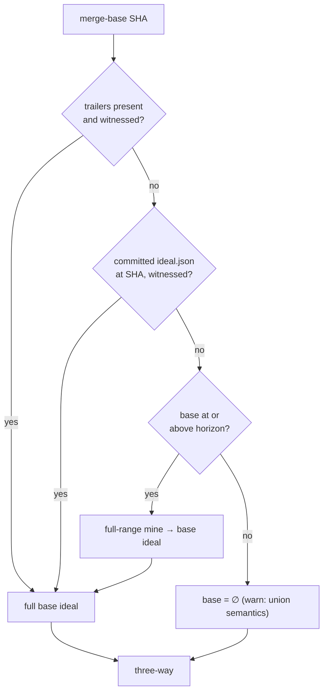
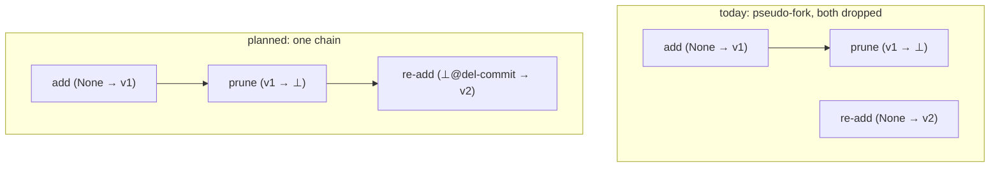
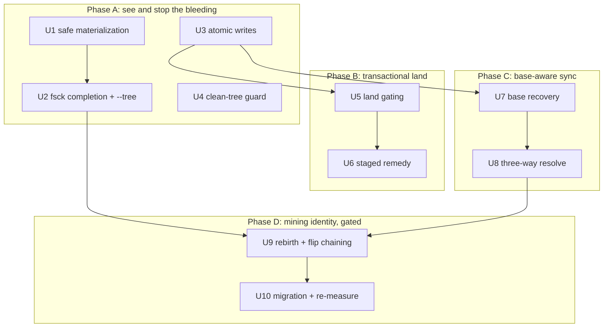

# fix: Enforce the kernel invariant and make destructive verbs transactional

## Summary

Fix the four architectural failure classes the 2026-07-12 multi-agent review left open: the kernel's master invariant (`code(I)` == HEAD tree) is silently violated by ordinary histories and then enforced destructively; `land` mutates before its gate; sync's blind union resurrects reverts; and every command pays a per-file subprocess storm on a clean tree. Each is fixed at the root — invariant checking and safe materialization first, then transactional land, base-aware sync, and finally the gated mining-identity change (rebirth and representation-flip chaining) with its full migration.

---

## Problem Frame

The operation-ideal kernel promises that materializing the current ideal reproduces the checked-out tree. Three ordinary git patterns break that promise silently, and `put()` then enforces the broken side by deleting live files and committing the deletion:

- A symbol added, deleted, and re-added mints a second birth claiming `(symbol, None)`; `order.fork_free` drops both up-sets, the path leaves `covered_paths`, and materialization deletes the live file (`sgt/core/mine.py` re-add mint; reproduced live in review). On this repo the reduction drops ~20% of ops (`FINDINGS.md`, U22.5 / Known v1 limitations).
- Symlinks have zero handling: mining records the mode-120000 blob (the target-path string) as ordinary content, and `lens._write_working_tree` writes through links — including targets outside the repo.
- A file flipping parseable↔unparseable (or across a language boundary) switches version schemes mid-chain with no bridging ops, so a later flip can materialize empty or foreign content.

Around the invariant, the destructive verbs lack transaction discipline: `sync/land.py` materializes the merged candidate and persists all `.sgt/` artifacts *before* the oracle gate with no rollback; `land <branch>` records the merged ideal under the checked-out ref's key; ~20 metadata artifacts write non-atomically; and `sync/resolve.py` is a blind op-set union — no removal semantics (a teammate's revert is resurrected), no grounding pass (crashes on ungrounded unions), and `Sgt-Op` trailers trusted unconditionally.

Finally, `lens._sync` hardcodes `include_dirty=True`, so every command mines the working tree at one `git show` subprocess per tracked file even when clean — the same cost class that turned the U25 closure-scale gate red.

---

## Requirements

**Invariant visibility**

- R1. `sgt fsck` implements the full R11 contract from the kernel plan: content addresses, chain linearity, ideal validity, witness reachability. A corrupt op file degrades to a reported read-side skip; no verb crashes on it.
- R2. `sgt fsck --tree` compares `code(current_ideal)` against the HEAD tree, distinguishes real drift from planned divergence (unmanaged paths, backstop-kept files, staged rewrite candidate, unseeded ref), and names the remedy direction per finding.

**Materialization safety**

- R3. No verb writes through or deletes via a symlink, at the leaf or any ancestor directory. Symlinked paths are unmanaged, decided by one shared predicate used by mine, fold/materialize, status, and fsck.
- R4. No verb deletes a working-tree path whose on-disk bytes cannot be reproduced from the op store. Skipped deletions are surfaced in status with an explicit resolution path.

**Durability**

- R5. Every `.sgt` metadata write is atomic (temp + fsync + rename). Artifact pairs that must move together (ideal table + witness; journal + table; forks + ops; staged bytes + staged record) move inside one locked read-modify-write. Lock granularity stays per-mutation; verb-wide locks remain forbidden (U23).
- R6. A crash at any point in sync or land leaves a state `sgt fsck` can diagnose and the next command can recover, never a half-written table presented as truth.

**Transactional land**

- R7. A `land` that does not land (red oracle, lost CAS after retries, crash) leaves the working tree, the visible op-store state, and `.sgt` metadata as it found them. Real-repo metadata persistence happens only after the CAS win.
- R8. `sgt land <branch>` records the merged ideal, witness, and journal state under that branch's key, not the checked-out ref's.
- R9. The `merge-op` fork remedy completes end-to-end: stage → oracle → land, with an explicit abandon path that clears staged state and rematerializes the committed ideal.

**Sync semantics**

- R10. Sync merges three-way against a verified base ideal. A teammate's revert is not resurrected — enforced by a new convergence law; LAW-U, LAW-I, LAW-F, LAW-R stay green.
- R11. Fork-recorded tips are excluded from removal computation, so divergence-as-state survives base subtraction.
- R12. Trailers and committed ideal records are trusted only when the commit actually witnesses the claimed ideal. Every sync reports which base-recovery path it used and warns loudly when it degrades to union.

**Mining identity**

- R13. A symbol deleted and re-added mines as one chain — no pseudo-fork, no silent file deletion. The 20% closure loss recorded for this repo is the before-number; the closure harness is re-run after the fix.
- R14. Representation flips (parse errors, language/extension changes) bridge chains with explicit transition ops and never materialize empty or foreign content. Transient flips in the dirty pass mint nothing permanent.
- R15. The identity change ships behind a single `MINER_VERSION` 2→3 bump with a resumable, dry-run-default migration that re-keys every op-id-bearing artifact; the cross-version refusal names `sgt migrate` as its remedy.

**Daily loop**

- R16. Commands on a clean tree skip the dirty mining pass entirely; CLI and `--json` goldens stay byte-stable or are regenerated deliberately.

---

## Key Technical Decisions

- **Snapshot/restore in the real tree, not a scratch worktree, for land gating.** The oracle runs tier commands that need untracked environment (venv, node_modules, `.env`) a fresh worktree lacks, and worktree lifecycles add crash-cleanup burden. Instead: journal a snapshot tree ref (via the existing `working_tree_snapshot()` scratch-index primitive), write the candidate tree, run the oracle in place, restore on any non-landing exit. Concurrent landers keep using separate worktrees/clones per the recorded U23 doctrine.
- **CAS before persistence.** The candidate commit is built off-ref from the already-written tree; `update_ref_cas` decides the race; only the winner persists metadata. A CAS loser restores and retries — never a persist-then-lose window.
- **Rebirth detection is a pure function of git history, never the local store.** `mine()` must stay deterministic across clones (LAW-0): the prior deletion is found by looking back through the commit's own history (the deleting commit's parent tree carries the deleted version), not by consulting `.sgt/ops`. Identical-content rebirth cycles (A→del→A→del) need a deterministic salt derived from the deleting commit so chains don't collapse into cycles.
- **One `MINER_VERSION` bump carries both rebirth chaining and flip bridging.** `miner_version` participates in `compute_id`, so any bump re-keys the entire store — two separate bumps would mean two full migrations. Rebirth and flip fixes ship together as v3.
- **The migration is a full-store re-key with an old→new id map.** Because the bump re-keys everything, `sgt migrate` must rewrite every op-id-bearing artifact — ideal table, journal, witness-adjacent forks, OR-Set declared edges, pins, staged/drafts/hollows, proposals — under a manifest with resume (crash mid-migration must not leave a mixed-version store). Published claims are keyed by `ideal_key` hashes of old id sets and orphan unavoidably; they are historical records and are documented as such, not migrated.
- **Base-aware resolve is ideal-algebra set subtraction, not git textual merge.** U19's removal of `git merge` from sync stands. Three-way over op-id sets: removals are the upward-closed sets of `(base − ours) ∪ (base − theirs)`, computed modulo fork-recorded tips, then `reduce_to_ideal` (grounding first — fixing the current crash class). Base = ∅ degrades exactly to today's union, so pre-sgt history costs nothing new.
- **Base recovery must yield a full ideal or nothing.** The existing mine path in `ingest._theirs_ideal` returns only the divergent contribution; used as a base it would mass-delete. A base is recovered only from verified trailers, a verified committed `.sgt/ideal.json` at that SHA (same witness check as tips — an inherited stale record must not be trusted), or a full-range mine when the base is at or above the horizon; otherwise ∅ with a loud warning.
- **Symlinked paths are unmanaged (refuse-to-model), decided at mine time.** Mining skips mode-120000 paths, so corrupt string-image ops never enter the shared DAG; materialization, status, and fsck consume the same predicate. Modeling link modes as first-class content is deferred.
- **All `state.py` artifacts write atomically; the U9 advisory-cache exemption is retired.** Uniformity is worth more than the exemption: one write path, one crash-tear story. This overturns a recorded decision explicitly.
- **Quarantine is a read-side skip plus report, never a file move.** `.sgt/ops/` is committed shared state; moving a corrupt file would commit a deletion teammates still reference.

---

## High-Level Technical Design

Directional guidance, not implementation specification.

### Transactional land (U5)

```mermaid
sequenceDiagram
    participant U as user
    participant L as land
    participant G as git
    participant O as oracle
    U->>L: sgt land [branch]
    L->>L: get() + is_clean gate
    L->>L: ingest + resolve (in memory)
    L->>G: snapshot tree ref (journaled in .sgt/local)
    L->>G: write candidate tree (real worktree)
    L->>O: run tiers (cwd=repo, env intact)
    alt red or oracle unavailable
        O-->>L: not green
        L->>G: restore snapshot
        L-->>U: blocked; nothing persisted
    else green
        L->>G: commit_tree off-ref, update_ref_cas
        alt CAS lost
            L->>G: restore snapshot, retry loop
        else CAS won
            L->>L: persist ops + metadata (keyed by target ref)
            L->>G: reconcile working tree with moved ref
            L-->>U: landed
        end
    end
```

Crash recovery: the journaled snapshot ref plus buffered-until-green metadata means a crash mid-land leaves at worst a candidate tree on disk with a recorded restore point; the next command (or `fsck`) offers the restore.

### Base-aware sync resolve (U7–U8)



```text
fork_protected = union of up-sets of fork-recorded tips        # R11
removals       = up_set((base − ours) ∪ (base − theirs)) − fork_protected
merged         = reduce_to_ideal((ours ∪ theirs) − removals)   # grounding first
```

The sync report carries `base_recovery: trailers | ideal-record | mined | none`.

### Rebirth and flip chaining (U9)



Representation flips get the same shape: the losing representation's live symbols are closed with BOTTOM ops and the winning representation's births chain from them, minted only for committed history (never the pending pass).

### Delivery phases



Phases A–C change no op identity and are individually landable. Phase D is the blast-radius change and goes last, gated like U21 was.

---

## Implementation Units

### U1. Unmanaged-path predicate and safe materialization

- **Goal:** No sgt code path destroys bytes it cannot reproduce; symlinks are never written through or deleted.
- **Requirements:** R3, R4
- **Dependencies:** none
- **Files:** `sgt/core/lens.py` (`_write_working_tree`, `_dirty_conflicts`), `sgt/core/mine.py` (skip mode-120000 at `tree_at`/diff ingestion), `sgt/store/gitbind.py` (expose entry modes), `sgt/api.py` (status surfacing), `tests/core/test_lens.py`, `tests/core/test_mine.py`, `tests/cli/test_porcelain.py` (new)
- **Approach:** One predicate — "unmanaged path" — computed at mine time from git entry mode and consumed everywhere. `_write_working_tree` gains two guards: refuse to write when the leaf or any ancestor directory is a symlink (`lstat` walk), and refuse to delete a path whose current bytes match no reproducible content in the store (the backstop). Skipped deletions and unmanaged paths surface in `status_view` with a named resolution. The porcelain daily-loop verbs (`switch`/`save`/`undo`) get their first behavioral tests here since they ride materialization.
- **Execution note:** Write the failing tests first — the review's live reproductions (symlink target overwrite; rebirth file deletion via `put`) become the regression tests, with the rebirth case initially asserting only "no deletion" (full chain fix is U9).
- **Test scenarios:**
  - Symlink to a file outside the repo; `put` after an unrelated edit: link target untouched, link intact, path reported unmanaged.
  - Symlinked directory component with a tracked file beneath it: no write occurs through the component.
  - Path whose history is add→delete→re-add (pre-U9): `put` does not delete the live file, path surfaces as backstop-kept.
  - `switch`/`save`/`undo` happy paths on a normal repo: bytes round-trip; `undo` restores the prior tree.
  - `switch` on a repo containing a symlink: link survives both directions.
  - Case-colliding paths (mined fixture): second write does not silently clobber; surfaced as a warning.
- **Verification:** Review's two data-loss reproductions fail before, pass after; full suite green.

### U2. fsck completion and `sgt fsck --tree`

- **Goal:** Invariant violations become diagnostics with remedies instead of silent corruption or crashes.
- **Requirements:** R1, R2
- **Dependencies:** U1 (consumes the unmanaged-path predicate)
- **Files:** `sgt/core/store.py` (`fsck`, `all_ops`), `sgt/core/lens.py` (tree check helper), `sgt/cli/inspect.py`, `sgt/core/sync/ingest.py` (same read-side tolerance for theirs' op blobs), `tests/core/test_store.py`, `tests/golden/`
- **Approach:** Extend `FsckReport` with the missing R11 checks: chain linearity, ideal validity of every ideal-table entry, witness reachability (with "prune or re-seed" remedy text), plus a mixed-miner-version check (prepares U10). `all_ops` and ingest's deserialization skip-and-report corrupt files instead of raising. `--tree` folds `current_ideal` and diffs against the HEAD tree, classifying each divergent path: real drift (remedy: `get` to absorb or `put` to enforce — stated per direction with their opposite data-loss profiles), unmanaged, backstop-kept, staged candidate, or unseeded ref (fresh clone/detached HEAD labeled distinctly, not reported as drift).
- **Test scenarios:**
  - Corrupt op file (truncated JSON): `fsck` reports it, `sgt status` still runs.
  - Op chain with a gap (hand-built store): linearity check names the symbol.
  - Ideal-table entry referencing a missing op id: reported with the ref key.
  - Witness entry pointing at a deleted branch SHA: reachability failure with remedy text.
  - `--tree` on a clean kernel repo: zero findings (must pass on this repo's own 7000-op store — the self-hosting rule).
  - `--tree` with a staged rewrite candidate present: classified staged, not drift.
- **Verification:** `sgt fsck --tree` exits clean on this repo; each planned-divergence class demonstrably not misreported.

### U3. Atomic metadata writes and paired RMW sections

- **Goal:** No crash tears a metadata file or splits an artifact pair.
- **Requirements:** R5, R6
- **Dependencies:** none
- **Files:** `sgt/state.py` (`save_json`, `save_claim`, `save_proposal`), `sgt/core/store.py` (shared `_write_atomic`, lock helper), `sgt/core/lens.py` (`record_ideal`, `_sync`, `undo_ideal`), `sgt/core/sync/materialize.py` (`_union_claims`, `_union_proposals`), `tests/core/test_store.py`, `tests/core/test_lens.py`
- **Approach:** Route every `state` write through `_write_atomic`. Add a small locked-RMW helper (same flock, same per-mutation granularity as `Store.add()`) and apply it to the pairs that must move together: (ideal table, witness) in `_sync`/`record_ideal`; (journal push, table overwrite) in `record_ideal` — closing the double-journal-entry crash window; (forks, op adds) in `persist_reconciled`; (staged bytes, staged record) in `rewrite.stage`. Two rules stated in code: critical sections never nest (`Store.add()` is never called while holding the helper's lock), and validate-before-persist everywhere (the U22.5 lesson). Loaders of local reseedable artifacts tolerate a torn file by reseeding; committed artifacts fail loudly to fsck.
- **Test scenarios:**
  - Kill-injection (exception mid-sequence) between journal push and table write: no duplicate journal entry after recovery.
  - Torn local `ideal.json` (truncated bytes on disk): next `get` reseeds instead of crashing.
  - Torn committed artifact: loud failure naming `fsck`.
  - Concurrent RMW from two processes on the pins table: both updates survive (mirrors U23's 600/600 methodology).
- **Verification:** No plain `write_text` remains for registry artifacts; grep-level audit plus the crash-injection tests.

### U4. Clean-tree guard

- **Goal:** Commands on a clean tree stop paying O(tracked files) subprocess costs.
- **Requirements:** R16
- **Dependencies:** none
- **Files:** `sgt/core/lens.py` (`_sync`), `sgt/store/gitbind.py` (`is_clean`), `tests/core/test_lens.py`, `tests/golden/`
- **Approach:** `_sync` consults `is_clean()` (one `git status --porcelain`) and skips the dirty mining pass when clean. "Clean" is defined modulo mine-excluded paths (`.sgt/` working-tree changes, untracked files) or the guard never fires in real repos. The `put`-side byte-comparison escape hatch (`_dirty_conflicts`) is untouched. Behavioral edge accepted and stated: an editor save landing between the clean check and a subsequent `put` refuses (dirty-conflict) instead of being absorbed — same guard, earlier detection.
- **Test scenarios:**
  - Clean repo: `sgt status` triggers zero `git show` calls for the dirty pass (assert via mined-op count or a counting fake).
  - Untracked-only changes: guard still fires.
  - `.sgt/`-only changes: guard still fires.
  - Genuinely dirty file: pending overlay identical to today's.
  - CLI/`--json` goldens byte-identical.
- **Verification:** Wall-clock of `sgt status` on this repo drops measurably (record before/after in FINDINGS); goldens stable.

### U5. Transactional land

- **Goal:** A land that doesn't land leaves no trace; one that lands persists under the right ref.
- **Requirements:** R7, R8
- **Dependencies:** U3
- **Files:** `sgt/core/sync/land.py`, `sgt/core/sync/materialize.py` (split persist into buffered/committed halves), `sgt/core/lens.py` (`record_ideal(ref_key=...)`), `sgt/core/oracle.py` (verdict handling for merged ideal), `sgt/store/gitbind.py` (snapshot/restore helper), `tests/core/test_land.py`
- **Approach:** Per the KTD: journal a snapshot tree ref, write the candidate tree in place, run the oracle with environment intact, restore on every non-landing exit (red, structurally-failed oracle — distinguishable states — lost CAS after retries, crash). Metadata persistence is buffered in memory (extending U19's ingest-in-memory shape) and flushed only after the CAS win, keyed by the target branch, with the oracle verdict recorded for the merged ideal so later verbs see green rather than pending. Landing a non-checked-out branch restores the session's own tree after the win and does not journal an undo entry (undo stays scoped to the checked-out ref). Op-store adds are monotone and may persist early; everything else waits.
- **Execution note:** Start from a failing test capturing the review's reproduction: red-gated land currently leaves six mutated `.sgt` artifacts plus a rewritten tree.
- **Test scenarios:**
  - Red oracle: tree byte-identical to pre-land, no new `.sgt` artifacts, fork/ideal tables untouched.
  - No oracle configured: refusal, zero mutation (existing rule preserved).
  - CAS lost then won on retry: single persisted result, no double-application.
  - CAS exhausted: restored, reported, nothing persisted.
  - `land <other-branch>` green: that branch's ideal-table/witness keys updated, checked-out ref's untouched, session tree restored.
  - Crash injection after candidate write, before CAS: next command finds the journaled snapshot and offers restore; fsck names the state.
  - Green land on checked-out ref: working tree, index, and moved ref agree (no phantom `git status` diff).
- **Verification:** Review reproduction fails before, passes after; two-lander concurrency per U23 doctrine still converges.

### U6. Staged-remedy coherence

- **Goal:** The `merge-op` fork remedy lands or is cleanly abandoned; staged state can't wedge the repo.
- **Requirements:** R9
- **Dependencies:** U5
- **Files:** `sgt/core/rewrite.py` (`stage`, `land`), `sgt/core/lens.py` (staged-awareness in the `put` path), `sgt/cli/rewrite.py` (abandon verb), `tests/core/test_rewrite.py`
- **Approach:** Make staged state first-class: `rewrite.land` commits the staged candidate directly (it already holds the exact ideal and bytes) instead of routing through `lens.put`'s re-mine of the deliberately dirty tree. Add `sgt unstage` (or equivalent) that clears `staged.json` and rematerializes the committed ideal. Define staleness: edits or syncs after staging invalidate the stage (detected by comparing the tree against the staged bytes), and the land refuses with the abandon remedy rather than landing a mixture.
- **Test scenarios:**
  - Post-sync-fork: `merge-op` → `fulfill` → `land` completes and the fork record closes (the review's end-to-end reproduction).
  - Abandon after stage: tree back to committed ideal, `staged.json` gone, `switch` works again.
  - Edit after stage, then land: refused with staleness message; abandon path still works.
  - `fsck --tree` during staged state: classified staged (ties to U2).
- **Verification:** The advertised remedy string in `forks.json` executes successfully end-to-end on a two-clone fixture.

### U7. Base recovery and trailer verification

- **Goal:** Sync knows its base and never trusts an unwitnessed claim.
- **Requirements:** R12
- **Dependencies:** U3
- **Files:** `sgt/core/sync/ingest.py` (`_theirs_ideal`, new base recovery), `sgt/store/gitbind.py` (merge-base helpers already present), `sgt/core/sync/__init__.py` (report field), `tests/core/test_sync_stages.py`
- **Approach:** Per the KTDs: a recovered ideal is either full or unusable. Apply the tip witness-containment check to all three sources uniformly — trailers (currently trusted unconditionally), the committed `.sgt/ideal.json` record (currently checked for tips but the base path must not inherit a stale record), and full-range mining bounded by the horizon (R10 of the kernel plan: pre-horizon history is never mined — below the horizon, degrade to ∅). Trailer-less tips whose commits carry `.sgt/ops` blobs become a first-class detectable state (recorded fixture footgun) with a remedy message instead of silent misbehavior. The sync report and `--json` gain `base_recovery`; `none` warns loudly.
- **Test scenarios:**
  - Base with valid trailers: full ideal recovered.
  - Base = plain-git commit inheriting a stale `ideal.json`: rejected, next source tried.
  - Squash-merge destroyed trailers, committed record survives: recovered via record (existing C5 behavior preserved).
  - Base below horizon: `base_recovery: none`, loud warning, union semantics.
  - Tip with ops but no trailers: detected state, named remedy.
  - Forged trailers (ids not witnessed by the tip's tree): rejected.
- **Verification:** Every recovery path visible in the sync report; existing sync suite green.

### U8. Three-way resolve

- **Goal:** Reverts travel; sync stops resurrecting what a teammate removed.
- **Requirements:** R10, R11
- **Dependencies:** U7
- **Files:** `sgt/core/sync/resolve.py`, `sgt/core/order.py` (up-set helper if missing), `tests/laws/test_convergence.py`, `tests/core/test_sync.py`
- **Approach:** The HTD formula: removals are upward-closed differences from base, computed modulo fork-recorded tips (both tips and their up-sets are protected so divergence-as-state survives subtraction), then `reduce_to_ideal` — restoring the grounding pass whose absence crashes today's resolve on ungrounded unions. Base = ∅ reproduces today's union exactly, keeping pre-sgt and degraded histories at status-quo semantics. Declared-edge OR-Set, pins, aliases, and fork detection are unchanged.
- **Execution note:** Add the three law tests first, `xfail(strict=True)` per U16's pattern: revert-travels, fork-tips-survive-base-subtraction, degraded-base-warns.
- **Test scenarios:**
  - Two clones; A reverts an op and pushes; B syncs: B's ideal excludes the op and B's tree loses the bytes (the review's resurrection reproduction, inverted).
  - Both sides independently added since base: union of additions (unchanged behavior).
  - A reverts X while B extends X's symbol (op above X): fork or removal-wins is decided by the up-set rule — the extension rides X's up-set and is removed with it; B's work surfaces via the fork/backstop path, never silently duplicated.
  - Open fork recorded, then sync against a base that witnessed one tip: fork record and both tips survive.
  - base=∅: byte-identical result to today's resolve on the same fixtures.
  - LAW-U/I/F/R corpus: green, order-independent with removals in play.
- **Verification:** New laws flip green intentionally; convergence corpus green; two-clone revert scenario passes.

### U9. Rebirth and representation-flip chaining

- **Goal:** Ordinary linear history never produces a pseudo-fork or a severed chain.
- **Requirements:** R13, R14
- **Dependencies:** U2 (fsck verifies the result), U8 (sync semantics settled before identity changes)
- **Files:** `sgt/core/mine.py` (re-add site, unparseable degrade, transition ops), `sgt/core/op.py` (`MINER_VERSION`), `sgt/core/fold.py` (whole-file-wins interaction), `tests/core/test_mine.py`, `tests/laws/test_determinism.py`, `tests/laws/test_roundtrip.py`
- **Approach:** Per the KTDs: re-adds chain from the deleted version, detected purely from git history (the deleting commit's parent tree), salted by the deleting commit for identical-content cycles. Parse-error, language, and extension flips emit transition ops — BOTTOM the losing representation's live symbols, chain the winning representation's births — and unify the version-scheme mix at the unparseable-degrade site. Transition ops are suppressed for the pending (dirty) pass so a transient syntax error during editing mints nothing permanent. `MINER_VERSION` 2→3, both changes together.
- **Execution note:** Characterization first — pin current v2 behavior on the flip fixtures before changing anything, so the diff of behavior is explicit.
- **Test scenarios:**
  - add→delete→re-add same content: one chain, three ops, file present in `code(I)`; the existing `test_get_survives_add_delete_readd_fork_in_linear_history` upgraded from "survives" to "materializes completely".
  - add→del→A→del→A cycles: distinct chained ops (salt works), deterministic ids across two clones mining the same history (LAW-0).
  - Incremental mine where the deletion predates `since`: chain still correct (lookback is history-derived, not range-derived).
  - Parseable→unparseable→parseable: entity symbols closed and reborn; fold reproduces exact bytes at every commit (roundtrip law over the fixture).
  - `.txt`→`.py` rename: bridged, no scheme mix.
  - Dirty pass with a syntax error: no transition ops in the store after the command.
- **Verification:** Roundtrip and determinism laws green over new fixtures; closure loss on this repo drops from the recorded ~20% (measured in U10).

### U10. Store migration and re-measurement

- **Goal:** Existing stores and teams cross the v3 boundary without stranding or forking.
- **Requirements:** R15, R13 (measurement)
- **Dependencies:** U9
- **Files:** `sgt/cli/migrate.py`, `sgt/core/store.py` (mixed-version fsck check from U2), `sgt/core/sync/ingest.py` (`MinerVersionMismatch` remedy text), `experiments/closure_scale/measure.py` (re-run, not modified), `tests/core/test_migrate.py` (new), `tests/golden/`
- **Approach:** `sgt migrate ops-v3` follows the U21 gated pattern — dry-run default, atomic apply — but at full-store scope: re-mine or re-mint every op under v3, build the old→new id map, rewrite every op-id-bearing artifact (ideal table, journal, witness, forks, declared OR-Set, pins, staged, drafts, hollows, proposals) under a manifest with resume so a crash never leaves a mixed store; fsck's mixed-version check is the backstop. Claims orphan by design (documented in FINDINGS). Team protocol documented in the refusal message itself: `MinerVersionMismatch` remedy text changes from "upgrade sgt and re-mine" to "run `sgt migrate ops-v3`"; the ordering rule (migrate the shared branch's landing clone first, others re-sync after) rides the same message. Then: regenerate goldens deliberately, and re-run the closure harness recording before (≈20%) and after in FINDINGS.
- **Test scenarios:**
  - Dry run: report only, store untouched.
  - Apply on a fixture store with rebirth history: zero pseudo-forks after; all table references resolve; undo journal replays.
  - Crash injection mid-apply, then resume: converges to the same result as uninterrupted apply.
  - Migrated clone syncs with un-migrated peer: refused with the new remedy text, both directions.
  - Old proposal referencing pre-migration ids: either re-keyed or explicitly reported as historical — never a crash.
- **Verification:** Migration of this repo's own store succeeds (self-hosting rule); closure re-measurement recorded; `sgt fsck` clean post-migration.

---

## Scope Boundaries

### Deferred to Follow-Up Work

- MCP verb parity (11 of 37 verbs today; an MCP-only agent can't run the edit→save loop) — product-scope decision, next plan.
- VS Code extension race fixes (store epoch counter, previewCache) — one mechanism serves both; extension work is not kernel work.
- Modeling symlink modes as first-class content (this plan makes them safely unmanaged).
- Mining throughput (per-commit entity-graph rebuild, batch blob reads — the BET-E class); this plan removes only the clean-tree storm.
- The review's P2 tail: revert stub files, VerbPreview triplication, orphaned modules, oracle/git subprocess timeouts, quotePath decoding, `types.ts` drift, `--json` exit-code semantics sweep, broken e2e scripts.
- Continuing the product-surface plan (U27–U32 there).

### Outside this plan's identity

- Reintroducing git textual merge into sync (U19's removal stands).
- Verb-wide or store-wide locking (U23's measured decision stands).

---

## Acceptance Examples

- AE1. Given a repo whose history added, deleted, and re-added `notes.txt`, when the user runs any materializing verb, then `notes.txt` survives with its live content — before Phase D via the deletion backstop (surfaced, not silent), after Phase D via a complete chain.
- AE2. Given a configured oracle that returns red, when the user runs `sgt land`, then `git status` and `.sgt/` are byte-identical to before the command.
- AE3. Given clone A reverts an op and lands, when clone B syncs, then B's tree drops the reverted bytes and `sgt log` shows the revert — not a resurrection.
- AE4. Given a squash-merge destroyed the base's trailers and no committed record survives, when the user syncs, then the sync completes with union semantics and prints a warning naming `base_recovery: none`.
- AE5. Given a corrupt file in `.sgt/ops/`, when the user runs any verb, then the verb completes and `sgt fsck` names the corrupt op with a remedy — no traceback.

---

## Risks & Dependencies

- **The v3 migration is the riskiest unit in the repo's history** — it re-keys every op and every reference. Mitigations are structural: it ships last, dry-run default, manifest + resume, mixed-version fsck backstop, and the U21 precedent (whose gate caught a real data-loss bug) as the template. If Phase D slips, Phases A–C still remove every silent-data-loss path (the backstop converts rebirth deletion into a surfaced, recoverable state).
- **Removal semantics interact with unmeasured reference-edge recall (BET-B).** Up-set removals are only as sound as the edges; BET-B was never measured. The fork-protection rule (R11) bounds the damage, but U8's law fixtures should include a missing-edge scenario deliberately.
- **Oracle tiers running against a candidate tree in the real repo** mean a red-destined candidate briefly occupies the working tree. The snapshot ref makes this recoverable, but a user interrupting mid-oracle sees candidate bytes; the journaled restore must be discoverable (`fsck` names it, next command offers it).
- **Golden and law-fixture churn in Phase D** is large by construction (every id changes). Budget review time for the regenerated diffs; the golden byte-parity discipline from the collab-foundations plan (its U16, C11) applies.

---

## Sources & Research

- Review findings and live reproductions: 2026-07-12 multi-agent review (applied fixes landed as `b08fa1c`; ephemeral run artifacts under `/tmp/compound-engineering/ce-code-review/20260712-121014-9516f6a9/`). Durable anchors below.
- `FINDINGS.md` — U22.5 (rebirth pseudo-fork, ~20% closure loss, the named deferred fix this plan executes), U23 (locking doctrine: per-`add()` flock + ref-CAS + per-session worktrees, "must not be widened"), U19/U20 (in-memory ingest, divergence-as-state, textual-merge removal), U21 (gated atomic migration pattern), U15 (trailer footguns), U9 (advisory-cache write exemption, overturned here).
- Code sites: `sgt/core/mine.py` (re-add mint, unparseable degrade), `sgt/core/lens.py` (`_write_working_tree`, `_sync` `include_dirty`, `record_ideal` ref-key), `sgt/core/sync/land.py` (persist-before-gate), `sgt/core/sync/resolve.py` (blind union, missing grounding), `sgt/core/sync/ingest.py` (`_theirs_ideal` trust order), `sgt/core/store.py` (`_write_atomic`, `_locked`, `fsck`), `sgt/store/gitbind.py` (`update_ref_cas`, `working_tree_snapshot`, `is_clean`).
- Kernel plan contracts referenced: R8 identification law, R10 horizon, R11 fsck checks, R12 miner-version, R13/R14 async-oracle vs blocking-land split, LAW-0/U/I/F/R/G — `docs/plans/2026-07-06-001-feat-operation-ideal-kernel-plan.md`.
