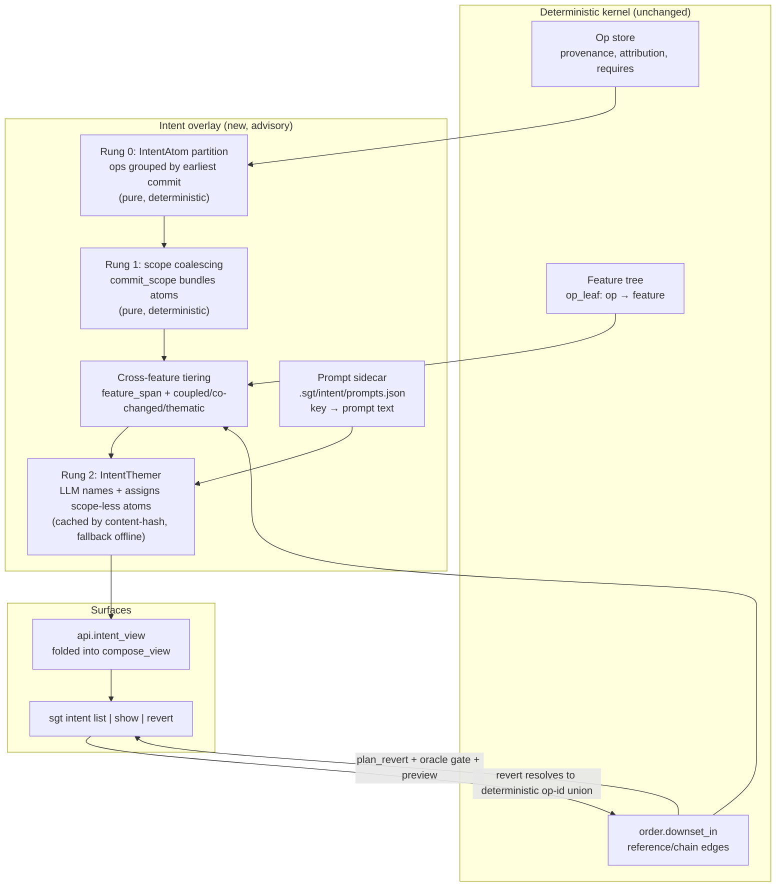
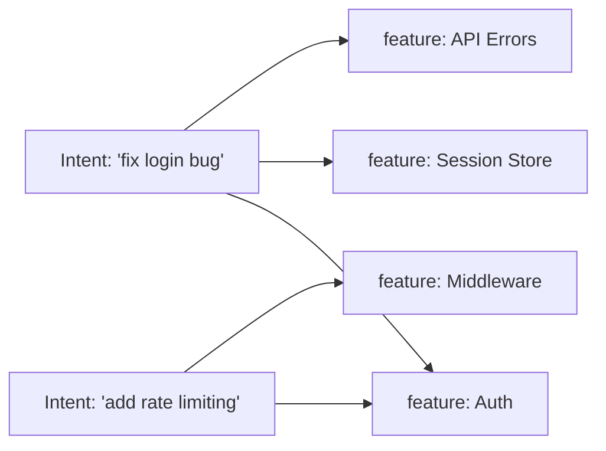

# feat: Intent Clustering Overlay

## Summary

Add a second, cross-cutting lens on top of the existing structural feature tree: an **intent overlay** that groups *operations* by *why they happened* (the commit / plan / prompt that produced them) rather than *what code they touch*. The feature tree answers "what is this code"; the intent overlay answers "what change was this part of." A single intent — "fix the login bug" — routinely spans several features, and the overlay makes that visible and actionable.

The whole design is a **fallback ladder** (matching the repo's existing idiom): every layer is deterministic and useful on its own, and the LLM sits at the last rung as a namer/coalescer, never as the thing that decides membership.

- **Rung 0 (deterministic, no LLM):** partition every op by its earliest witnessing commit → an `IntentAtom`. Free, exact, rebuildable. Each atom carries the commit subject as its human label already.
- **Rung 1 (deterministic coalescing):** bundle atoms that share a conventional-commit scope (`fix(auth):` across three commits → one bundle) using the existing `commit_scope` parser.
- **Rung 2 (LLM overlay, cached, closed-form):** name each bundle, and assign scope-less atoms to a theme — bounded to the atom partition, never emitting individual op-ids.

"Across features" is **backed by the dependency graph**, not asserted by the LLM: each group's cross-feature span is computed from `op_leaf`, and each group is *tiered* by how strongly its ops are connected in the op-DAG (`coupled` via `requires`/reference edges → `co-changed` → `thematic`). The tier is shown so a reader knows which groupings to trust.

Because groups always resolve to a **deterministic union of op-ids**, `sgt intent revert <group>` reuses the exact same `plan_revert` → ideal-algebra → oracle-gate → preview path as every other revert. The LLM decides the *bundle*; the kernel executes and gates the *edit*.

v1 also adds **live prompt capture**: a committed sidecar keyed by the provenance keys the kernel already writes (plan-id / session-id / commit sha), so the intent an agent was given is recorded alongside the ops it produced — without touching op identity.

---

## Problem Frame

The feature tree (`sgt/lens/tree.py`, `cluster.py`) clusters **symbols** by structural coupling into a stable spatial map. It is deliberately blind to *why* an edit happened — a commit that fixes one bug across three subsystems is scattered across three feature leaves with nothing tying the pieces together.

The kernel already records the raw material for the missing "why" axis and does nothing user-facing with it:

- `Op.provenance: tuple[str, ...]` — witnessing commit SHAs (`sgt/core/op.py:126`).
- `Op.attribution: tuple[Attribution, ...]` — structured `{sha, session, agent, plan}` per SHA (`sgt/core/op.py:127`, `:102`).
- `Op.intent: str | None` — advisory rewrite/plan-intake label (`sgt/core/op.py:129`).
- Commit subjects via `GitBinding.history()` → `(sha, parent, subject)`.
- The op-DAG's real directed dependency edges: `Op.requires` (`sgt/core/op.py:63`), `order.reference_edges` / `order.chain_edges`, and the closure primitive `order.downset_in` already used by `proposal_review_view`.
- `op_leaf: dict[op_id → feature_id]` from `sgt/lens/tree.py` — every op's feature.

All of the above are **excluded from the content-address id** (`compute_id`, `sgt/core/op.py:140`) — they are advisory by design. That is exactly the seam an overlay attaches to.

**Goal:** surface and act on the "why" axis by deriving it deterministically from provenance + the dependency graph, using the LLM only to name and coalesce — and never letting the overlay mutate op identity or the structural clustering.

**Success criteria:**
1. `sgt intent list --json` returns intent groups spanning features, with each group's feature span and dependency tier, computed with zero LLM calls (LLM only adds names).
2. Re-running the build with an unchanged op store produces byte-identical group membership and cached names — no flicker (the failure mode the label cache already fixed; see [[label-cache-and-rebuild-architecture]]).
3. `sgt intent revert <group>` produces the identical ideal edit, preview, and oracle verdict as reverting the same op-set by hand.
4. An agent's prompt recorded at edit time is retrievable against the ops that edit produced.

---

## Key Technical Decisions

**KTD1 — The intent overlay is an advisory overlay, never part of op identity.**
No new field on `Op`; `compute_id` stays untouched. Intent data lives in new `.sgt/` artifacts and read-time derivation. Rationale: `Op` is frozen, content-addressed, and participates in a merge semilattice; polluting it would break the identification law (R8) and the attribution merge (`merge_attribution`). This mirrors how *labels* and *renames* are already overlays on the deterministic tree (`sgt/lens/label.py`, `pins.labels`).

**KTD2 — The grouping unit is the operation, keyed on provenance; the base partition is deterministic.**
Base `IntentAtom` = all ops sharing an earliest-witnessing commit (mirroring `history_view`'s `commit_index` rule: the earliest provenance sha that appears in `GitBinding.history()`). This is a *total, deterministic partition* of the op store — every op lands in exactly one atom. Rationale: the user's ask ("cluster the operations") is temporal/provenance-shaped, orthogonal to the symbol-shaped feature tree. A commit is the smallest recorded intent; a plan/session/theme is a coarser one.

**KTD3 — "Across features" is dependency-graph-backed and tiered, not LLM-asserted.**
Each group computes its `feature_span` (distinct `op_leaf` values across its ops) and a `tier`:
- `coupled` — the group's ops are connected across features by `requires`/reference edges (computed with `order.downset_in` over the group's op-set, the same primitive as `proposal_review_view`'s `requires`). Strong.
- `co-changed` — same commit, spans features, but no cross-feature dependency edge. Medium.
- `thematic` — bundled across *different* commits by scope or LLM theme only. Weak.
Rationale: this is the direct answer to "how much can the dependency graph back the across-features part" — compute it, tier it, show it. The dependency graph backs mechanical cross-feature intent; it cannot back purely thematic intent, and the tier says so honestly.

**KTD4 — The LLM (rung 2) is a closed-form namer/coalescer keyed by content-hash; it never emits op-ids.**
`IntentThemer` mirrors `sgt/lens/label.py` exactly: pydantic-typed `responses.parse`, `gpt-5.4-mini`/`low`, deterministic offline `_fallback` (= scope + subject), cache tagged `source: "llm" | "fallback"` and keyed by a content-hash of the atom-partition signature. The LLM input is *commit subjects + scope + feature spans* — never file bytes — and its output assigns each atom to a theme-id + names it. Membership is always the deterministic atom union. Rationale: this is what makes rung 2 safe to drive edits (KTD6) and kills name flicker (success criterion 2).

**KTD5 — Prompt capture is a committed sidecar keyed on existing provenance keys, written at existing attribution-write points.**
New committed artifact `.sgt/intent/prompts.json`: `{ key → prompt_text }` where `key` is a plan-id, session-id, or commit sha (the same keys `Attribution` already carries). Written where attribution is already written: `session.py` (session start), `loop/plan.py` (plan intake), `sgt/mcp/server.py`, `sgt/repair/loop.py`. Rationale: prompts attach naturally to a *plan/session*, not per-op; a sidecar keeps large/dirty prompt text out of the content address and out of the frozen `Attribution` semilattice. Merge = union-by-key (a key's prompt is write-once). Alternative rejected: adding `prompt` to `Attribution` (frozen, hashable, part of the merge lattice — wrong home for free text).

**KTD6 — Revert-by-intent executes as a standard ideal edit with mandatory preview and subset selection.**
`sgt intent revert <group>` resolves the group to its deterministic op-id union and runs the existing `verbs.plan_revert` path — same preview (`verb_preview_view`), same oracle gate (LAW-G), same fork refusal. For a `thematic` group spanning multiple commits, the preview breaks down per-atom and supports subset selection, reusing the `proposal land --subset` / `feature_checklist` UX shape (`proposal_review_view`). Rationale: the LLM-decided theme boundary only chooses the *default bundle*; the actual deletion is deterministic, previewable, and gated — so a wrong theme boundary is a mis-default the user sees and edits, not a silent destructive op.

**KTD7 — The overlay is compute-on-read for the deterministic layers; only LLM names are cached; theme assignment is committed.**
The atom partition and tiers are cheap pure functions of the op store, recomputed on read (like `map_view` reads `tree.json` but the coupling `edges` are recomputed). The theme→atom assignment + labels persist to committed `.sgt/intent/themes.json` (so teammates see the same themes); raw LLM responses cache locally in `.sgt/local/intent_cache.json` (retryable fallback, like `label_cache`). Rationale: matches the existing committed-tree / local-cache split.

---

## High-Level Technical Design

The overlay is a strict layering; each rung consumes only the rung below plus already-committed kernel data. Nothing flows back down into op identity or the structural tree.



The intent×feature relationship is **many-to-many**: one intent group spans many features; one feature is touched by many intents. This is why it is an overlay (a labeled bipartite spanning), not a second partition competing with the tree.



---

## Output Structure

New and touched files (repo-relative):

```
sgt/
  intent/
    resolve.py          # (existing — NL target resolution, untouched)
    group.py            # NEW — U1/U2: IntentAtom partition + scope coalescing + tiering (pure)
    theme.py            # NEW — U4: IntentThemer (LLM namer/coalescer, cached; mirrors lens/label.py)
    prompts.py          # NEW — U3: prompt sidecar read/write API
  api.py                # MOD — U6: add intent_view; fold into compose_view
  state.py              # MOD — U3/U5: register prompts.json + themes.json + intent_cache
  cli/
    intent.py           # NEW — U7/U8: `sgt intent list|show|revert` verb family
    __init__.py         # MOD — register the intent family + help text
  session.py            # MOD — U3: capture prompt on session start
  loop/plan.py          # MOD — U3: capture prompt on plan intake
  mcp/server.py         # MOD — U3: capture prompt when an agent drives an edit
tests/
  intent/
    test_group.py       # NEW — U1/U2 partition + tier determinism
    test_theme.py       # NEW — U4 caching, fallback, no-op-id invariant
    test_prompts.py     # NEW — U3 sidecar + merge
    test_intent_view.py # NEW — U6 projection shape / additive schema
    test_intent_cli.py  # NEW — U7/U8 list/show/revert, subset, oracle gate
```

---

## Implementation Units

### U1. Deterministic intent-atom partition (rung 0 + rung 1)

**Goal:** A pure module that turns the op store into a deterministic list of `IntentAtom`s and scope-coalesced bundles, with zero LLM/network dependency.

**Requirements:** Success criteria 1, 2. KTD2, KTD1.

**Dependencies:** none (reads the existing store + gitbind).

**Files:** `sgt/intent/group.py`, `tests/intent/test_group.py`.

**Approach:**
- Define `IntentAtom` (frozen dataclass): `commit_sha`, `subject`, `op_ids: frozenset[str]`, `plan_ids: frozenset[str]`, `session_ids: frozenset[str]`, derived from `Op.provenance` / `Op.attribution`.
- `atoms(repo) -> list[IntentAtom]`: for each op, pick its earliest provenance sha present in `GitBinding.history()` (reuse `history_view`'s `commit_index` logic — factor a shared helper if clean, else mirror it). Group ops by that sha. An op whose provenance is entirely outside `history()` goes to a synthetic `"(unwitnessed)"` atom rather than being dropped.
- `scope_bundles(atoms) -> list[Bundle]`: group atoms by `cluster.commit_scope(subject)`; atoms with no scope stay singleton bundles at this rung (rung 2 may reassign them). Reuse `sgt/lens/cluster.commit_scope` — do not reimplement.
- Fully sorted output (by commit-index then sha) for a stable projection, matching the `sgt.api` determinism discipline.

**Patterns to follow:** `sgt/api.py:history_view` (earliest-provenance-in-history rule), `sgt/lens/cluster.commit_scope`, frozen-dataclass style in `sgt/core/op.py`.

**Test scenarios:**
- Happy path: three ops from one commit → one atom whose `op_ids` is exactly those three; two commits under `feat(store):` → one scope bundle of two atoms.
- Edge: op with multiple provenance shas → atom keyed on the earliest that appears in history.
- Edge: op whose provenance shas are all absent from history → lands in `(unwitnessed)`, never dropped.
- Determinism: `atoms(repo)` called twice returns identical ordering and membership.
- Edge: empty store → `[]`, no crash.

### U2. Cross-feature span and dependency tiering

**Goal:** For any group of ops, compute the feature span and the `coupled | co-changed | thematic` tier from the dependency graph.

**Requirements:** Success criterion 1, 3. KTD3.

**Dependencies:** U1.

**Files:** `sgt/intent/group.py` (same module), `tests/intent/test_group.py`.

**Approach:**
- `feature_span(op_ids, op_leaf) -> set[str]`: distinct `op_leaf` values over the ops (skip ops with no leaf).
- `tier(group_op_ids, all_ops, declared, op_leaf) -> str`:
  - `thematic` if the group's ops come from more than one commit and no cross-feature dependency edge exists among them.
  - `coupled` if `order.downset_in` over the group's op-set links ops assigned to *different* features (a real `requires`/reference edge crosses a feature boundary).
  - `co-changed` if the group is single-commit and spans features but is dependency-disconnected across them.
- Reuse `sgt/core/order.downset_in` and `_load_declared` exactly as `proposal_review_view` does; do not write a new closure walk.

**Patterns to follow:** `sgt/api.py:proposal_review_view` (`order.downset_in` restricted to a candidate op-set), `sgt/lens/select.py` (reference/chain edge reads).

**Test scenarios:**
- `coupled`: op in feature A `requires` a symbol version produced by an op in feature B, both in the group → `coupled`.
- `co-changed`: one commit touches features A and B with no dep edge between them → `co-changed`.
- `thematic`: two commits bundled by scope, spanning features, no dep edge → `thematic`.
- `feature_span` excludes ops with no `op_leaf` (tree not built / hollow) without erroring.
- Integration: tier is stable across repeated computation on the same store.

### U3. Live prompt capture sidecar

**Goal:** Record the prompt/intent text an agent or user was given, keyed on the provenance keys the kernel already writes, as a committed sidecar — without touching `Op` or `Attribution`.

**Requirements:** Success criterion 4. KTD5, KTD1.

**Dependencies:** none (independent of U1/U2; can land in parallel).

**Files:** `sgt/intent/prompts.py`, `sgt/state.py` (register artifact), `sgt/core/session.py`, `sgt/loop/plan.py`, `sgt/mcp/server.py`, `tests/intent/test_prompts.py`.

**Approach:**
- Register `.sgt/intent/prompts.json` in `state.py` `_ARTIFACTS` as `committed=True` (inherits schema envelope + atomic write + sync blob dispatch).
- `record_prompt(repo, key, text)` — write-once per key (first writer wins; ignore a second write to an existing key so re-mining/sync never clobbers). `prompt_for(repo, key) -> str | None`.
- Wire capture at the points that already set `Attribution`:
  - `session.py` session start (already writes `Attribution(session=name)` at `:192`) → record the session's task/prompt if available.
  - `loop/plan.py` plan intake (already carries `plan_text`) → record keyed by plan-id. `plan_text` is the most reliable existing prompt signal.
  - `mcp/server.py` — when an MCP call drives an edit with a known prompt/plan.
- Merge for `sync`: union-by-key. Because writes are write-once, union is conflict-free (mirror the alias G-Set union in `sgt/lens/reconcile.py`).

**Execution note:** Wire `loop/plan.py` first — `plan_text` already exists there, so it proves the capture→retrieval path end-to-end before touching session/MCP.

**Patterns to follow:** `sgt/state.py` `_ARTIFACTS` registration + `save_json_if_changed`; `sgt/lens/reconcile.py:union_aliases` (commutative union merge).

**Test scenarios:**
- Happy path: `record_prompt(repo, plan_id, "fix login")` then `prompt_for(repo, plan_id)` returns it.
- Write-once: a second `record_prompt` on an existing key is a no-op; original preserved.
- Merge: two clones each record a distinct key → union holds both; same key both sides → deterministic keep (no crash, no duplicate).
- Integration: a plan intake in `loop/plan.py` results in a retrievable prompt keyed by the plan-id that later appears in ops' `attribution.plan`.
- Edge: missing key → `None`, never raises.

### U4. LLM theme layer (rung 2), cached and offline-safe

**Goal:** Name each bundle and assign scope-less atoms to a theme, as a closed-form cached call that never emits op-ids.

**Requirements:** Success criteria 1, 2. KTD4, KTD7.

**Dependencies:** U1, U2.

**Files:** `sgt/intent/theme.py`, `sgt/state.py` (register `themes.json` + `intent_cache`), `tests/intent/test_theme.py`.

**Approach:**
- `IntentThemer` mirrors `sgt/lens/label.py:Labeler` structure: `get_client`, `responses.parse`, `MODEL="gpt-5.4-mini"`, `EFFORT="low"`, cache tagged `source: "llm" | "fallback"`, keyed by a content-hash of the atom-partition signature (sorted atom commit-shas + subjects + scope). A membership-unchanged rebuild never re-pays and never re-names (kills flicker — [[label-cache-and-rebuild-architecture]]).
- Pydantic output: `ThemeAssignment { theme_id: str, label: str, rationale: str, atom_shas: list[str] }` — `atom_shas` must be a subset of the input atom shas (validate; drop hallucinated shas). **Schema carries commit shas only — never op-ids** (the invariant that keeps revert deterministic).
- Deterministic offline fallback: one theme per scope bundle, `label = scope`, scope-less atoms stay singletons. So themes exist with zero network.
- Persist the resolved atom→theme assignment + labels to committed `.sgt/intent/themes.json`; cache raw responses in `.sgt/local/intent_cache.json`.

**Patterns to follow:** `sgt/lens/label.py` (whole structure: `_key` content-hash, `_fallback`, `source` tagging, retry-on-fallback, `save_json_if_changed`).

**Test scenarios:**
- No-op-id invariant: assert the pydantic schema and persisted `themes.json` contain zero op-ids; an LLM response naming an op-id is rejected/ignored.
- Cache hit: unchanged atom partition → zero live calls on the second build; identical labels.
- Fallback: no client → scope-based themes exist and are tagged `source: "fallback"`; a later call with a client upgrades them.
- Subset validation: an LLM `atom_shas` containing a sha not in the input is dropped, not persisted.
- Determinism: same partition + cached response → byte-identical `themes.json`.

### U5. Persistence + sync reconciliation for the overlay

**Goal:** The committed `themes.json` and `prompts.json` survive `sgt sync` deterministically.

**Requirements:** Success criterion 2. KTD7, KTD5.

**Dependencies:** U3, U4.

**Files:** `sgt/lens/reconcile.py` (or `sgt/intent/` merge helpers), `tests/intent/test_theme.py`, `tests/intent/test_prompts.py`.

**Approach:**
- `prompts.json`: union-by-key (U3).
- `themes.json`: rebuild-on-sync from the merged op partition, exactly as `reconcile_tree` rebuilds the feature tree rather than merging it. Because themes are content-hash-keyed, a merged store that yields the same atoms re-derives the same themes (cache hit); genuinely new atoms get fresh themes.
- Do not invent a bespoke CRDT — themes are a pure function of the (mergeable) op partition + prompt sidecar, so reconciliation = re-derive.

**Patterns to follow:** `sgt/lens/reconcile.py:reconcile_tree` (rebuild, don't merge), `union_aliases` (union sidecars).

**Test scenarios:**
- Two clones diverge on ops → after sync, themes re-derive over the union; no duplicate theme-ids for identical atoms.
- Prompt sidecars union without loss.
- A sync that adds no new ops leaves `themes.json` byte-identical (no mtime churn).

### U6. `intent_view` projection + `compose_view` fold-in

**Goal:** One canonical JSON projection of the overlay, consumed by every client (CLI `--json`, MCP, TUI, VS Code) with no per-client logic.

**Requirements:** Success criteria 1, 3. KTD3, R21 (additive-only schema).

**Dependencies:** U1, U2, U4.

**Files:** `sgt/api.py`, `tests/intent/test_intent_view.py`.

**Approach:**
- `intent_view(repo) -> dict`: `themes` (each: `theme_id`, `label`, `rationale`, `tier`, `feature_span`, `atom_shas`, `op_ids`, `source`) and `atoms` (each: `commit_sha`, `subject`, `op_ids`, `feature_span`, `tier`, `prompt` (from U3, nullable)). Fully sorted.
- Fold into `compose_view` as an additive `"intent"` key so the workbench refresh gets it in one call.
- Keep it a pure read over already-mined/built state (no build side-effects), consistent with every other `sgt.api` view; building `themes.json` is the CLI/`build` caller's job (like `map_view` vs `build_map`).

**Patterns to follow:** `sgt/api.py:map_view` (pure read of a built artifact + recomputed edges), `_attribution_entries`, `compose_view` delegation.

**Test scenarios:**
- Shape: `intent_view` emits themes and atoms with all documented keys; sorted deterministically.
- Additive: existing `compose_view` keys are unchanged; `"intent"` is added.
- Empty: no themes built yet → `{"themes": [], "atoms": [...]}` (atoms still derive from the store), UI can render "run `sgt intent build`".
- Cross-feature: a theme spanning two features reports both in `feature_span` with the correct tier.

### U7. `sgt intent list | show` read verbs

**Goal:** Human + `--json` read surface for the overlay.

**Requirements:** Success criterion 1. Matches the existing `inspect.py` verb-family shape.

**Dependencies:** U6.

**Files:** `sgt/cli/intent.py`, `sgt/cli/__init__.py`, `tests/intent/test_intent_cli.py`.

**Approach:**
- New verb family module exposing `register(subs, parent)` and added to `_FAMILIES` + `_VERBS` + `_help()` in `sgt/cli/__init__.py`.
- `sgt intent list` — themes with tier badge, feature span, op count. `sgt intent show <theme|commit>` — the group's atoms, ops, prompt, and per-feature breakdown. `--json` returns `intent_view` slices.
- `sgt intent build` — the one command that runs the LLM theme pass and writes `themes.json` (keeps the read views side-effect-free, mirroring `sgt map` vs `map_view`).

**Patterns to follow:** `sgt/cli/inspect.py` (`register`, `--json` dispatch to `sgt.api`), `sgt/cli/feature.py`.

**Test scenarios:**
- `intent list --json` matches `intent_view`'s `themes`.
- `intent show <commit-sha>` resolves an atom and lists its ops + feature breakdown.
- `intent build` writes `themes.json`; a second `build` with no changes is a no-op (cache hit, no mtime churn).
- Golden: CLI surface snapshot updated (`tests/golden/`).

### U8. `sgt intent revert <group>` — deterministic, previewable, oracle-gated

**Goal:** Revert an intent group as a standard ideal edit, with mandatory preview, per-atom subset selection, and the existing oracle/fork gates.

**Requirements:** Success criterion 3. KTD6, KTD2.

**Dependencies:** U6, U7.

**Files:** `sgt/cli/intent.py`, `sgt/api.py` (preview reuse), `tests/intent/test_intent_cli.py`.

**Approach:**
- Resolve `<group>` (theme-id or commit-sha) → its deterministic op-id union (never from the LLM output — from the atom partition).
- Route through the **existing** `verbs.plan_revert` / `verb_preview_view` path: same removed/added op-ids, same `forked` refusal, same oracle verdict. No new mutation semantics (respects the U31 "report, don't invent mutation" boundary).
- For a multi-commit `thematic` group, the preview breaks down per-atom and accepts `--subset <commit-sha>...` to revert only chosen atoms — reuse the `proposal_review_view` `feature_checklist` / `propose land --subset` closure-validation pattern so deselecting an atom that a kept atom depends on is refused with a name, not a raw failure.
- `--emit` for a dry byte preview, matching `revert`.

**Execution note:** Start with a failing test asserting `intent revert <commit>` yields byte-identical `removed`/`added`/oracle-verdict to a hand-issued `revert` over the same op-set — this is the correctness contract for the whole feature.

**Patterns to follow:** `sgt/core/verbs.plan_revert`, `sgt/api.py:verb_preview_view` + `_project_verb_preview`, `sgt/api.py:proposal_review_view` (`feature_checklist` subset validation).

**Test scenarios:**
- Equivalence: `intent revert <commit>` == manual `revert` over that commit's op-set (removed/added/oracle identical).
- Preview mandatory: revert never applies without producing a preview; `--emit` shows byte diff without flipping the ideal.
- Oracle gate: a revert that would leave a red/absent oracle is refused (LAW-G), same as other ideal edits.
- Fork refusal: a group revert that would fork is refused with the standard message.
- Subset: `--subset` reverts only chosen atoms; deselecting a required atom is refused by name (closure check).
- Thematic guard: a multi-commit thematic revert shows the per-atom breakdown so the LLM-decided bundle is visible before apply.

---

## Scope Boundaries

**In scope (v1):** the fallback-ladder derivation (U1/U2), prompt capture (U3), LLM theme layer (U4), sync reconciliation (U5), projection (U6), read CLI (U7), and revert-by-intent (U8).

### Deferred to Follow-Up Work
- **VS Code / TUI intent overlay rendering.** `intent_view` + `compose_view` deliberately ship the data so the workbench *can* render an intent lane, but the webview UI (a toggle between the feature tree and the intent overlay, hover-preview of a theme's blast radius) is a separate surface-heavy PR. `editor/vscode/` and `sgt/tui/` are untouched in v1.
- **`sgt propose` by intent** (propose a theme as a PR unit). The projection makes it possible; the proposal wiring is follow-up.
- **Backfilling prompts for historical commits.** v1 captures prompts going forward; mining old history for prompt text is out.
- **Theme editing verbs** (merge/split/rename themes by hand, à la the feature-lens verbs). v1 themes are LLM-derived + cached; manual curation of theme boundaries is deferred. Note: renaming is partially free because themes are cached and re-derived, but a durable user override table (like `pins.labels`) is follow-up.

### Out of scope (not this feature)
- Any change to `Op`, `compute_id`, mining, or the structural feature-tree clustering. The overlay reads these; it never writes them.
- Making intent the source of truth for anything. It is an advisory overlay (KTD1).

---

## Risks & Dependencies

- **R1 — A wrong LLM theme boundary drives an unintended revert.** *Mitigation (KTD6):* membership is always the deterministic atom union; every revert is previewed, oracle-gated, fork-refused, and subset-selectable. The LLM only sets the default bundle, which the user sees per-atom before applying. This is the single most important guard — the correctness test in U8 enforces the equivalence.
- **R2 — Per-group dependency-closure on every read is slow on large stores.** `order.downset_in` per group is O(group × edges). *Mitigation:* tiers are derived at `intent build` time and can be cached alongside `themes.json`; the read view then reads a stored tier. Start simple (compute-on-read), measure, cache if needed. Flagged, not pre-optimized.
- **R3 — Prompt signal is sparse and dirty.** Many commits have no captured prompt; `plan_text` is the only reliable source initially. *Mitigation:* prompts are strictly optional enrichment; the commit *subject* is always the fallback human label, so the overlay is useful with zero prompts.
- **R4 — Theme flicker across rebuilds** (the exact failure the label cache already hit). *Mitigation (KTD4/KTD7):* content-hash keying + `save_json_if_changed`, tested directly (success criterion 2).
- **R5 — Sync divergence of themes.** *Mitigation (KTD7/U5):* re-derive over the merged partition rather than merging theme records — themes are a pure function of mergeable inputs.

**Dependencies:** none external. Uses existing `leidenalg`/`igraph` only transitively (via the tree it reads, not directly). LLM calls reuse `sgt.config.get_client` exactly as `label.py`.

---

## Open Questions (deferred to implementation)

- Exact `record_prompt` call site inside `sgt/mcp/server.py` — depends on which MCP entry points carry a usable prompt; resolve when wiring U3 (the `loop/plan.py` path proves the contract first).
- Whether `tier` should be persisted into `themes.json` (R2 perf) or stay compute-on-read — decide after measuring on this repo's own history at `intent build`.
- Whether `(unwitnessed)` atoms (ops with no in-history provenance) deserve their own display bucket or fold into a catch-all — cosmetic, settle during U7.

---

## Sources & Research

- `sgt/core/op.py` — `Op`, `Attribution`, `compute_id` (advisory fields excluded from id).
- `sgt/api.py` — `map_view`, `history_view`, `proposal_review_view` (`order.downset_in` closure), `compose_view`, `_attribution_entries`; the "one schema, many clients / additive-only (R21)" invariant.
- `sgt/lens/label.py` — the `Labeler` structure this feature's `IntentThemer` mirrors (content-hash cache, offline fallback, `source` tagging).
- `sgt/lens/cluster.py` — `commit_scope` / `scope_edges` (deterministic scope coalescing, rung 1).
- `sgt/lens/tree.py` — `op_leaf`, feature identity.
- `sgt/lens/reconcile.py` — `reconcile_tree` (rebuild-don't-merge), `union_aliases`.
- `sgt/loop/plan.py`, `sgt/core/session.py`, `sgt/repair/loop.py` — existing attribution-write points and `plan_text` (prompt-capture seams).
- `sgt/state.py` — `_ARTIFACTS` registration, committed vs local, schema envelope.
- Memory: [[label-cache-and-rebuild-architecture]] (flicker fix precedent), [[unified-direction-fallback-ladder]] (the ladder idiom), [[decision-dag-pivot]] / [[time-aware-semantic-map-direction]] (why the overlay must not become a competing partition).
