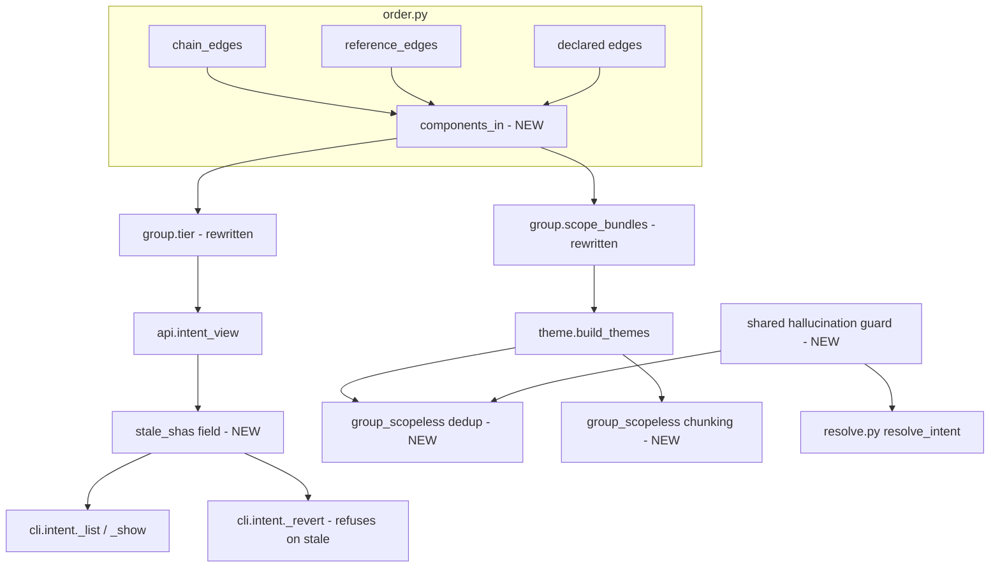

# Intent-Clustering Overlay Hardening - Plan

## Goal Capsule

- **Objective:** Close the gaps an adversarial review found in the shipped intent-clustering overlay (`sgt/intent/*`, U1-U8 of `docs/plans/2026-07-17-001-feat-intent-clustering-overlay-plan.md`) so it survives messy real-world history (non-add-only commits, rebases, non-conventional messages, large scope-less backlogs) without crashing, silently mis-reverting, or breaking its own stated invariants.
- **Authority hierarchy:** This plan's Key Technical Decisions govern implementation; where a unit's approach conflicts with the original U1-U8 plan's KTDs, this plan's decision supersedes it for the affected code path only (the original KTDs are not being re-litigated wholesale).
- **Stop conditions:** Stop and flag if fixing the `tier()` crash (U1) requires changing `order.py`'s public `upset_in`/`downset_in` contracts in a way that changes behavior for their existing callers (`group_requires`/`apply_subset`, U8's sync resolve, `restore`/`cherry-pick` verbs) — those must stay byte-identical.
- **Execution profile:** Standard code change across `sgt/core/order.py`, `sgt/intent/group.py`, `sgt/intent/theme.py`, `sgt/intent/resolve.py`, `sgt/cli/intent.py`, `sgt/api.py`, plus tests. No new dependencies, no schema migration (themes.json's shape is additive-only).
- **Tail ownership:** Whoever implements U1-U7 also updates the affected docstrings' claims (several currently assert invariants the review found unenforced) and runs the full existing test suite plus the new tests each unit adds.

## Product Contract

### Summary

An adversarial code review of the intent-clustering overlay (dispatched per explicit request, transcript-verified against the actual code) found six concrete defects ranging from a reproducible crash to unenforced docstring claims. The most severe two share one root cause: `sgt/core/order.py` has no primitive for "are these ops structurally connected" that works on an arbitrary op subset — only on a subset already known to be a valid, downward-closed ideal. `tier()` (rung-0/1 cross-feature grading) and `scope_bundles()` (rung-1 merging) both need exactly that arbitrary-subset connectivity question answered, and neither can safely reuse `upset_in`/`downset_in` as-is. This plan adds the missing primitive once and uses it to fix both call sites, then fixes four smaller, independent defects the same review surfaced.

### Problem Frame

The overlay's safety story rests on membership being a pure deterministic function of provenance and dependency data. Four of the six findings undermine that story in practice, not in theory:

- `tier()` (`sgt/intent/group.py:164`) passes a bare op-id set — "this commit's ops" or "this bundle's ops" — into `order.downset_in`, which internally calls `_ordered_chains` (`sgt/core/order.py:308-309`). `_ordered_chains` assumes every symbol touched by the input set has its chain head (`before=None` producer) inside that same set — true for a genuine ideal, false for an arbitrary commit/bundle op-set. Any commit that modifies a pre-existing symbol without also carrying that symbol's origin op raises `KeyError: None`. Because `sgt/api.py`'s `compose_view` builds its entire aggregate (`map`, `history`, `status`, `forks`, `plan`, `drift`, `sessions`, `trust`, `oracle_verdict`, `proposals`) as one unguarded dict literal that also calls `intent_view` (line 1066), this single crash takes down every one of those views, not just the intent overlay.
- `scope_bundles()` (`sgt/intent/group.py:107-126`) merges every atom sharing a conventional-commit scope string into one bundle with zero structural check — confirmed unconditional. `tier()`, the only signal that could flag a bad merge, is never consulted by `sgt intent revert` (`sgt/cli/intent.py:125-157` never references `tier`); it only renders as a list/show badge a user must separately notice before reverting.
- Persisted `themes.json` is keyed on commit shas that a rebase/amend/force-push can invalidate. `intent_view` (`sgt/api.py:1023`) and `resolve_group` (`sgt/intent/group.py:183`) both silently filter out vanished shas (`if sha in atoms_by_sha`, `if sha in by_sha`) with no staleness signal, so a revert can silently act on a diminished subset of what a theme claims, or report "no change" when the theme is actually orphaned.
- `group_scopeless` (`sgt/intent/theme.py:137-188`) has no cross-group dedup (an atom can appear in two persisted themes) and truncates scope-less atoms to `MAX_ATOMS=40` sorted by sha, silently dropping the rest from ever getting a theme — both falsify `build_themes`'s own docstring claim that "every atom lands in exactly one theme."

A fifth finding (`sgt/intent/resolve.py`'s independently-coded LLM-confinement check) is not unsafe today but is an architectural inconsistency worth closing while the rest of this code is being touched: it enforces "the LLM never invents a ref" by caller convention, while `theme.py` enforces the equivalent guard inside the module itself.

### Requirements

**Structural connectivity primitive**

- R1. `sgt/core/order.py` provides a connectivity primitive that answers "are two ops linked by a chain/reference/declared edge path" over an arbitrary op-id subset, without assuming the subset is downward-closed or grounded.
- R2. `tier()` uses that primitive instead of `downset_in`, so it never raises on a commit/bundle whose op-set omits a touched symbol's origin op, and correctly detects coupling that passes through an op outside the group (the review's finding #7 undercounting case).

**Rung-1 structural gating**

- R3. `scope_bundles()` splits same-scope atoms into separate bundles when they are not structurally connected (via the R1 primitive over the atoms' own op-ids), so two unrelated commits sharing a scope string no longer merge into one revertable unit.
- R4. `sgt intent revert`'s preview surfaces a bundle's tier so a `thematic`-only (no structural backing) group is visibly flagged before the user commits to reverting it as one unit.

**Staleness signaling**

- R5. `intent_view` reports which persisted theme shas no longer resolve against the current atom partition, instead of silently dropping them.
- R6. `sgt intent revert <theme>` refuses (with a clear message) to proceed on a theme with any unresolved member sha, rather than silently reverting a diminished subset or reporting a misleading "no change."

**Theme partition integrity**

- R7. `group_scopeless` never assigns the same atom sha to two different returned groups; on an LLM response that overlaps groups, the first group (in the LLM's returned order) keeps the atom and later groups drop it.
- R8. `group_scopeless` processes all scope-less atoms in bounded chronological batches (chunking, not truncating) so every atom ends up in exactly one theme regardless of how many scope-less atoms exist, and the cache key change from batching is accounted for in the existing content-hash cache.

**Shared LLM-confinement guard**

- R9. The "output refs/shas must be a subset of what was shown, or dropped" check that `theme.py` currently inlines is extracted into one shared function, and `sgt/intent/resolve.py` calls it too, so both modules enforce the invariant identically rather than independently.

### Scope Boundaries

- **In scope:** the six findings above, confined to `sgt/intent/group.py`, `sgt/intent/theme.py`, `sgt/intent/resolve.py`, `sgt/cli/intent.py`, `sgt/api.py`, and one new primitive in `sgt/core/order.py`.
- **Deferred:** `group_requires`/`apply_subset`'s own reliance on `_grounded` over a non-ideal `group_op_ids` (noted during review verification as a related but not-yet-confirmed risk — `_grounded` degrades to under-inclusion rather than crashing, so it is lower urgency than `tier()`'s crash). Flagged as a follow-up, not fixed here.
- **Outside this plan's identity:** rung-0 atom-identity stability under history rewrites at the `atoms()` level (the atom's `commit_sha` changing identity across a rebase is expected/by-design per the original plan's docstrings); this plan only fixes the *silent* consumption of that fact downstream (R5/R6), not the identity scheme itself.

## Planning Contract

### Key Technical Decisions

- **KTD1 — One connectivity primitive, not two crash-avoidance patches.** `tier()`'s crash and `scope_bundles()`'s fragility both reduce to the same missing capability: undirected structural connectivity over an arbitrary op-id subset. Rather than special-casing `downset_in` for `tier()` and inventing a separate walk for rung-1, `sgt/core/order.py` gets one new function, `components_in(op_ids, ops, declared)`, returning the connected components of `op_ids` under the union of `chain_edges | reference_edges | declared`, restricted to edges whose both endpoints are in `op_ids`. This is plain undirected BFS/union-find over a restricted edge set — it never calls `_ordered_chains`/`_grounded`, so it has no downward-closure precondition to violate. `tier()` and `scope_bundles()` both become callers of this one primitive.
- **KTD2 — Undirected connectivity, not directed reachability, for both call sites.** `tier()`'s question ("does this group's op-set touch more than one feature via a real dependency edge") and rung-1's question ("are these same-scope atoms actually one coherent change") are both connectivity questions, not "does A build on B" direction questions — `upset_in`/`downset_in`'s direction is the wrong shape here, not just their downward-closure precondition. `components_in` returns components; callers ask "are op X and op Y in the same component," never "does X precede Y."
- **KTD3 — Tier becomes a gate for revert confirmation, not just a list/show badge.** R4's fix keeps `tier()` computed the same way (descriptive), but `_revert` (`sgt/cli/intent.py`) now includes the tier in its preview output for every atom/bundle being reverted, so `thematic`-tier groups are visible at the point of action, not only in a separate `sgt intent list` call the user has to remember to run first. This does not block the revert (the original plan's "preview, never silent" discipline stays intact) — it surfaces the signal at the decision point instead of leaving it to be discovered elsewhere.
- **KTD4 — Staleness is a visible field, not a refusal, in `intent_view`; but `_revert` refuses.** `intent_view` (a read) reports staleness (R5) so `sgt intent list`/`show` can render it; `_revert` (a destructive action) refuses outright on any unresolved sha (R6) rather than silently reverting a subset. Read paths inform; the write path that can destroy data blocks until the user re-runs `sgt intent build` to reconcile.
- **KTD5 — Batch scope-less atoms instead of truncating.** R8 replaces the `[:MAX_ATOMS]` truncation with chunking: atoms are sorted chronologically (not by sha — sha-sort was itself part of the truncation's instability) and split into chunks of `MAX_ATOMS`, each chunk gets its own LLM call and its own cache key (content-hash over that chunk's members, same scheme as `_bundle_key`), and `build_themes` iterates all chunks. A store with 45 scope-less atoms costs two LLM calls instead of one, but every atom gets a theme and the cache still hits on an unchanged chunk.
- **KTD6 — Extract the hallucination guard as a pure function over (produced, shown) sets.** R9's shared guard takes "the items the LLM was shown" and "the items the LLM's output named" and returns "the output filtered to only items that were actually shown" — a pure set-intersection operation already implicit in `theme.py:183`'s `[g for g in groups if frozenset(g.atom_shas) <= valid_shas]`. Lifting this into `sgt/intent/_guard.py` (or a similarly-scoped shared module) and having `resolve.py` call it closes the divergence risk without changing either module's existing behavior for the common case.

### High-Level Technical Design

### Assumptions

- The existing test suite (`tests/intent/`, `tests/core/test_order.py`) is the correctness baseline; no unit in this plan changes `order.py`'s existing public function behavior for their current callers.
- `components_in`'s BFS over `chain_edges | reference_edges | declared` restricted to a given `op_ids` set is cheap enough for interactive CLI use at this repo's current scale (same assumption `tier()`'s original `downset_in` call already made — this plan does not need a new performance budget).
- No change to `themes.json`'s on-disk shape is required beyond adding fields (`stale_shas` is computed at read time in `intent_view`, never persisted); existing `themes.json` files remain readable.

## Implementation Units

### U1. `components_in`: undirected structural connectivity over an arbitrary op-id subset

- **Goal:** Add the one primitive KTD1/KTD2 call for — connected components of a given op-id set under `chain_edges | reference_edges | declared`, with no downward-closure precondition.
- **Requirements:** R1
- **Files:**
  - `sgt/core/order.py` — add `components_in(op_ids: frozenset[str], ops: list[Op], declared: Declared = frozenset()) -> list[frozenset[str]]`.
  - `tests/core/test_order.py` — new tests.
- **Approach:** Build the restricted undirected adjacency directly (mirror `_adjacency`'s edge-union logic but keep it undirected and restrict both endpoints to `op_ids`, not `ops`), then run the same `_reachable`-style BFS from each unvisited node to produce components. Do not route through `_grounded` or `_ordered_chains` — that is the exact precondition this primitive exists to avoid. Also add a convenience `connected(a: str, b: str, op_ids, ops, declared) -> bool` (are `a` and `b` in the same component) since both `tier()` and `scope_bundles()` ask that shape of question, not "list all components."
- **Test Scenarios:**
  - Two ops linked by a chain edge, both in `op_ids` → one component.
  - Two ops linked only through a third op *outside* `op_ids` → two separate components (confirms this does NOT silently walk through excluded ops — that would just reintroduce a different form of finding #7's miscount from the other direction; the fix is "answer connectivity correctly for the restricted set," not "pretend excluded ops don't exist as a boundary").
  - An op-id set where one op modifies a symbol whose origin op is *not* in the set → no crash, that op is simply its own singleton component (this is the direct regression test for the `KeyError: None` finding, run through the primitive in isolation before U2 wires it into `tier()`).
  - Empty `op_ids` → empty list, no crash.
  - A `declared` edge between two ops in `op_ids` → they're in the same component even with no chain/reference edge.
- **Verification:** `pytest tests/core/test_order.py -v`.

### U2. Rewrite `tier()` on `components_in`, fixing the crash and the undercounting

- **Goal:** `tier()` never raises on real, non-add-only commits, and correctly reports `coupled` when connectivity passes through an op outside the group.
- **Requirements:** R2
- **Files:**
  - `sgt/intent/group.py` — rewrite `tier()`'s body (lines ~145-168).
  - `tests/intent/test_group.py` — new tests; keep existing passing tests green.
- **Approach:** Replace the `order.downset_in(op_id, group_op_ids, all_ops, declared)` walk with `order.components_in(group_op_ids, all_ops, declared)` computed once per call, then for each component check whether it spans more than one feature via `feature_span` on that component's op-ids restricted to `op_leaf`. `coupled` fires when any single component (not the whole group) spans ≥2 features — this is what fixes finding #7: a component naturally includes any op needed to connect two group members, even one outside the group, because `components_in` computes components over the full `all_ops` edge set restricted to `group_op_ids`'s *membership test*, not restricted to walking only through `group_op_ids` internally. Re-verify this distinction against U1's second test scenario before wiring it in — the fix must connect *through* an external op's edges without ever admitting that external op's id into the reported component (since `tier()` only cares about the group's own ops' feature span).
- **Test Scenarios:**
  - The exact repro from the review: `feat(x): add foo` then `chore: tweak foo and add bar` (foo modified without its origin op in the same atom, bar in a different feature) → `tier()` returns a tier string, does not raise.
  - Two group ops in different features connected only through a third op outside the group → `coupled` (regression test for finding #7).
  - Existing `coupled`/`co-changed`/`thematic` fixtures from the current test file continue to pass unchanged.
- **Verification:** `pytest tests/intent/test_group.py -v`, `pytest tests/core/test_order.py -v`.

### U3. Structural gating in `scope_bundles()`

- **Goal:** Same-scope atoms only merge into one bundle when structurally connected; unconnected same-scope atoms become separate bundles.
- **Requirements:** R3
- **Files:**
  - `sgt/intent/group.py` — `scope_bundles()` (lines 107-126), signature gains `all_ops: list[Op]` and `declared` parameters.
  - `sgt/intent/theme.py` — `build_themes()` call site updated to load and pass `all_ops`/`declared` (mirroring the exact pattern `cli/intent.py::_revert` already uses at lines 132-133).
  - `sgt/cli/intent.py` — no signature change needed (calls `build_themes(repo)` only); confirm no other caller of `scope_bundles` needs updating.
  - `tests/intent/test_group.py` — new tests.
- **Approach:** Within each scope's candidate atom list, run `order.components_in(union of atom op_ids, all_ops, declared)`, then group atoms by which component their op-ids landed in — one `Bundle` per component, still keyed to the same `scope` string, sorted the same deterministic way `scope_bundles` already sorts. An atom whose ops touch no other same-scope atom's ops (a singleton component) becomes its own single-atom `Bundle` with that scope, same as today's scope-less singleton shape but now for a same-scope atom that failed to connect. This preserves the "every atom lands in exactly one bundle" total-partition property while removing the false-merge risk.
- **Test Scenarios:**
  - Two commits both `fix(auth): ...` whose ops share a chain edge → one bundle (current behavior preserved for the legitimate case).
  - Two commits both `fix(auth): ...` with no structural edge between their ops → two separate bundles, same scope string, each a small component (the review's exact repro: unrelated CVE patch and doc typo fix coincidentally both scoped `auth`).
  - Three same-scope atoms where two are connected and one is isolated → one two-atom bundle plus one singleton bundle.
  - Scope-less atoms are entirely unaffected (still singleton, still routed to rung 2).
- **Verification:** `pytest tests/intent/test_group.py -v`, `pytest tests/intent/test_theme.py -v`.

### U4. Surface tier in the revert preview

- **Goal:** A user reverting a `thematic`-tier group sees that signal at the point of the revert, not only via a separate `list`/`show` call.
- **Requirements:** R4
- **Files:**
  - `sgt/cli/intent.py` — `_revert()` (lines 125-157): compute and print each chosen atom's/the group's tier before the existing "reverting N atom(s) as one group" print.
  - `tests/cli/test_intent.py` (or wherever CLI-level intent tests live — confirm exact path during implementation) — new test asserting tier appears in non-JSON revert output; JSON output gains a `tier` key on the preview payload.
- **Approach:** `_revert` already has `all_ops`, `declared`, and the chosen atoms in scope (lines 132-142) — call the same `group.tier()` U2 rewrote, using `op_leaf` (load via the same tree-loading path `intent_view` uses) to compute one tier for the union of chosen atoms' op-ids, and print/emit it alongside the existing atom listing. Do not block the revert on tier — KTD3 keeps this informational, consistent with the "preview, never silent" discipline the rest of `sgt` follows.
- **Test Scenarios:**
  - Reverting a `thematic`-tier bundle prints the tier badge/word in the non-JSON path.
  - JSON revert preview includes a `tier` field.
  - Reverting a single unwitnessed atom (no tree/`op_leaf` available) degrades to whatever `tier()` already returns for that case (`co-changed`/`thematic` per existing logic) without crashing.
- **Verification:** `pytest tests/cli/ -k intent -v` (adjust path to match actual test layout).

### U5. Staleness signal in `intent_view`, refusal in `_revert`

- **Goal:** A theme whose persisted shas no longer resolve against the current atom partition is visibly flagged on read, and blocks revert on write.
- **Requirements:** R5, R6
- **Files:**
  - `sgt/api.py` — `intent_view()` (around lines 1019-1037): add a `stale_shas` list (persisted shas with no matching current atom) per theme.
  - `sgt/intent/group.py` — `resolve_group()` (lines 173-188): return enough information for the caller to detect a partial/total resolution failure, or add a companion check function.
  - `sgt/cli/intent.py` — `_list`/`_show` render `stale_shas` when non-empty; `_revert` (lines 125-157) checks for any unresolved sha in the target theme and fails with a clear message ("run `sgt intent build` to reconcile — N member commit(s) no longer resolve") instead of proceeding.
- **Approach:** In `intent_view`, compute `member_shas - {atoms present}` per theme (the set `atoms_by_sha` already filters against) and attach it as `stale_shas` rather than silently discarding it. In `_revert`, before calling `group.resolve_group`, compare the target theme's persisted `atom_shas` (if `target` resolves as a theme in `themes.json`) against `{a.commit_sha for a in all_atoms}` and refuse if any are missing — this is a stricter, earlier check than relying on `resolve_group`'s existing silent-filter behavior, which stays unchanged for other callers.
- **Test Scenarios:**
  - A theme with all member shas present → `stale_shas` is empty, `_revert` proceeds as today.
  - A theme with one member sha missing (simulating a rebase) → `intent_view` reports it in `stale_shas`; `_revert` on that theme fails with the reconcile message instead of reverting the remaining members.
  - A theme with *all* member shas missing → `_revert` fails with the same reconcile message, not the misleading "no change" `plan_revert_op_set` would otherwise report.
- **Verification:** `pytest tests/intent/ -v`, `pytest tests/cli/ -k intent -v`.

### U6. Fix `group_scopeless`: no double-membership, no truncation-drop

- **Goal:** Every scope-less atom lands in exactly one theme, regardless of LLM response overlap or backlog size.
- **Requirements:** R7, R8
- **Files:**
  - `sgt/intent/theme.py` — `group_scopeless()` (lines 137-188) and `build_themes()` (lines 202-257).
  - `tests/intent/test_theme.py` — new tests.
- **Approach:** For R7, track a running `assigned: set[str]` while building `groups` from the LLM's `result.groups` in order; when resolving each group's `atom_shas`, drop any sha already in `assigned` before appending the group, then union the group's surviving shas into `assigned` — first group wins, matching the LLM's own returned order deterministically. For R8, replace the `[:MAX_ATOMS]` slice with chronological chunking (sort scope-less atoms by `_atom_sort_key`, split into `MAX_ATOMS`-sized chunks), call the existing per-chunk LLM/cache path once per chunk with a chunk-scoped cache key (extend `_scopeless_key` to hash the chunk's own members, which it already does per-list — just call it per chunk instead of once over a truncated list), and have `build_themes` merge results from all chunks into one `themes` dict as it already does per-bundle.
- **Test Scenarios:**
  - A crafted LLM response with overlapping `atom_shas` across two groups → the earlier group keeps the atom, the later group's `atom_shas` for that sha is dropped (reproduces and fixes the review's direct repro).
  - 45 synthetic scope-less atoms → all 45 appear across the returned theme set (regression test for the review's exact repro, which previously landed only 40).
  - An unchanged chunk on a rebuild hits the cache (no live LLM call) while a chunk with a new atom does not.
- **Verification:** `pytest tests/intent/test_theme.py -v`.

### U7. Shared LLM-confinement guard used by both `theme.py` and `resolve.py`

- **Goal:** One enforced implementation of "the LLM's output is filtered to what it was actually shown," not two independently-coded versions.
- **Requirements:** R9
- **Files:**
  - `sgt/intent/_guard.py` (new) — `filter_to_shown(items: list, shown_keys: frozenset[str], key_of) -> list` or an equivalent minimal pure function; exact shape decided during implementation to fit both call sites' data shapes without forcing an awkward common type.
  - `sgt/intent/theme.py` — `group_scopeless()` line 183's inline filter calls the shared function instead.
  - `sgt/intent/resolve.py` — `resolve_intent()` (lines 90-119) calls the shared function on the LLM's returned candidates against the context pool it built, replacing the currently-absent module-level check.
  - `tests/intent/test_theme.py`, new `tests/intent/test_resolve.py` (or existing file, confirm during implementation) — tests for the shared guard and both call sites.
- **Approach:** Extract the exact filtering logic `theme.py:183` already performs (`[g for g in groups if frozenset(g.atom_shas) <= valid_shas]`) into the new module as a small, dependency-free function operating on plain sets/keys — not on `ThemeGroup`/`Candidate` types directly, so both modules can adapt their own shapes to it. Wire `resolve.py` to call it before returning candidates, so `resolve_intent`'s own contract now enforces what its docstring already claims, rather than relying on `cli/ideal_edit.py`'s caller-side re-plan-and-drop as the only real enforcement.
- **Test Scenarios:**
  - `theme.py`'s existing hallucination-guard tests continue to pass through the shared function (no behavior change for the common case).
  - `resolve_intent` given a fabricated LLM response naming a ref never present in its built context pool → the invented ref is dropped from the returned `IntentResolution` before it reaches the caller (this is the new behavior R9 adds; previously this reached the caller and depended on the caller's re-plan step to catch it).
- **Verification:** `pytest tests/intent/ -v`.

## Verification Contract

| Command | Applies to | Purpose |
|---|---|---|
| `pytest tests/core/test_order.py -v` | U1, U2 | New `components_in` primitive and its use in `tier()` behave correctly and don't regress existing order-algebra tests. |
| `pytest tests/intent/ -v` | U2, U3, U5, U6, U7 | Full intent-overlay suite, including every new regression test this plan adds. |
| `pytest tests/cli/ -k intent -v` | U4, U5 | CLI-level revert/list/show behavior, including the new tier badge and staleness refusal (confirm exact test path during implementation — CLI intent tests may live elsewhere). |
| `pytest` (full suite) | All units | No regression outside the touched modules; run once before considering the plan done. |

No `release:validate`-equivalent gate exists for this repo's CLI tooling beyond the pytest suite above.

## Definition of Done

- All seven units implemented; every new test scenario listed above has a corresponding passing test.
- Full existing test suite passes with no new failures (pre-existing unrelated failures, if any, are called out explicitly rather than silently absorbed into this plan's diff).
- Docstring claims that the review found unenforced are corrected to match the new, actually-enforced behavior: `build_themes`'s "every atom lands in exactly one theme" claim (now true via U6), `tier()`'s "reuses `order.downset_in` exactly as `proposal_review_view` does" claim (now describes `components_in`, U2), and `resolve.py`'s confinement claim (now backed by U7's shared guard rather than caller convention).
- No dead code left from the `downset_in`-based `tier()` implementation or the `[:MAX_ATOMS]` truncation path once their replacements land.
- The six review findings are each traceable to the unit that resolved them (U1/U2 → finding #1 and #7; U3/U4 → finding #3; U5 → finding #2; U6 → findings #4 and #5; U7 → finding #6).
