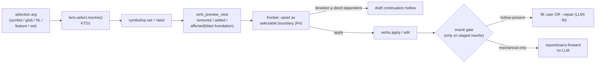
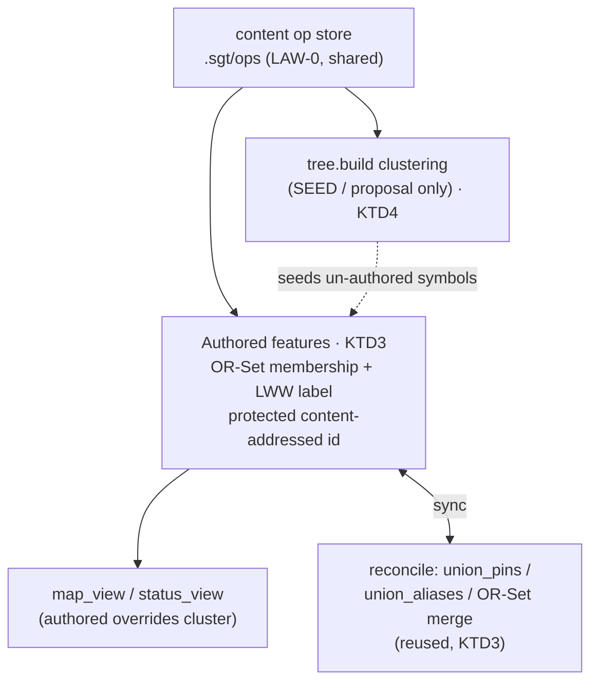
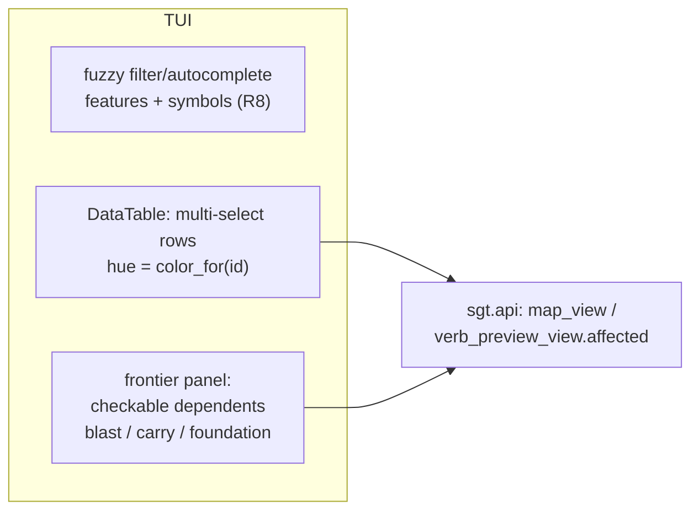

# refactor: semantic user model + TUI

## Product Contract

### Summary

Reshape sgt's user-facing model around one authored noun — the **feature** as a user-owned named
selection over the deterministic symbol graph — collapse the ~50-verb surface into a ~7-verb daily
spine (`save`, `status`, `log`, `undo`, `revert`, `restore`, `edit`) with **selection as the
universal argument**, add interactive frontier control on `revert`/`edit`, make the LLM's role a
single crisp rule, unify undo over one operation log, and upgrade the Textual TUI with
fuzzy-search, multi-select, and frontier visualization. This is a hard rename/removal of the old
verb surface (CLI + MCP + tests), not an additive alias layer.

### Problem Frame

sgt today has **two machine-derived nouns** — ops (mined) and features (clustered) — and the user
authors neither. Features come from a Leiden-CPM clustering overlay (`sgt/lens/tree.py`) whose
boundaries the user did not choose, so the primary noun is untrustworthy: it does not match the
user's mental model, chunking is "arbitrary" from the user's seat, and reorganizing work means
fighting the algorithm. The ~50 verbs are the symptom — the plumbing of a two-noun machine
(`merge-op` vs `merge`, `save` vs `commit` vs `land`, `fulfill`/`stage`/`unstage`) leaks to the top
level. jj is clean because it has one *authored* noun (the commit), total operations, and one
universal undo. sgt's differentiator is the symbol graph; the synthesis is to make the user's
authored feature the one noun over that graph, let the LLM in only to fill declared gaps, and give
`undo` a single meaning. The kernel-level conflict/identity/sync rigor options are a separate
concern (`docs/plans/2026-07-18-001-refactor-vcs-inspired-architecture-options-plan.md`) and are
out of scope here.

### Requirements

- **R1** — A single selection resolver maps any of {symbol id, path/glob pattern, NL phrase,
  named-feature ref, explicit op/symbol set} to a symbol/op set, and is the argument type every
  operating verb consumes.
- **R2** — The daily surface is ~7 verbs: `save`, `status`, `log`, `undo`, `revert`, `restore`,
  `edit`. All other verbs are removed from the top level (folded into these, made subcommands, or
  deleted). MCP tool names and tests move with the rename.
- **R3** — Features are user-authored named selections over the symbol graph, seeded from the
  clustering but not governed by it, and they survive sync/merge across collaborators as
  first-class merged state (identity + membership + label), not as a rebuild artifact.
- **R4** — `revert` and `edit` expose their upset/downset as a previewable, selectable **frontier**:
  the user chooses which dependents are dropped vs. kept, and keeping a direct dependent drafts a
  continuation hollow.
- **R5** — `edit <selection>` changes a feature/symbol in place: it chain-extends the target and
  mechanically re-points dependents; the LLM is invoked only when a dependent genuinely breaks.
- **R6** — One crisp LLM rule holds everywhere: the LLM is invoked *only* to fill a declared
  hollow; mechanical repair (carry-forward, `requires`-repoint) is LLM-free and visibly labeled;
  the LLM never runs silently and never touches non-hollow symbols.
- **R7** — `undo` is one mechanism over one append-only operation log capturing *all* mutation
  types (today only ideal-edits are journaled), and walks arbitrarily far back.
- **R8** — The TUI (`sgt/tui/app.py`) supports fuzzy-search/autocomplete over features and symbols,
  multi-select of rows, and renders the revert/edit frontier as a checkable list, reusing the
  shared `color_for` identity hue.

### Scope Boundaries

**In scope:** the CLI verb surface, the MCP tool surface, `sgt.api` projections, the selection
engine, authored-feature persistence + sync-merge, the frontier data path, `sgt edit`, the unified
undo log, and the Textual TUI.

**Out of scope / deferred:**

#### Deferred to Follow-Up Work
- **Kernel conflict/identity/sync rigor** (fork granularity, persisted identity registry, sync
  operation-log-as-coordination) — owned by the VCS-inspired-architecture-options doc.
- **Graphical node-link graph rendering in the TUI** — the frontier ships as a checkable list this
  round; a drawn dependency-graph view is a later enhancement.
- **Direct op emission for agents** (skipping the mine bridge / worktree) — a distinct substrate
  change; not required for this user-model work.
- **Collaboration verbs** (`sync`, `land`, `propose`, `session`, `push`) keep their current
  behavior and names except where the unified undo log must record their mutations (R7).

---

## Planning Contract

### Key Technical Decisions

**KTD1 — Selection is one resolver in `sgt/lens/select.py`, returning a symbol/op set + a resolved
label.** Today `selection_view` (`sgt/api.py:227`) and `sgt/lens/select.py` accept only
feature-tree refs. Generalize the resolver to a discriminated input: an exact `file::symbol`, a
glob, an NL phrase (**new work** — there is no existing NL/embedding revert resolution today;
`revert` resolves only op-id/prefix/`file::symbol`/feature-id via `resolve_target`, so this ships as
a fuzzy match over feature label + id per the Assumptions, not a reuse), a named authored-feature
ref, or an explicit set. Every operating verb calls it; the frontier and TUI
consume the same result. Rationale: this is the single move that lets a user "operate at the level
*I* think in" and dissolves the alignment mismatch — you select what you mean; the cluster is a
default, not a cage.

**KTD2 — Hard rename via a compatibility-free spine, executed as a mechanical sweep.** The ~7 spine
verbs become the only top-level `_VERBS` (`sgt/cli/__init__.py:44-51`); removed verbs either move
under a spine verb as a subcommand/flag, move under an `advanced`/maintenance grouping, or are
deleted. The 11 MCP tools (`sgt/mcp/server.py:206-297`) are renamed to match. Rationale: the user
chose the clean end state over an alias layer — a two-noun surface with a thin new front would keep
the confusion. Old→new mapping is enumerated in the HTD table so the sweep is unambiguous.

**KTD3 — An authored feature is (OR-Set membership) + (witness-topological LWW label register) keyed
by a globally-tagged, protected id — reusing primitives that already exist.** Membership copies
`DeclaredORSet` (`sgt/core/lens.py:104-122`): add carries a globally-unique tag, remove tombstones
observed tags, merge is by tag — so concurrent create/delete converges.

The id is a **globally-tagged UUID minted at feature-creation time and carried, never re-derived**
(not content-addressed). This is a deliberate choice between two schemes with *opposite* failure
modes: a content-addressed `f-<founding-op-id>` would make two users who author *different* features
over the same seed op collide into one id (with a label fight), and `_content_birth_id`'s
convergence guarantee (`sgt/lens/tree.py:537`) does not even apply here because it requires both
sides to see the same member set — but an authored feature's membership is an *independently-authored*
OR-Set. A carried UUID means two clones independently authoring "the same" feature yield two distinct
features (no accidental merge), which matches user-owned-selection semantics. The UUID also lives in
its own `af-` namespace, so it can never collide with the clustering/split layer's `f-<op-id>` ids
(KTD4). The id travels via the alias G-Set (`union_aliases`, `sgt/lens/reconcile.py:169`) and is
`protected` from birth (`sgt/lens/tree.py:441,618-623`) so a rebuild never re-mints it.

The label is a **witness-topological LWW register** merged via the `_assign_winner` rule
(`sgt/lens/reconcile.py:41-79`) — it carries its own introducing-witness map (mirroring
`pins.assign_witness`) so a causally-later rename beats a stale one, hash tie-break only when truly
concurrent. Note: `pins.labels`'s *own* merge (`reconcile.py:111-117`) is hash-tie-break only with no
witness input, so it is **not** sufficient for "latest rename wins" — the feature-label register must
follow the `assign`/`_assign_winner` pattern, not the `pins.labels` pattern.

Rationale: the pins system is *already* a merged authored layer; this promotes the feature object
itself to first-class merged state rather than a `tree.build` output, reusing the OR-Set,
`_assign_winner`, and `union_aliases` primitives — but each with the *correct* merge rule named above,
not treated as interchangeable.

**KTD4 — `tree.build` demotes to a seed; authored features override; split's `F<n>` hazard is
fixed.** Clustering still runs to *propose* groupings for un-authored symbols (drift), but the
authored-feature layer is the authority for anything the user named. `apply_split`
(`sgt/lens/verbs.py:274`) currently mints a replica-local `F<n>` (`:286`) — an identity hazard for
the CRDT; it must mint a **content-addressed `f-<founding-op-id>`** instead (via `_content_birth_id`,
which converges because a split's members are derived from the shared op store). This is a different
namespace from authored features' carried `af-` UUIDs (KTD3), so the two layers' ids can never
collide. Feature-reorg (`regroup`) writes authored-feature ops, not only pins.

**KTD5 — `sgt edit` composes two existing draft templates plus a new mechanical repoint.** Chain-
extend the target with a hollow whose `before = target's current after_version` (the chain-extension
mint pattern in `merge_op`, `sgt/core/rewrite.py:201`, where `before = the tip's after_version` — not
`split_op`, whose intermediate cut uses the *original's* before_version) and split the upset
blast-vs-carry like `revert_keep_dependents` (`sgt/core/rewrite.py:302`). The new wrinkle: because
versions are content hashes, *any* edit stales every dependent's `requires` edge, so add a mechanical
**repoint** variant of `carry_forward` that rewrites `requires` to the new version (no LLM) and only
falls back to a continuation hollow when the oracle goes red.

**Bounded-safety caveat (load-bearing).** The repoint path's safety is exactly as complete as the
configured oracle — the oracle is user-configured shell tiers returning one whole-suite pass/fail
(`sgt/core/sync/land.py:75-87`), so a semantic break outside test coverage would be repointed and
ship silently. Two consequences the plan commits to: (1) the DoD criterion is stated as
**oracle-green**, not "behavior-preserving" — the edit records zero model calls when the oracle passes,
which is a coverage-bounded claim, not a semantic-safety guarantee; (2) because the whole-suite verdict
cannot be attributed to a specific dependent, a red oracle drafts continuation hollows for **all**
repointed blast (direct) dependents, not "only the broken ones." Rationale: reuses the
hollow→fulfill→oracle-gate machinery; the only genuinely new logic is the repoint.

**KTD6 — The unified op-log is a new committed-or-local append-only event log, distinct from
`oplog_view`.** `oplog_view` (`sgt/api.py:80`) is the *content* op-DAG, not a user-action history.
The undoable log today is the per-ref `ideal_journal` (`sgt/core/lens.py:91-98,569-590`), which
misses feature-reorg, `after`, `tiers`, `intent`, `session`, and plan-state mutations. Introduce
one operation-event log every mutating verb appends to (op-kind, inverse-descriptor, affected
refs); `undo` pops it and applies the inverse uniformly. Two decisions this KTD commits to, to avoid
known hazards: (1) the unified log **subsumes** `ideal_journal` (single store, one pop per undo) —
it does not coexist with it, which would risk a double-pop when an ideal-edit event and its journal
entry are popped by two mechanisms; ideal-edit inverses are stored as events carrying the prior
ideal, folding today's `undo_ideal` logic into the one log. (2) `undo` is **reverse-chronological**:
repeated `undo` walks back one tail event at a time. "Arbitrarily far back" means *depth of sequential
undo*, not random-access undo of a non-tail op — undoing an op that later ops built on would need a
rebase/conflict story that is explicitly out of scope. Rationale: jj's real safety is *one*
mechanism; fragmented per-file undo is the current gap.

### Assumptions

- The NL-selection path can reuse whatever mechanism `revert "<nl phrase>"` already uses today; if
  no embedding index exists, NL resolution degrades to a fuzzy label match (confirm during U1).
- `undo` of a collaboration mutation (`land`/`propose`) that already left the local clone is out of
  scope — the log records it for provenance, but the inverse is only applied for local, not-yet-
  shared operations (matches today's `journal=checked_out` guard at `sgt/core/sync/land.py:207`).

---

## High-Level Technical Design

### Verb spine — old surface → new surface

| New spine verb | Absorbs / replaces | Old verbs (file) |
|---|---|---|
| `save` | local snapshot commit | `save` (porcelain), `commit`/`unstage`/`fulfill` → `save --stage`/internal (rewrite) |
| `status` | one-screen state | `status`, `state`, `compose`, `drift`, `forks`, `plan status` (inspect/loop/sync) |
| `log` | history + blame + why | `log`, `history`, `blame`, `why` (inspect/select) |
| `undo` | universal rewind | `undo` (porcelain) + `after`-inverse etc. now logged (R7) |
| `revert <sel>` | remove + frontier | `revert`, `revert-keep-dependents` (ideal_edit/rewrite) |
| `restore <sel>` | re-add | `restore` (ideal_edit) |
| `edit <sel>` | in-place change | NEW (KTD5); subsumes `merge-op`/`split-op`/`transplant` as internal mechanics |
| `feature` (grouping) | author/re-cut features | `merge`/`split`/`rename`/`move` → `feature regroup/rename` |
| `advanced` (grouping) | maintenance/rare | `fsck`, `reindex`, `fold`, `preview`, `tiers`, `identity`, `migrate`, `oracle`, `pin` |
| unchanged | collaboration + setup | `sync`, `land`, `push`, `propose`, `session`, `init`, `mcp` |

### Selection → frontier → apply (the universal path)

### Authored-feature layering (CRDT over the deterministic graph)

### TUI (extends `sgt/tui/app.py`)

---

## Implementation Units

### U1. Universal selection resolver

**Goal:** One resolver turning any selection form into a symbol/op set + resolved label; the
argument type every operating verb and the TUI consume.
**Requirements:** R1.
**Dependencies:** none.
**Files:** `sgt/lens/select.py` (extend `select`), `sgt/api.py` (`selection_view` at :227 accepts the
discriminated input; add a thin `resolve_selection` projection), `tests/lens/test_select.py`,
`tests/test_api.py`.
**Approach:** Add a `resolve(repo, spec)` that dispatches on spec shape: exact `file::symbol`, glob
(match against live symbols), NL phrase (**new** — a fuzzy match over feature label + id; no NL
resolution exists today to reuse), authored-feature ref (U6), explicit id set. Return the op/symbol
set, the induced closure (existing `select` logic), and a display label. Keep it report-only (no
materialization — preserve the U25 BET-C constraint noted in the `select` docstring).
**Patterns to follow:** existing `select`/`selection_view` closure logic; `resolve_target`'s
op-id/prefix/`file::symbol`/feature-id dispatch in `sgt/core/verbs.py` (the exact-ref half — NL is
additive on top).
**Test scenarios:**
- Happy: each spec form resolves to the expected op set (exact symbol; `pay/*.py` glob; a named
  feature; an explicit 2-op set).
- Edge: empty match returns `ok=False` with a message, not an exception; ambiguous NL phrase returns
  the ranked candidates.
- Edge: a glob matching symbols across two features reports both in the closure.
- Integration: `resolve` output feeds `verb_preview_view` unchanged (U3).
**Verification:** `sgt select <any form>` prints a consistent closure; the same call underlies a
revert preview.

### U2. Collapse to the ~7-verb spine (hard rename, CLI + MCP + tests)

**Goal:** The spine is the only top-level surface; removed verbs are folded, re-homed under
`feature`/`advanced`, or deleted; MCP tools renamed to match.
**Requirements:** R2.
**Dependencies:** U1 (spine verbs take a selection), U3–U8 (the absorbed behaviors must exist before
their old verb is removed — sequence the sweep last within each behavior).
**Files:** `sgt/cli/__init__.py` (`_FAMILIES` :53, `_VERBS` :44-51, `_help` :120-208), the family
modules under `sgt/cli/` (fold/rehome per the HTD mapping table), `sgt/mcp/server.py` (`TOOLS`
:206-297, handlers `tool_*` :42-198), `tests/cli/**`, `tests/test_mcp*.py`.
**Approach:** Execute the HTD old→new mapping table exactly. Introduce two grouping parsers
(`feature`, `advanced`) that host re-homed subcommands. Rename MCP keys + descriptions in lockstep.
This is mostly mechanical but wide — do it as the final integrating unit after the behaviors it
fronts (U3–U8) land.
**Execution note:** Land behavior units first; this unit is the surface sweep. Expect broad test
renames — run the full CLI + MCP suites before and after.
**Patterns to follow:** `tiers.py`'s nested subparser (`:20-21`) for the `feature`/`advanced`
groupings; existing `register(subs, parent)` convention.
**Test scenarios:**
- Happy: each of the 7 spine verbs dispatches; `sgt feature regroup`/`sgt advanced fsck` resolve.
- Error: a removed top-level verb (`sgt merge-op`) errors with a pointer to its new home.
- Integration: every MCP tool call round-trips under its new name; no handler orphaned.
- Covers R2: `_VERBS` contains exactly the spine + grouping + collaboration set, nothing else.
**Verification:** `sgt --help` shows the spine; full CLI + MCP test suites green.

### U3. Interactive revert/edit frontier

**Goal:** Expose the upset/downset as a selectable boundary; keeping a direct dependent drafts a
continuation hollow.
**Requirements:** R4.
**Dependencies:** U1, U5.
**Files:** `sgt/core/verbs.py` (`plan_revert` :122 accepts a caller-supplied kept-set),
`sgt/core/rewrite.py` (`revert_keep_dependents` :302 generalizes from all-or-nothing to a per-
dependent frontier), the `revert`/`edit` CLI spine handlers (add `--keep <id>,<id>` to supply the
kept-set non-interactively from the `--preview` frontier; the TUI checklist in U9 is the interactive
equivalent), `sgt/api.py` (`verb_preview_view`/`_project_verb_preview` :300-381 already emit
`removed`/`added`/`affected` — add a `frontier` block classifying each dependent on one axis into
**blast** / **carry** / **foundation**), `tests/core/test_verbs.py`, `tests/core/test_rewrite.py`,
`tests/test_api.py`.
**Approach:** One canonical 3-bucket vocabulary, used identically in the projection, the CLI, U9,
and the HTD diagram (no `direct`/`blast` drift): **blast** = a direct reference-edge dependent that
needs rework if kept (drafts a continuation hollow); **carry** = a transitive dependent that
repoints mechanically (U5, free); **foundation** = an upstream prerequisite the reverted core is
built on, which cannot be dropped in a revert (read-only in the frontier, never toggleable). The
caller passes back which of the *toggleable* (blast/carry) dependents to keep. Reuse
`order.upset_in`/`reference_edges` already used by `revert_keep_dependents`; the `blast`/`foundation`
terms match the existing `_affected_rows` direction vocabulary (`sgt/api.py:326`).
**Patterns to follow:** `revert_keep_dependents`'s existing direct-vs-carry split (`sgt/core/rewrite.py:326-354`);
`_affected_rows` (`sgt/api.py:326`).
**Test scenarios:**
- Happy: reverting a symbol with 2 direct + 3 transitive dependents, keeping all → 2 hollows drafted,
  3 carried; keeping none → full-upset removal.
- Edge: keeping a dependent whose only tie is transitive drafts *no* hollow (repoint only).
- Edge: frontier on a symbol with zero dependents equals a plain revert.
- Integration: the `frontier` projection matches what the TUI checklist renders (U9).
**Verification:** `sgt revert <sel> --preview` lists the frontier; applying a partial frontier
produces exactly the drafted hollows.

### U4. `sgt edit <selection>` — in-place change

**Goal:** Change a feature/symbol in place; dependents mechanically repoint; LLM only on real break.
**Requirements:** R5.
**Dependencies:** U1, U3, U5.
**Files:** `sgt/core/rewrite.py` (new `edit_op` draft builder + `build_candidate` branch), a new
`sgt/cli` spine handler for `edit`, `sgt/api.py` (`rewrite_view` already surfaces drafts/staged —
extend if needed), `tests/core/test_rewrite.py`, `tests/cli/test_edit.py`.
**Approach:** Draft a chain-extension hollow for the target (`before = current after_version`,
`after = _PENDING`) exactly like `split_op` (`sgt/core/rewrite.py:224`). The user edits the file;
`fulfill(..., from_tree=True)` reads the new bytes. Dependents are repointed mechanically (U5); the
candidate goes through the oracle; only dependents that actually break get a continuation hollow.
**Patterns to follow:** `split_op` (chain extension) and `revert_keep_dependents` (upset split) in
`sgt/core/rewrite.py`; the `RewriteDraft`→`stage`→`land` pipeline.
**Test scenarios:**
- Happy: behavior-preserving edit of a symbol with 3 dependents → repoint only, oracle passes, no LLM,
  one `save`/land.
- Error path: behavior-changing edit that breaks a caller → that caller becomes a continuation
  hollow; `--repair` fills it; oracle re-gates.
- Edge: editing a symbol with no dependents is a plain chain extension.
- Integration: staged edit candidate is stale-guarded like other rewrites (`_stale_paths`).
**Verification:** `sgt edit <sel>` on a rename-free body change commits without an LLM call; a
breaking change surfaces exactly the broken dependents.

### U5. One crisp LLM rule + mechanical repoint

**Goal:** LLM invoked only to fill a declared hollow; mechanical repair (carry-forward + new
`requires`-repoint) is LLM-free and labeled; no silent LLM.
**Requirements:** R6.
**Dependencies:** none (foundation for U3/U4).
**Files:** `sgt/core/rewrite.py` (`build_candidate` :400 — add a `repoint` step beside
`carry_forward` :453 that rewrites a dependent's `requires` to the new target version without a
hollow), `sgt/repair/*` (ensure the LLM entry point fires only on hollows and stamps provenance),
`tests/core/test_rewrite.py`, `tests/repair/test_repair.py`.
**Approach:** Add a mechanical repoint mirroring the existing `carry_forward` mint (same footprint,
same image, `requires` rewritten to the new version) — a pure, LLM-free op. Audit the repair loop so
the only path that calls the model is hollow fulfillment; label mechanically-produced ops distinctly
from LLM-filled ones (intent string / kind).
**Patterns to follow:** `carry_forward` mint (`sgt/core/rewrite.py:453-470`); split-op tail mint
(`:440-451`).
**Test scenarios:**
- Happy: a repoint produces a `requires`-updated op byte-identical in image to the original, no model
  call.
- Behavioral: the LLM entry is invoked iff at least one hollow remains after mechanical repair
  (assert call count == hollow count).
- Edge: an op with no `requires` edge to the target is untouched by repoint.
- Integration: a fulfilled hollow carries LLM provenance; a repointed op does not.
**Verification:** a behavior-preserving edit records zero model calls; grep of op provenance shows
LLM tags only on hollow-filled symbols.

### U6. Authored feature as first-class merged object

**Goal:** A feature is a user-authored object (OR-Set membership + LWW label + protected id) that
survives sync/merge.
**Requirements:** R3.
**Dependencies:** none (but U7 consumes it).
**Files:** new `sgt/lens/authored.py` (the `AuthoredFeature` type + create/rename/delete/merge), a
new committed artifact slot in `sgt/state.py` (`_ARTIFACTS`, `committed=True`, sits beside `pins`,
`aliases`), `sgt/lens/reconcile.py` (merge on sync — reuse `union_pins` :82, `union_aliases` :169,
`DeclaredORSet` merge), `sgt/core/sync/resolve.py` + `materialize.py` (persist beside pins/aliases at
`:116-118`), `tests/lens/test_authored.py`, `tests/lens/test_reconcile.py`.
**Approach:** Model membership as an OR-Set (copy `DeclaredORSet`, `sgt/core/lens.py:104-122`): add
carries a unique tag, remove tombstones, merge by tag. Model the label as an LWW register merged like
`pins.labels`/`_assign_winner` (`sgt/lens/reconcile.py:41-126`). Mint the id content-addressed
(`f-<founding-op-id>`, like `_content_birth_id` `sgt/lens/tree.py:537`) and mark it `protected` from
birth. On sync, merge the three components; never rebuild them.
**Patterns to follow:** `DeclaredORSet` (OR-Set), `union_pins`/`union_aliases` (register + G-Set),
`_content_birth_id` (replica-independent id).
**Test scenarios:**
- Happy: create a feature from a selection, rename it, delete a member — reads back correctly.
- CRDT: two replicas concurrently add different members → union; concurrent rename → witness-topological
  LWW winner, hash tie-break when truly concurrent; concurrent create+delete of the same feature →
  OR-Set converges (delete wins only if it observed the add).
- Edge: an authored id is `protected` — a `tree.build`/`sgt map` rebuild never re-mints or orphans it.
- Integration: merge is commutative + idempotent (apply A∪B == B∪A; re-applying is a no-op).
**Verification:** a rename + membership edit survives a `sync` round-trip between two clones; ids
match on both.

### U7. Demote clustering to a seed; fix split's id hazard

**Goal:** Clustering proposes groupings for un-authored symbols only; authored features are the
authority; feature-reorg writes authored ops; split mints a safe id.
**Requirements:** R3 (authority inversion), and closes the `F<n>` hazard.
**Dependencies:** U6.
**Files:** `sgt/lens/tree.py` (`label_tree`/`build` — authored features override the clustered leaf;
`apply_split` :274 mints a content-addressed id, not `F<n>` :286), `sgt/lens/verbs.py`
(`merge`/`split`/`rename`/`move` → `feature regroup/rename` write authored-feature ops via U6, not
only pins), `sgt/api.py` (`map_view` :426 reflects authored-over-cluster), `tests/lens/test_tree.py`,
`tests/lens/test_verbs.py`.
**Approach:** Where a symbol belongs to an authored feature, that assignment wins; the clustering fills
only the remainder (drift). Reorg verbs become thin wrappers that mutate authored features (U6);
`apply_split` mints a content-addressed/tagged id so two replicas splitting the same members converge.
**Patterns to follow:** existing pin-override pass in `label_tree` (`sgt/lens/tree.py:836-839`); the
`protected` set (`:441,618-623`).
**Test scenarios:**
- Happy: `sgt map` shows authored feature labels/membership overriding the clustered proposal;
  un-authored symbols still get cluster labels.
- Edge: `feature split` on the same members on two replicas mints the identical id (regression on the
  `F<n>` hazard).
- Integration: after authoring, a re-cluster (`sgt map` refresh) does not move authored members.
**Verification:** authored membership is stable across refreshes and matches across a synced clone.

### U8. Unified operation log + universal `undo`

**Goal:** One append-only operation-event log capturing all mutating verbs; `undo` pops and applies
the inverse uniformly.
**Requirements:** R7.
**Dependencies:** U3–U7 (their mutations must emit events).
**Files:** new `sgt/core/oplog.py` (the event log: append + inverse-descriptor + pop) that
**subsumes** `ideal_journal` (a single store, one pop per undo — not a second log coexisting with it,
which would risk a double-pop when an ideal-edit event and its journal entry are popped separately),
`sgt/state.py` (the `ideal_journal` slot is promoted/renamed to the unified log, not added beside),
`sgt/cli/porcelain.py`
(`_undo` :139 walks the unified log), and one-line `append` calls at each mutation site
(`sgt/core/verbs.py:247`, `sgt/core/rewrite.py:629`, `sgt/lens/verbs.py` reorg, `sgt/core/sync/*`
land/propose, `after`/`tiers`/`intent`/`session`/plan state), `sgt/api.py` (an `oplog` *action*
view distinct from `oplog_view`), `tests/core/test_oplog.py`, `tests/cli/test_undo.py`.
**Approach:** Each mutating verb appends an event `{kind, inverse, refs, provenance}`. `undo` is
**reverse-chronological** — it pops the tail event and applies its inverse (ideal edits re-materialize
the prior ideal, folding today's `undo_ideal` logic into the one log; feature-reorg re-applies the
inverse authored-feature op; etc.). Repeated `undo` walks back one tail event at a time; undoing a
non-tail op that later ops depend on is out of scope (no rebase story). Keep the existing append-only,
never-rewind discipline. Respect the `journal=checked_out` guard (`sgt/core/sync/land.py:207`) — a
shared-out mutation is logged for provenance but its inverse is not applied.
**Patterns to follow:** `_load_ideal_journal`/`undo_ideal` (`sgt/core/lens.py:91-98,569-590`);
`record_ideal`'s locked read-modify-write (`:540-550`).
**Test scenarios:**
- Happy: a sequence save → revert → feature rename → edit; four `undo`s walk back through all four,
  each restoring the prior state.
- Edge: `undo` with an empty log reports "nothing to undo".
- Edge: a feature-reorg `undo` restores prior membership/label (not just ideal edits — the current
  gap).
- Integration: an already-landed (shared) `land` is in the log but its `undo` is refused with a clear
  message.
**Verification:** every mutating spine verb produces exactly one log event; `undo` reverses each
kind.

### U9. TUI: fuzzy search, multi-select, frontier panel

**Goal:** Fuzzy-search/autocomplete over features + symbols, multi-select rows, frontier as a
checkable list.
**Requirements:** R8.
**Dependencies:** U1 (selection), U3 (frontier projection).
**Files:** `sgt/tui/app.py` (fuzzy filter replacing the substring filter at `_populate` :208; enable
`DataTable` multi-select / a selection set; a frontier `ModalScreen`/panel rendering
`verb_preview_view`'s `affected`/`frontier`), reuse `sgt/tui/color.py` `color_for`, `tests/tui/**`.
**Approach:** Swap the current `in`-substring filter for a fuzzy matcher over `label + id`. Interaction
specifics the current single-row `cursor_type="row"` table lacks, all to be built here:
- **Symbol rows (R8's "and symbols"):** the feature table has no symbol source today. Expand a feature
  row on demand into its member symbols (the `_flatten` depth model already supports a tree), so
  symbols become fuzzy-matchable, selectable rows; specify the expand/collapse key. Without this, the
  symbol-scoped selection R8/U1 promise has no TUI entry point.
- **Multi-select:** spacebar toggles the highlighted row into a selection set, shown by a leading
  marker column (✓ in the row's `color_for` hue); the accumulated set feeds the U1 resolver.
- **Frontier panel:** each **blast/carry** dependent is a checkable row (toggles what's kept);
  **foundation** rows render read-only (a revert cannot drop an upstream prerequisite), never
  toggleable. Toggling updates the previewed removed/kept counts live.
- **Frontier states:** beyond the empty state, specify a **refused** state (surface
  `verb_preview_view`'s `ok=False` message, mirroring today's `action_preview_revert` notify) and a
  **partial** state for multi-select where some selections resolve and others refuse (show which
  succeeded/rejected before apply).
**Patterns to follow:** existing `ConfirmScreen`/`RenameScreen`/`DetailScreen` modals, the
`action_preview_revert` refusal-notify, and the responsive `_apply_responsive` discipline in
`sgt/tui/app.py`; hue=identity / glyph=kind convention.
**Test scenarios:**
- Happy: typing a fuzzy fragment narrows the table to ranked matches; multi-select two features and
  preview a combined revert.
- Edge: fuzzy match with no results shows an empty-state, not a crash; clearing the filter restores
  all rows.
- Interaction: toggling a dependent in the frontier panel updates the previewed removed/kept counts
  live (reads the same projection the CLI uses).
- Verification note: TUI logic that is pure (fuzzy rank, frontier classification) is unit-tested;
  render is smoke-verified.
**Verification:** launch the TUI, fuzzy-find a feature, multi-select, open the frontier panel, toggle
a dependent, and see the preview update; apply matches the CLI result.

---

## Risks & Dependencies

- **R3/U6 is the highest-risk unit** — a wrong CRDT merge rule is a cross-replica bug that surfaces
  only when two people's features disagree. Mitigation: reuse the *exact* existing primitives
  (`DeclaredORSet`, `union_pins`, `union_aliases`) rather than authoring new merge logic; test
  commutativity/idempotence explicitly (U6 scenarios).
- **U2's hard rename is wide and breaking** — sequence it last, after the behaviors it fronts exist,
  and run full CLI + MCP suites before/after. The MCP rename changes the agent-facing contract;
  any external agent config referencing old tool names breaks (acceptable per the user's clean-end-
  state choice, but call it out in release notes).
- **`MINER_VERSION` / migration** — a new committed authored-feature artifact and the `apply_split`
  id change are schema additions; follow the established `sgt migrate` pattern
  (`sgt/lens/reconcile.py:238-262` re-mints ids + rewrites pins/aliases atomically).
- **Ordering** — U5 (mechanical repoint) is a prerequisite for U3/U4; U6 precedes U7; U8 records
  events from U3–U7, so it lands after them; U2 is the final integrating sweep.

## Verification Contract / Definition of Done

- All spine verbs (`save`/`status`/`log`/`undo`/`revert`/`restore`/`edit`) work with any selection
  form (R1/R2), and `sgt --help` shows only the spine + `feature`/`advanced`/collaboration groupings.
- MCP tools renamed and green; no orphaned handler.
- A revert/edit shows a selectable frontier; a partial frontier drafts exactly the expected hollows
  (R4).
- An **oracle-green** `edit` records **zero** model calls (a coverage-bounded claim, not a semantic-
  safety guarantee — see KTD5); a red oracle drafts continuation hollows for all repointed blast
  dependents and fills them via `--repair` behind the gate (R5/R6).
- An authored feature's rename + membership edit survives a two-clone `sync` round-trip with matching
  ids (R3); a re-cluster never moves authored members or re-mints ids.
- `undo` reverses each mutation kind — including feature-reorg, previously un-journaled (R7).
- The TUI supports fuzzy-search, multi-select, and a live frontier panel (R8).
- Full test suite green (`tests/**`), including new `tests/lens/test_authored.py`,
  `tests/core/test_oplog.py`, `tests/cli/test_edit.py`.

## Sources & Research

Current sgt source: `sgt/cli/__init__.py` (verb registry), `sgt/mcp/server.py` (tools),
`sgt/lens/select.py` + `sgt/api.py` (selection/preview projections), `sgt/core/verbs.py` +
`sgt/core/rewrite.py` (ideal edits + rewrite pipeline), `sgt/lens/tree.py` + `sgt/lens/verbs.py` +
`sgt/lens/reconcile.py` (feature tree, reorg, sync merge), `sgt/core/lens.py` (`DeclaredORSet`,
ideal journal), `sgt/lens/pins.py` (authored labels/assign), `sgt/tui/app.py` + `sgt/tui/color.py`
(TUI). Related: `docs/plans/2026-07-18-001-refactor-vcs-inspired-architecture-options-plan.md`
(kernel rigor — out of scope here). jj user model (one authored noun, operation log, total
operations) as the design north star.
