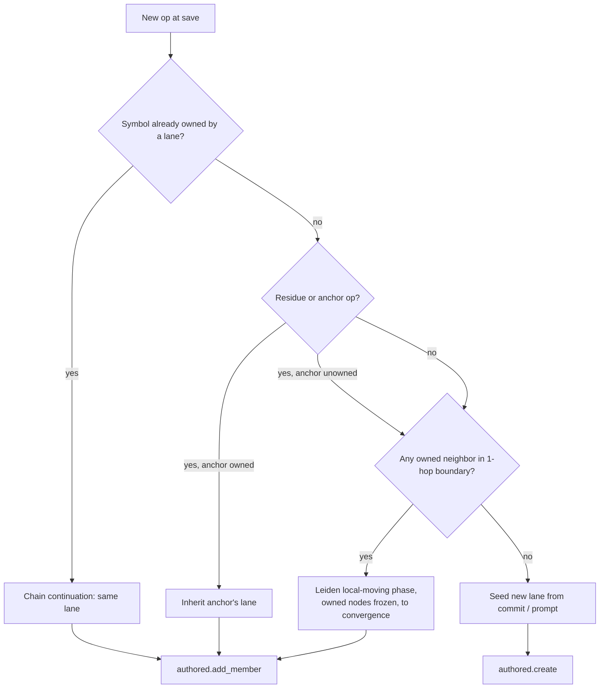
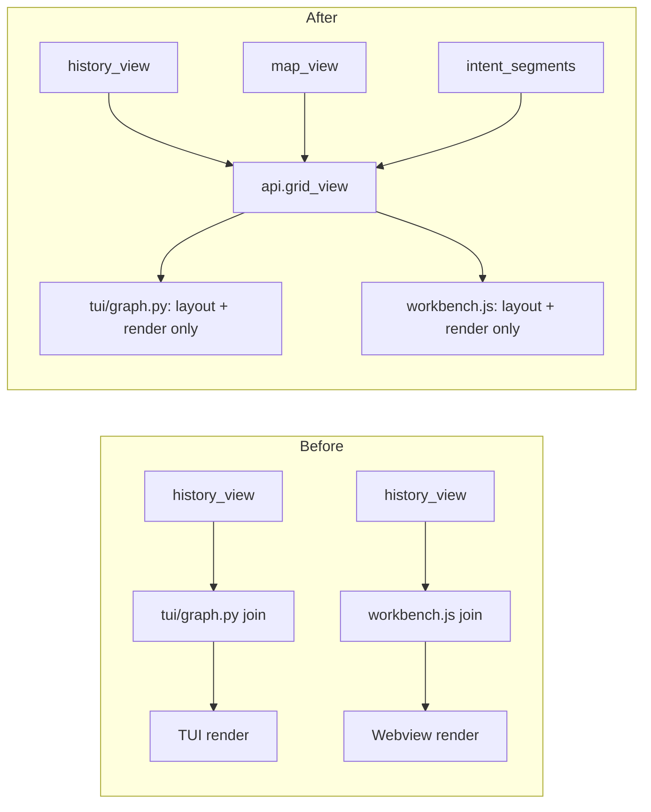

# refactor: save-time ownership ledger, unified grid projection, and daily-verb collapse

## Summary

Replace `sgt`'s clustering-as-authority feature model with a deterministic ledger that assigns
every op to a lane at `save` time, consolidate the three independently-computed lane×commit grid
projections (CLI/TUI, VS Code webview) into one canonical `sgt.api` view, fix the two measured
performance bottlenecks that stand between that grid and being the default daily surface, and
collapse the CLI/MCP verb surface around it.

## Problem Frame

`sgt` mines git history into a symbol-level op DAG and clusters symbols into a feature tree via
Leiden/CPM (`sgt/lens/cluster.py`, `sgt/lens/tree.py`). That tree is re-derived on every rebuild.
Between rebuilds, a new op's `feature_id` is `None` and `history_view`/`map_view`-derived layouts
drop it from the grid silently (`sgt/api.py:658-666`, `sgt/tui/graph.py:46-47`) — new work is
invisible, not mislabeled. The clustering algorithm is not the problem (Stage B measured it taking
the god-lane share from 99% to 22% — `docs/plans/stageB_plan.md:147-149`); the problem is that it
re-elects itself as the authority on every rebuild instead of being demoted to a seed once a lane
exists.

The team has already tried collapsing the CLI verb surface once. `c36fcfb` ("collapse to the
~7-verb spine") shipped the exact ~7-verb spine a follow-up plan proposed
(`docs/plans/2026-07-20-001-refactor-semantic-user-model-and-tui-plan.md:277-300`), tucking
`intent`, `graph`, `episodes`, `map`, and others under an `advanced` grouping. Within a day,
`c4f9966` re-promoted `intent` back to top level: "The intent-clustering overlay is a shipped
navigation surface... so add it to `_VERBS`." The top-level surface today is roughly 24 verbs, not
7 (`sgt/cli/__init__.py:49-62`). Burying a verb a user reaches for daily regrows the surface; the
lesson this plan takes from that history is that the fold has to remove the *need* for a separate
verb, not just its visibility.

A related, already-diagnosed and already-scoped-but-unbuilt fix this plan implements directly:
FINDINGS.md's U32 finding (`FINDINGS.md:1455-1469`) found that two adjacent functions sharing a
residue whitespace op are not an independently-landable slice — accepting one feature's bare
symbol op without its shared residue op materializes a corrupt file. The team named the fix
direction ("a residue op declaring a `requires` on whichever feature is positionally adjacent")
and explicitly deferred it as out of scope for that unit. This plan builds it as part of the
ownership ledger, since ownership assignment and residue coupling are the same mechanism.

Two performance facts make the grid unusable as a default: `sgt status` takes ~71s on this repo's
own ~7,800-op store because `order.reduce_to_ideal` (~28s/call) runs more than once per invocation
(`FINDINGS.md:1534-1543`); and mining a commit costs ~3.5s because `_mine_one` rebuilds the
whole-repo entity graph from scratch every time, a cost the miner's own comments already flag
(`FINDINGS.md:317-324`). Both are diagnosed, neither has been attempted.

A fifth, narrower problem the ledger itself must not reintroduce: the user's own mental model for
"go back" is a commit, not an op id — the whole reason the grid is a commit×feature axis rather
than a bare op list. `revert`/`restore` today only address a symbol/op/feature by id; there is no
way to say "take this lane back to how it looked at this commit," which is the operation the
commit-anchored grid exists to make legible.

---

## Requirements

**Ownership & assignment**

- R1. New ops attribute to a lane deterministically at `save` time — chain continuation, residue/
  anchor ops inheriting their anchor's lane, and new symbols attaching via a bounded Leiden
  local-moving step — so no op is ever invisible on the grid between reclusters.
- R2. Lane membership is durable, authored CRDT state (`sgt/lens/authored.py`) that a full
  recluster can never silently move or drop.
- R3. A residue span shared by two adjacent features is recorded as an explicit coupling edge,
  visible in `revert`/`restore` previews, closing the U32 partial-accept corruption case.
- R4. Batch clustering is demoted to (a) the seed for un-authored/imported history and (b) a
  background suggestion queue a user accepts or dismisses; it never auto-applies a merge/split to
  authored membership.

**Unified projection**

- R5. One canonical `grid_view` projection in `sgt/api.py` supplies the lane×commit cell join
  (including ghost/plan segments and partial-mining fidelity marks) that every surface — CLI, TUI,
  VS Code webview, MCP — renders from; no surface re-derives the join independently.
- R6. A commit whose ops `reduce_to_ideal` could not fully reconstruct is marked on the grid rather
  than silently omitted.

**Performance**

- R7. `sgt status` returns in low single-digit seconds on this repo's own store (from ~71s), by
  removing the redundant `Store.all_ops`/`current_ideal`/`reduce_to_ideal` calls inside one
  invocation.
- R8. Mining a commit no longer rebuilds the whole-repo entity graph from scratch; a content-
  addressed extraction cache plus incremental graph patching brings unchanged-file mining toward
  sub-second.

**Verb surface**

- R9. `revert`/`restore` support truncating a lane at a commit (`--to <commit>`) and composing
  across lanes (`--keep <lane>`), previewed as a painted blast on the grid before applying.
- R10. `save` auto-matches and replaces pending plan ghost segments; `checkpoint` and `drift` are
  no longer user-facing verbs.
- R11. Fork resolution is one guided verb, `sgt resolve <symbol>`, wrapping the existing
  draft → fulfill → oracle → land spine.
- R12. The top-level CLI/MCP surface is `save`/`undo`/`revert`/`restore`/`plan`/`resolve`/`log`
  (the grid's new home) plus the existing `feature`/`advanced` groupings and unchanged
  collaboration/setup verbs.

---

## Key Technical Decisions

- **KTD1 — Fixed cascade order.** The save-time assignment cascade always tries, in order: chain
  continuation, then residue/anchor inheritance (R3), then incremental local-move, then a new-lane
  fallback. Rationale: the first two cases are free lookups against data the symbol id or the
  existing chain already carries; local-move is the only new algorithmic cost and should only run
  over symbols the free cases couldn't place, keeping its cost proportional to genuinely new work.

- **KTD2 — New-lane ids mint via `authored.create`'s fresh UUID, not `verbs.py`'s deterministic
  `_authored_id_for(feature_id)`.** `_authored_id_for` (`sgt/lens/verbs.py:107-116`) exists to give
  a pre-existing *clustered* feature a stable identity the first time a reorg verb touches it; the
  ledger's new-lane case has no clustered counterpart to key off — it is an act of authorship, so
  it gets the same free-standing identity a user-created feature gets.

- **KTD3 — Local-move is `leidenalg`'s own local-moving phase, frozen to a bounded boundary, fed by
  U10's incrementally-maintained entity graph rather than a batch recompute.** `sgt/lens/cluster.py`
  already depends on `leidenalg`, which ships `Optimiser.move_nodes(partition,
  is_membership_fixed=...)` — one local-moving pass to convergence, with a boolean mask that
  freezes selected nodes. The cascade fixes every already-owned symbol via that mask and lets only
  the save's new symbols move, seeded at the highest-edge-weight owned neighbor's lane (or a free
  singleton with no owned neighbor). Because a fixed node can never move, resolving each new
  symbol's final lane after convergence is a direct dict lookup, not a fuzzy vote. This is the real
  local-moving phase of incremental Leiden, not a one-shot greedy attach, while staying bounded:
  only new symbols and their 1-hop owned, non-hub neighbors (capped at 50) ever enter the local
  graph, and it never re-scores an already-owned symbol outside that boundary. Critically, the
  boundary's edge weights must come from U10's incrementally-patched entity graph (U5 depends on
  U10) — `cluster.py`'s own `signals`/`fused_graph` are a pure function of HEAD but pay a ~1.2s
  full-codebase reparse on every cache miss (`_structural_edges_at`), which a save-time cascade
  cannot afford to pay per save without reintroducing the exact whole-repo cost U10 exists to
  eliminate for mining.

  **Gamma inheritance covers three sources, not one.** The `resolution_parameter` for the local
  move comes from, in order: (1) the top-scoring owned neighbor's own persisted split `gamma`, (2)
  if that neighbor's lane was never produced by a real Leiden split (a lane born entirely from
  prior ledger local-moves or the new-lane fallback), the `gamma` recorded on the lane itself at
  `authored.create` time (U6, defaulted to the geometric midpoint of `GAMMA_LO`/`GAMMA_HI`), (3)
  the same midpoint for a pre-upgrade tree with neither. Persisting split `gamma` must survive not
  only `_split_once`/`SplitResult` but `_splice` — the ordinary incremental-rebuild path
  (`_dirty_subdivide`) reconstructs unchanged subtrees through `_splice`'s fixed node-dict shape,
  which silently drops any field `_splice` doesn't explicitly carry through; without extending
  `_splice`, a freshly split leaf's `gamma` vanishes on the very next incremental `sgt map` build.

- **KTD4 — The suggestion queue reuses `sgt/core/review.py`'s exact template.** Content-addressed
  record id (`sha256(sorted(op_ids))`), G-Set persistence, one file per record. A merge/split
  suggestion is the same shape as a trust-queue review — reusing it avoids inventing a second sync/
  merge mechanism.

- **KTD5 — No new merge logic is authored for the CRDT layer.** The ledger calls
  `authored.add_member`/`create`/`merge_feature` verbatim. FINDINGS.md's U21 gate found a real
  data-loss bug the one time id-minting ran outside a migration-gated path — an ordinary rebuild
  silently orphaned pin references (`FINDINGS.md:948-970`) — and the prior plan named
  `sgt/lens/authored.py` its highest-risk unit for exactly this reason
  (`docs/plans/2026-07-20-001-...-plan.md:515-517`). The ledger is a new caller, not a new
  implementation, of `authored.py`'s merge rules.

- **KTD6 — `grid_view` is the single source of truth for the data join; per-surface code keeps only
  rendering.** This departs from the codebase's own established "mirrored pair, parity-tested"
  pattern (`sgt/tui/graph.py` ↔ `editor/vscode/media/workbench.js`, used twice in Stage C). That
  pattern has no automated cross-language byte-diff — the JS file even marks its own test-slice
  boundary (`workbench.js:393-394`) — and is a standing, self-documented divergence risk. One
  canonical projection removes the class of bug parity tests can only catch after the fact.

- **KTD7 — Residue/anchor ownership is the fix direction FINDINGS.md's U32 entry already named and
  deferred**, not a new design. Implementing the smaller, more mechanical of the two options that
  entry considered (residue declaring a coupling to the positionally adjacent feature) rather than
  the other (rejecting checklist splits that cut through shared residue).

- **KTD8 — The verb collapse removes the *concepts* that needed separate verbs, not just their
  visibility.** `map`/`graph`/`episodes`/`status`/`intent list` are confirmed re-projections of one
  (feature × commit) dataset, not independent concepts, so they fold onto one verb rather than move
  under `advanced`. The prior sweep tried the "move under advanced" version and it regrew within a
  day (`c4f9966`) once a user hit the redirect on a verb they used daily.

- **KTD9 — The grid becomes `sgt log`'s new default body on the CLI; MCP keeps `tool_log`'s schema
  stable and gains a new `tool_grid` tool instead of repurposing it.** `log` is already top-level
  and already the git-analogous "show me what happened" verb. Bare `sgt log` renders the lane×
  commit grid; `--rail` gives the time-major episode rail, `--tree` the feature-tree-only view,
  `--summary` today's status scalars, `--ops` today's flat op-DAG dump (`sgt log --json` defaults
  to the same grid shape as the text render). Checkpoint markers render as segments directly on the
  grid, so `intent list` is not a separate verb; `intent show <lane>[@n]` folds into `log show
  <lane>[@n]`. `blame` demotes to `advanced blame` — a narrow single-symbol lookup, not a daily
  scrub. `state`/`diff`/`fsck` stay separate, low-frequency plumbing, unchanged.

  MCP is the one surface where a silent schema change under an unchanged name is uniquely bad — an
  agent has no CLI help text to notice the shape moved, only a runtime type mismatch. `tool_log`'s
  JSON-RPC contract stays pinned to today's `oplog_view` shape; a new `tool_grid` tool is added for
  the grid data, following the existing `TOOLS` dict convention rather than mutating a name external
  agent configs already depend on. The CLI's `sgt log`/`sgt log --json` repurposing is lower-risk by
  comparison — a human or script hitting an unexpected shape has `sgt log --help` one command away,
  and the plan already accepts this class of break for the rest of the verb sweep (System-Wide
  Impact).

- **KTD10 — `sgt resolve <symbol>` is new, not part of the original ~7-verb spine.** It wraps
  `sgt/core/rewrite.py`'s existing `merge_op` → `stage` → `fulfill(from_tree)` → `land`
  (oracle-gated) sequence into one guided flow. Sync/land already print the exact
  `sgt merge-op <a> <b>` remedy string; `resolve` only removes the ceremony of stitching three
  verbs together by hand.

---

## High-Level Technical Design

### Save-time assignment cascade

### Before / after: the grid projection

### Verb surface, old → new

| Today (top-level) | New home |
|---|---|
| `map`, `graph`, `episodes`, `status`, `intent list` | `sgt log` render modes (`--tree`, `--rail`, `--summary`) and grid segments (KTD9) |
| `blame` | `sgt advanced blame` |
| `checkpoint`, `drift` | folded into `sgt save` (R10) |
| `edit` | `sgt advanced edit` (opt-in oracle-gated ceremony; ordinary edits go through plain `save`) |
| `fulfill`, `commit` | `sgt advanced` (joins `merge-op`/`split-op`/`transplant`, already there) |
| `merge-op` (manual 3-verb sequence) | `sgt resolve <symbol>` (R11) |
| `save`, `undo`, `revert`, `restore`, `plan`, `resolve`, `log` | unchanged top level |
| `feature`, `advanced` groupings; `sync`/`land`/`push`/`propose`/`session`/`init`/`mcp` | unchanged |

---

## Scope Boundaries

### Deferred to Follow-Up Work

- Fork-as-named-variant (generalizing `.sgt/forks.json` into swappable named variants per lane) —
  design direction only, not built here.
- Overlapping / program-slice-style selections (a feature as a non-exclusive op-set rather than a
  partition cell) — design direction only, not built here.
- A second clustering hierarchy level or further directory-cohesion tuning beyond what Stage B
  already shipped.
- Incremental grounding revalidation (touched-chain-only re-walk of `order._grounded`). U8's
  single-pass fix + memoization already claims the R7 target (~71s → low single digits) on its own;
  adding a second, riskier change to core grounding logic is not justified without a measured
  per-save grounding cost that survives U8's fix. Revisit only if a real gap is measured after U8
  ships.

### Out of scope

- The D1–D6 kernel-rigor items from `docs/plans/2026-07-18-001-refactor-vcs-inspired-architecture-
  options-plan.md` (append-only operation log, persisted identity registry, Darcs-style
  commutation pre-check, safe-join tier, structured resolution provenance, wider locking) — a
  separate, larger, unproven research track.
- Rewriting `sgt/lens/tree.py`'s Leiden/CPM clustering algorithm itself. Its authority is demoted
  (R4); its internal mechanics (binary-search arity control, hub suppression, path/co-commit
  signals) are untouched.
- TUI/VS Code visual polish beyond what rendering `grid_view` requires — no new animation work, no
  detail-pane redesign.

---

## System-Wide Impact

- **CLI users.** The daily verb surface changes shape (R12): `map`/`graph`/`episodes`/`status`/
  `blame`/`intent list`/`checkpoint`/`drift`/`edit`/`fulfill`/`commit` stop being top-level. A
  removed verb's error message names its new home (U14), matching the precedent `c36fcfb` already
  established.
- **MCP agent consumers.** Every renamed/removed `TOOLS` entry changes the agent-facing contract
  the same way the first sweep did — an external agent config referencing an old tool name breaks.
  Acceptable per the same clean-end-state choice the prior plan made, called out here for
  visibility.
- **VS Code extension / TUI.** Both consume `grid_view` instead of independently computing the
  lane×commit join (U3) — a real rewrite of their data-fetch layer, not just a backend change; both
  need their own test pass, not only a backend regression check.
- **Collaboration (`sync`/`land`/`propose`).** The ownership ledger adds a new CRDT surface
  (`sgt/lens/authored.py`) to what `sync` merges. `merge_feature`'s existing commutativity/
  idempotence guarantees extend to ledger-originated features (U6); no new sync-path code beyond
  calling the existing merge functions.
- **Golden test suite.** `grid_view`, ledger writes, and the verb sweep together touch
  `tests/golden/snapshots/cli_surface.json` and the kernel-view captures in
  `tests/golden/test_golden.py`. Each unit that changes a captured surface regenerates and reviews
  its own diff, rather than one blind regeneration at the end.

---

## Risks & Dependencies

- **CRDT merge risk (highest).** A wrong merge rule in the ownership ledger is a cross-replica bug
  invisible until two clones' features disagree — the exact risk the prior plan flagged for
  `sgt/lens/authored.py`. Mitigated by KTD5 (no new merge logic) and explicit commutativity/
  idempotence tests in U6.
- **Local-move determinism.** `leidenalg`'s local-moving phase can shuffle multiple new symbols
  jointly (one symbol's move changes what its neighbor sees), so a careless implementation could
  converge to an order-dependent local optimum. Mitigated by pinning the boundary's vertex order
  and the `Optimiser`'s RNG seed in one place (U5), plus the mutual-coupling determinism test and
  the boundary-bound stress test U5 names explicitly.
- **Cross-clone dual-lane membership.** Two clones can each run U5's local-move on the same new
  symbol against a locally-different owned-neighbor view before syncing, landing it as a live
  member of two different authored features — `authored.merge`/`merge_feature` only merges
  membership *within* one feature id, so two distinct ids both carrying the same live member is not
  itself rejected. Mitigated by U6's post-merge overlap check, which surfaces (never silently
  resolves) the conflict through U7's suggestion queue for the user to resolve via `sgt feature
  move`.
- **Verb-collapse regrowth.** Already happened once (`c4f9966`). Mitigated by KTD8/KTD9 — the fold
  removes concepts, not just visibility.
- **Golden-snapshot churn.** `grid_view`, ledger CRDT writes, and verb renames all touch
  `tests/golden/`. Regenerate and diff-review per the existing `SGT_UPDATE_GOLDEN=1` convention
  (established in `c36fcfb`'s own diff) — never blind-regenerate.
- **Incremental mining correctness.** Patched entity-graph reuse (U10) is new code underneath the
  def-use untangling every op's identity depends on, and its correctness is non-local: a name
  added or removed in one changed file can flip reference resolution in an unrelated, unchanged
  file that shares the name. Mitigated by U10's reverse name-to-referencing-entities index and a
  full-vs-incremental parity check whose fixtures explicitly include a naming collision introduced
  or removed outside the touched file set, not just unit tests on the changed files themselves.
- **Sequencing is cross-phase, not strictly linear.** Phase E (verb sweep) depends on Phase D's
  `resolve` and save-fold behaviors existing first, and now also on U8 (`grid_view`'s `map_view`
  component falls back to `current_ideal`'s `_committed_ids_by_provenance` path — the same ~28s
  `reduce_to_ideal` cost `sgt status` has today — on a fresh clone or any ref with no persisted
  ideal-table entry, so removing the `map`/`status` fallback verbs in U14 needs U8 landed first).
  U5 (Phase B) similarly depends on U10 (Phase C) for its local-move boundary computation, so
  Phase B's ledger cascade is only fully cheap once part of Phase C has landed — the phase labels
  group units thematically, they are not a strict landing order; each unit's own Dependencies
  field is authoritative.

---

## Implementation Units

**Phase A — Canonical grid projection.**

### U1. Canonical `grid_view` projection

**Goal:** One `sgt.api.grid_view(repo, *, full=False, ...)` function computing the lane×commit cell
join — op → (commit_index, feature_id), ghost/plan segments, partial-mining fidelity marks — that
every surface renders from.
**Requirements:** R5, R6
**Dependencies:** none
**Files:** `sgt/api.py` (new `grid_view`, placed near `history_view` at `:637` and `map_view` at
`:530`), `sgt/cli/inspect.py` (repurpose `_log`/`_cmd_log` to call `grid_view` by default, add
`--tree`/`--rail`/`--summary`/`--ops` flags per KTD9, mirroring the `_map`/`_history`
wrapper-pair pattern at `:328`/`:461`), `sgt/mcp/server.py` (add a new `tool_grid` handler + `TOOLS`
entry per KTD9 — `tool_log` keeps its existing `oplog_view` schema unchanged, mirroring the
existing `TOOLS` dict convention at `:210-301`), `tests/test_api.py`, `tests/mcp/test_server.py`.
**Approach:** Compose `history_view(repo, full=True)` (commit axis + per-op `commit_index`/
`feature_id`, `sgt/api.py:637-685`) with `map_view`'s tree/`op_leaf` and the persisted
`intent_segments` checkpoint markers into one cell table:
`{feature_id: [{commit_index, op_ids, ghost: bool, fidelity: "full"|"partial"}]}`. Ghost cells come
from active plan sessions' off-chain hollow ops (`sgt/loop/plan.py`'s `predicted_footprint`/
`predicted_feature`) rendered as dim segments at a lane's tip. Fidelity marks come from U2. This
function replaces the ad hoc joins independently computed inside `sgt/tui/graph.py`'s
`graph_layout`/`episodes`/`episode_rail_layout` (`:31-187`, `:254-315`, `:318-365`) and
`editor/vscode/media/workbench.js`'s `computeGraphLayout`/`rollupEpisodes`/`episodeRailLayout`
(`:34-208`, `:279-330`, `:354-390`) — those keep only pure layout/render math (U3).
**Patterns to follow:** `sgt/api.py`'s view-function convention (bare `def <name>_view(repo, *, ...)
-> dict`, lazy internal imports, no mining inside, `sgt/api.py:1-8`); `history_view`'s compact-by-
default / `full=True` split; `sgt/cli/_common.py:25-33`'s `_add_view_flags`.
**Test scenarios:**
- Happy: a feature with ops in 3 non-consecutive commits produces a cell table with the correct
  gaps; an active plan session shows a ghost cell at its lane's tip.
- Edge: an op with no `commit_index` (per `history_view`'s own omission rule, `:663-665`) does not
  appear in any cell.
- Integration: once TUI/webview switch to consuming `grid_view` (U3), the rendered Gantt is
  structurally identical to a captured pre-refactor snapshot on a fixed fixture.
**Verification:** `sgt log --json` returns a stable, sorted cell table on repeated calls against an
unchanged store.

### U2. Partial-mining fidelity marks

**Goal:** Record which commits `reduce_to_ideal` had to drop ops from, so the grid marks them
instead of silently omitting the loss.
**Requirements:** R6
**Dependencies:** U1
**Files:** `sgt/core/lens.py` (`_committed_ids_by_provenance`, `ideal_for_ref` — the
`reduce_to_ideal` call sites), `sgt/core/order.py` (`reduce_to_ideal`, `:209-225` — surface the
dropped id set alongside the reduced ideal), `sgt/state.py` (new local artifact, e.g. `"fidelity"`,
gitignored), `sgt/api.py` (`grid_view` reads it), `tests/core/test_order.py`,
`tests/core/test_lens.py`.
**Approach:** `reduce_to_ideal` already computes exactly which ids `_grounded`/`fork_free` excluded
(`order.py:209-225`); persist the excluded ids' provenance SHAs in a small local side table at the
two call sites in `lens.py`, keyed by ref. `grid_view` reads it and marks the corresponding
`commit_index` cells `fidelity: "partial"`.
**Patterns to follow:** the local-artifact convention in `sgt/state.py` (`_Artifact(...,
committed=False)`, e.g. `sync_cache`/`witness` at `:131-142`).
**Test scenarios:**
- Happy: a fixture forcing a fork (add → delete → re-add across a version boundary the migration
  doesn't cover) produces a fidelity entry; `grid_view` marks the corresponding commit.
- Edge: a clean store with no reductions produces an empty table and no marks.
**Verification:** `sgt log` on this repo's own store shows partial marks matching the known
~13.5% op-exclusion figure's commits.

### U3. Consolidate CLI/TUI/webview onto `grid_view`

**Goal:** `sgt/tui/graph.py` and `editor/vscode/media/workbench.js` stop computing the (op → cell)
join themselves; they consume `grid_view`'s cell table and keep only layout/render.
**Requirements:** R5
**Dependencies:** U1
**Files:** `sgt/tui/graph.py` (`graph_layout` `:31-187`, `episodes` `:254-315`,
`episode_rail_layout` `:318-365`), `editor/vscode/media/workbench.js` (`computeGraphLayout`
`:34-208`, `rollupEpisodes` `:279-330`, `episodeRailLayout` `:354-390`), `sgt/tui/app.py` (call
sites), `editor/vscode/src` (webview data-fetch, shelling `sgt log --json` per the existing
convention), `tests/tui/test_graph.py`, `tests/test_graph_layout.py`, `tests/test_episodes.py`,
`tests/tui/test_episodes.py`.
**Approach:** Each layout function's signature narrows to `(cell_table, ...) -> layout`; the
commit-axis/op-DAG traversal currently duplicated on both sides is deleted from both files, not
just one. The JS side already marks its own boundary (`workbench.js:393-394`, "everything below
touches the DOM/vscode API") — the pure-data-join half above that line is what moves to
Python-only (`grid_view`); the render half stays in JS unchanged. The existing hand-mirrored test
suites collapse: JS tests assert layout-given-a-fixed-cell-table; Python's `grid_view` gets its own
contract tests; cross-surface parity is enforced structurally (same JSON in) rather than by two
independently-maintained suites.
**Patterns to follow:** `workbench.js`'s `// ---- test slice boundary ----` comments as the exact
cut line; the existing `sgt <verb> --json` webview data-fetch convention.
**Test scenarios:**
- Happy: TUI and CLI render identical lane/cell positions from the same `grid_view` fixture.
- Regression: existing scenarios (frontier filtering, lane ordering by first appearance,
  determinism) re-pointed at cell-table input still pass.
- Integration: webview's `renderGraph`/`renderRail` consume a captured `sgt log --json` fixture and
  produce the same DOM structure as before the refactor.
**Verification:** `tsc --noEmit` + `node --check` clean; full TUI + JS suites green; a manual
side-by-side CLI/TUI/webview comparison on this repo shows the same lanes/cells.

---

**Phase B — Save-time ownership ledger.** (U5's local-move step depends on U10 in Phase C; see
Risks & Dependencies — the phases group units thematically, not by strict landing order.)

### U4. Residue/anchor ownership binding + boundary-coupling edge

**Goal:** Residue and anchor pseudo-symbol ops attribute to their anchor entity's lane by
construction; two features sharing a residue span get an explicit, preview-visible coupling edge,
closing U32.
**Requirements:** R1, R3
**Dependencies:** none
**Files:** `sgt/lens/tree.py` (`assign_ops_to_leaves`, `:367-381` — residue/anchor ops bypass the
plurality vote and inherit their anchor's leaf), `sgt/api.py` (`verb_preview_view`/
`_project_verb_preview` — surface the coupling edge when a preview's op-set would cut through a
shared residue span), `tests/lens/test_tree.py`, `tests/core/test_rewrite.py`.
**Approach:** A residue/anchor symbol id already encodes its anchor entity's name
(`path::__residue__::anchor`). Before the plurality vote in `assign_ops_to_leaves`, resolve
residue/anchor ops directly to whatever leaf owns their anchor entity, falling through to the vote
only when the anchor itself is unowned (e.g. HEAD-of-file residue with no preceding entity). When a
residue op's anchor is claimed by feature A but its other neighbor (the next live entity after the
gap) belongs to feature B, record a coupling edge `(A, B, op_id)` that preview computation
consults, so a revert/restore/checklist that would split the pair surfaces it rather than silently
building a corrupt slice — the exact fix direction FINDINGS.md's U32 entry named and deferred.
**Patterns to follow:** `assign_ops_to_leaves` itself; the existing reference-edge preview
machinery `verb_preview_view` already uses for blast/carry/foundation classification.
**Test scenarios:**
- Happy: two adjacent functions in one file, added in the same commit, later split across two
  authored features by `move` — the shared residue op resolves to one and the coupling edge is
  recorded.
- Edge: a residue op whose anchor was pruned falls back to the plurality vote, not a crash.
- Regression: the exact U32 scenario (accept-one-feature partial materialization) now surfaces the
  coupling in preview before the corrupt slice would be built, instead of after.
**Verification:** the U32 fixture from `tests/core/test_propose_review.py`, re-run, shows the
coupling warning instead of silent corruption.

### U5. Save-time incremental assignment cascade

**Goal:** At `save`, every new op is assigned a lane deterministically per KTD1's fixed order.
**Requirements:** R1
**Dependencies:** U4, U10
**Files:** new `sgt/lens/ledger.py`, `sgt/cli/porcelain.py` (`save`/`_save`, `:108-136` — wire the
cascade in after `put`/`record_ideal`), `tests/lens/test_ledger.py`.
**Approach:** (1) An op on a symbol already owned by a lane continues in that lane — a dict lookup
against the current authored-membership index. (2) Residue/anchor ops resolve via U4. (3) A
genuinely new symbol enters the local-move step (KTD3): build the boundary from the new symbol(s)
plus their 1-hop owned, non-hub neighbors, with edge weights read from **U10's incrementally-
maintained entity graph and its own commit/path signal bookkeeping**, not `cluster.py`'s
`signals()`/`fused_graph()` — those are correct for a batch build but pay a fresh whole-codebase
reparse on every HEAD change (`_structural_edges_at`'s cache miss cost, ~1.2s on this repo), which a
per-save cascade cannot afford. This is why U5 depends on U10: the boundary lookup is only cheap
once U10's patched graph is the thing being queried. Cap the boundary at the 50 highest-weight
neighbors. Seed each owned neighbor fixed at its own lane index and the new symbol(s) as free
singletons in a `leidenalg` `CPMVertexPartition` over the induced boundary subgraph, with
`resolution_parameter` inherited per KTD3's three-source order (split-persisted `gamma`, then
lane-persisted `gamma` from `authored.create` for a ledger-born lane, then the `GAMMA_LO`/
`GAMMA_HI` midpoint). Run `Optimiser.move_nodes(partition, is_membership_fixed=mask)` —
`leidenalg`'s own local-moving phase to convergence, reusing `cluster.SEED` verbatim for the
optimiser's RNG. A fixed node never moves, so each new symbol's post-convergence community maps
directly back to its lane by inverse lookup. (4) A symbol with no owned neighbor at all (empty
boundary) skips straight to a new-lane fallback, seeded from the commit message or recorded
session/prompt (`sgt/intent/prompts.py`).
**Patterns to follow:** `sgt/lens/cluster.py`'s `_leiden` graph-build pattern (`:215-230`) and
`SEED`; `sgt/lens/tree.py`'s `_adjacency`/`_induced` helpers (`:56-66`) for the boundary subgraph;
`_split_once`/`SplitResult` (`:94-131`, extended per KTD3 to persist each split's `gamma`);
`_dirty_subdivide`'s existing new-member attachment (`:255-261`) as the precedent this step
upgrades from a one-shot attach to a full local-moving pass; U10's incremental entity graph as the
boundary's edge-weight source.
**Test scenarios:**
- Happy: a save touching only already-owned symbols assigns every op to its existing lane with
  zero new-lane creation.
- Happy: a save adding one new function that calls into an owned lane's code attaches to that lane.
- Edge: a save adding a wholly disconnected new file (no owned neighbor at all) seeds a new lane.
- Determinism: two new, mutually-coupled symbols (each calls the other, one also calls into an
  owned lane) saved together produce byte-identical joint placement across repeated runs — the case
  where the local-moving phase's own vertex-order and RNG-seed pinning matters, not just a single
  new symbol's placement.
- Edge (boundary bound): a new symbol edging into an artificially high-degree owned symbol stays
  within the 50-neighbor cap and the local-move step's cost does not scale with total repo size.
- Performance: the boundary-edge lookup for a save touching one new symbol in a large store reads
  only from U10's incrementally-patched graph and does not trigger a full `build_entity_graph`
  reparse — call-count-faked against `cluster.signals`/`_structural_edges_at` to assert zero calls.
**Verification:** run against this repo's own history in dry-run form; compare resulting lane
shape against Stage B's `sgt map --rebuild` baseline as a sanity check, not an exact-match
requirement.

### U6. Wire the cascade into the authored-feature CRDT

**Goal:** The cascade's decisions land as durable `AuthoredFeature` writes, not a side table, so a
rebuild can never move or drop them.
**Requirements:** R2
**Dependencies:** U5, U7
**Files:** `sgt/lens/ledger.py` (call sites into `sgt/lens/authored.py`), `tests/lens/test_ledger.py`,
`tests/lens/test_authored.py` (new cross-cutting scenarios).
**Approach:** Chain-continuation, residue/anchor, and local-move-attached cases all call
`authored.add_member(feature, symbol)` (`authored.py:83-86`) against the already-open
`AuthoredFeature` for that lane, mirroring
`verbs.py`'s `_open_authored` (`:147-157`). A new lane from the fallback case calls
`authored.create(members, label, witness=head_sha)` (`authored.py:67-75`) — a fresh UUID mint per
KTD2, not `_authored_id_for`'s deterministic handle — and additionally records a `gamma`
(`GAMMA_LO`/`GAMMA_HI` midpoint) on the new lane so a later symbol's local-move (KTD3's source 2)
has something to inherit even though this lane was never produced by a real Leiden split. Every
write goes through `save_authored`/`load_authored`'s existing round-trip (`authored.py:163-191`)
under `save`'s existing lock discipline; per KTD5, no new merge function is written — sync-time
reconciliation is `merge`/`merge_feature` (`authored.py:108-143`), unchanged.

After a sync-time merge, run one read-only overlap check: has the same symbol/op become a live
member (`live_members()`) of more than one authored feature? This can happen without any merge bug
— two clones each independently ran U5's local-move on the same new symbol against their own
locally-different owned-neighbor view before syncing, so `merge_feature`'s union-within-one-id
logic never sees the conflict (the two claims live under different feature ids). Do not resolve
this silently: record it as a `kind: "conflict"` entry in U7's suggestion queue (reusing its
content-addressed G-Set template) naming the two features and the disputed symbol, for the user to
resolve with the existing `sgt feature move` verb.
**Patterns to follow:** `sgt/lens/verbs.py`'s existing authored call sites (`merge` `:210-225`,
`move` `:289-309`, `rename` `:340-347`) as the template.
**Test scenarios:**
- Happy: a save's cascade produces the same authored-feature state whether run once or replayed
  from two mid-flight crash-recovery points (idempotence).
- CRDT: two clones independently save disjoint new lanes; `sync` merges both via `authored.merge`
  with zero id collision.
- CRDT (conflict): two clones independently run the local-move step on the same new symbol against
  different locally-owned neighbors, landing it in two different lanes; after sync, the overlap
  check emits exactly one `conflict` suggestion naming both features and the disputed symbol,
  rather than silently picking a winner.
- Regression: `tree.py:500-501`'s `protected` set (`pins.assign ∪ pins.labels ∪ load_authored`)
  still holds — a rebuild never re-mints or drops a ledger-created lane's id.
**Verification:** `tests/lens/test_authored.py`'s existing commutativity/idempotence style
(`:31-45`) extended to ledger-originated features; a two-clone sync round-trip on a ledger-created
lane; a two-clone dual-claim round-trip surfacing exactly one conflict suggestion.

### U7. Clustering suggestion-critic queue

**Goal:** Batch Leiden clustering becomes (a) the seed for un-authored/imported history and (b) a
background suggestion queue for merges/splits; it never auto-applies to authored membership.
**Requirements:** R4
**Dependencies:** U5
**Files:** `sgt/lens/tree.py` (`build`, `:428-511` — skip re-clustering entirely for members already
claimed by an authored feature per `_authored_leaf_claims`, `:744-766`; a cluster result that
disagrees with existing authored membership in a merge/split-shaped way emits a suggestion instead
of applying), new `sgt/core/suggest.py` (reusing `sgt/core/review.py`'s exact template per KTD4),
`sgt/state.py` (new committed G-Set artifact, e.g. `"suggestions"`, alongside `"reviews"` at
`:399`), `sgt/api.py` (new `suggestion_view`, mirroring `trust_view`, `:958-1007`), new CLI
subcommand under `advanced` (`sgt advanced suggestions list/accept/dismiss`),
`tests/lens/test_tree.py`, `tests/core/test_suggest.py`.
**Approach:** A suggestion record is `{id: sha256(sorted(op_ids))[:12], kind: "merge"|"split"|
"conflict", features: [...], rationale}` — the `ReviewRecord` shape (`review.py:24-34,51-56`) with a
different payload. `"merge"`/`"split"` come from this unit's own clustering-disagreement check;
`"conflict"` is written by U6's post-sync overlap check (this unit ships the record type and
persistence both callers share — `sgt/core/suggest.py` only needs `authored.py`'s existing types,
not U6's specific write path, which is why this unit depends on U5, not U6). Persistence and merge
reuse `state.save_json`/G-Set-union verbatim. Accepting a `merge`/`split` suggestion is a normal
`sgt feature merge`/`sgt feature split` call; accepting a `conflict` suggestion is `sgt feature
move` naming which feature keeps the disputed symbol. Either way the matching suggestion is
dismissed afterward; nothing new mutates authored membership directly from clustering output.
**Patterns to follow:** `sgt/core/review.py` in full; `trust_view` (`api.py:958-1007`) as the
read-projection template.
**Test scenarios:**
- Happy: an imported (never-saved) history's symbols get lane assignment purely from batch
  clustering with no suggestions generated.
- Happy: after several ledger saves, a cluster run finds two authored lanes with unusually high
  coupling and emits exactly one merge suggestion, not an auto-merge.
- Edge: accepting a suggestion via `sgt feature merge` dismisses the matching record; the same
  coupling doesn't re-suggest immediately after.
- Regression: `tests/lens/test_tree.py`'s existing authored-override tests
  (`test_authored_feature_label_overrides_the_cluster_leaf_and_survives_a_rebuild`,
  `test_build_is_shape_stable_whether_or_not_authored_features_exist`) still pass unchanged.
**Verification:** `sgt advanced suggestions list` on this repo after a `sgt map --rebuild` seed
shows readable, actionable candidates, not an unfiltered dump of every clustering delta.

---

**Phase C — Performance (prerequisite before Phase D ships as default).**

### U8. `status_view`/`state_view` single-pass + `reduce_to_ideal` memoization

**Goal:** Remove the redundant multi-call load pattern in `status_view`; cache `reduce_to_ideal` as
a pure function of its inputs.
**Requirements:** R7
**Dependencies:** none
**Files:** `sgt/api.py` (`status_view`, `:1487-1534`; `state_view`, `:168-227`), `sgt/core/opindex.py`
(`index_ops`, `:126-138`), `sgt/core/order.py` (`reduce_to_ideal`, `:209-225`), `tests/test_api.py`,
`tests/core/test_order.py`, `tests/core/test_opindex.py`.
**Approach:** `status_view` today calls `state_view` (which internally calls `index_ops` then
`ideal_for_ref`, itself calling `index_ops` again), then separately calls `Store(repo).all_ops()`,
`current_ideal(repo)` (another `index_ops` call), and `ideal.frontier(ops)` a second time — four
`index_ops` calls and at least two independent `reduce_to_ideal`-derived ideal builds per
invocation. Thread `state_view`'s already-computed `ops`/`ideal` through to `status_view`'s
remaining steps instead of recomputing; reconcile `ideal_for_ref(repo, "HEAD")` vs.
`current_ideal(repo)` to the single call `status_view` actually needs. Add a pure-function memo to
`reduce_to_ideal` keyed by a hash of `(sorted(ideal_ids), sorted(declared))`, bounded with an
LRU/`maxsize` eviction policy — the function itself is safe to cache forever (no external inputs
beyond its arguments), but the op store is append-only, so `ideal_ids` changes on nearly every
save; a long-running process (the MCP server's stdio loop, the TUI's persistent session) would
otherwise accumulate one cache entry per call indefinitely.
**Patterns to follow:** `opindex.py`'s existing staleness-check convention
(`_is_stale_body`/`_ops_dir_stat`, `:86-123`) as the cache-key basis.
**Test scenarios:**
- Happy: `status_view` output is byte-identical before and after the refactor on a fixed fixture
  (characterization test written first).
- Performance: call-count fakes show `opindex.index_ops`/`Store.all_ops`/`order.reduce_to_ideal`
  drop from today's measured 4/2/2+ to 1/at-most-1/1 per invocation.
- Edge: the memo evicts under its bound — a long-running-session simulation (many distinct
  `ideal_ids` sets) confirms the cache does not grow unbounded.
- Regression: `tests/golden/test_golden.py`'s `status_view`/`state_view` captures unchanged.
**Verification:** wall-clock `sgt status` (or `sgt log --summary`, per KTD9) on this repo's own
store drops from ~71s to low single digits.

### U10. Mining: content-addressed extraction cache + incremental entity-graph patching

**Goal:** `_mine_one` stops rebuilding the whole-repo entity graph from scratch per commit, and the
resulting incremental graph is kept live and queryable so U5's local-move can read it directly.
**Requirements:** R8
**Dependencies:** none
**Files:** `sgt/entities/extract.py` (`extract_file`/`extract_codebase`, `:329-394`),
`sgt/entities/graph.py` (`build_entity_graph`, `:213-269`), `sgt/core/mine.py` (`_mine_one`,
`:320-626`, specifically `:337-338`), `tests/core/test_mine.py`, `tests/entities/test_extract.py`,
`tests/entities/test_graph.py`.
**Approach:** Two caches compose. (1) A blob-OID-keyed extraction cache in `extract_file` — a file
byte-identical to a prior commit's (common across consecutive commits touching unrelated files)
skips re-parsing entirely, since blobs are immutable. (2) An incremental graph patch: given the
prior commit's `EntityGraph` and the diff's changed-path set (already computed by
`gb.diff_name_and_text`, `mine.py:374`), remove the changed files' old nodes/edges, re-extract only
those files (benefiting from cache (1) on the unchanged remainder), and re-resolve affected name
references via **two** maintained indices, not one: a forward `name -> defining entities` index for
the changed files' own new/removed definitions, and a reverse `name -> referencing entities` index
so a definition added or removed in a changed file also re-resolves reference edges in *unrelated,
unchanged* files that happen to share the name — `build_entity_graph`'s existing ambiguity check
(`leaf_to_ids`) is global over the whole codebase's candidate set, so a purely local patch that
only looks at the changed files' own edges can silently leave a stale resolution elsewhere. Persist
the patched graph (not just its ephemeral use inside one `_mine_one` call) so U5's local-move can
query it directly for boundary edge weights instead of recomputing from `cluster.py`'s batch
signals (KTD3). `_mine_one` calls the patched-graph path whenever the previous commit's graph is
available; full build remains the fallback at genesis and stays as a periodic correctness check
(see Verification), since incremental patching is new code underneath def-use untangling.
**Patterns to follow:** `_LANGS`'s existing Language/Parser object cache (`extract.py:94`) as the
precedent for "cache the expensive, content-invariant part"; `mine.py`'s own comments already
naming this exact fix (`FINDINGS.md:317-324`).
**Test scenarios:**
- Happy: mining a commit that touches one file out of 300 re-parses exactly that one file.
- Correctness: incremental-patched and from-scratch full-rebuild graphs produce identical
  `calls_by_src`/`entity_version`/edges on the same commit, across fixtures including a rename
  crossing file boundaries and a deletion.
- Correctness (non-local ambiguity): a commit that introduces a name collision with an existing
  definition in an *unchanged* file, and a later commit that removes one side of the collision,
  both produce graphs identical to a full rebuild — the case a forward-only index misses.
- Regression: `test_mine.py`'s existing untangling fixtures (the BET-A tangled-commit case) produce
  identical op sets mining incrementally vs. the pre-refactor full-rebuild path.
- Edge: a commit whose parent's graph isn't cached (first mine after `init`, or crossing a
  `MINER_VERSION` boundary) falls back to a full build unchanged.
**Verification:** mining this repo's own history end to end drops from the measured ~3.5s/commit
toward sub-second on repeat files; a full-vs-incremental parity check over the same range,
including the non-local-ambiguity fixtures, reports zero divergence.

---

**Phase D — One surface: scrubbing verbs.**

### U11. Truncation-revert verbs

**Goal:** `revert <lane> --to <commit>` truncates a lane at a commit boundary; `--keep <lane>`
composes across lanes; both preview as a painted blast on the grid.
**Requirements:** R9
**Dependencies:** U1, U4
**Files:** `sgt/core/verbs.py` (new `plan_revert_lane_to_commit`, reusing the same `order.upset_in`
algebra `plan_revert_feature`/`plan_revert_op_set` already use), `sgt/cli/ideal_edit.py` (new
`--to`/`--keep` flags on the existing `revert`/`restore` handlers), `sgt/api.py`
(`verb_preview_view` extension to paint the blast on `grid_view`'s cell table),
`tests/core/test_verbs.py`, `tests/cli/test_revert.py`.
**Approach:** Resolve `<lane>@<commit>` to the lane's op-set filtered to `commit_index <= C`; the
removal set is the lane's ops with `commit_index > C` plus their full `upset_in` closure — no new
ideal-edit primitive, just a new op-set selector feeding the existing `verbs.apply`/`Ideal.from_ops`
path. U4's coupling-edge check runs unconditionally on the computed removal set, for both the plain
truncation and the `--keep` path — a residue op in the removal set that's coupled to a lane not
named in `--keep` surfaces in preview the same way a whole-feature revert would, rather than only
being caught when the user happens to name the coupled lane themselves; this is what actually
prevents U11 from reopening U32's corruption case through the new truncation path. `--keep
<other-lane>` subtracts that lane's op-set from the removal set before validating
downward-closure, refusing rather than silently dropping if the result would fork.
**Patterns to follow:** `plan_revert_feature`'s existing op-set-to-upset bridging; U4's
coupling-edge surfacing in preview.
**Test scenarios:**
- Happy: `revert <lane> --to <commit>` removes exactly the lane's ops after that commit and
  everything built on them.
- Happy: `revert <lane> --to <commit> --keep <other-lane>` preserves the other lane's ops even
  where the upset closure would otherwise sweep them.
- Edge: a `--to` target with no ops after it is a no-op, reported as such.
- Edge: a truncation that would fork refuses with the same named remedy language
  `revert --keep-dependents` already uses.
- Edge (coupling): a truncation whose removal set includes a residue op coupled (via U4) to a lane
  not named in `--keep` surfaces the coupling in preview before applying, rather than materializing
  a corrupt file in the untruncated lane.
**Verification:** `sgt revert <lane> --to <commit> --emit` on this repo previews a truthful diff
matching the grid's painted blast.

### U12. Fold plan-matching into `save`; ghost segments on the grid

**Goal:** `save` auto-runs the existing checkpoint matcher and replaces plan ghosts; `checkpoint`
and `drift` stop being verbs a user runs.
**Requirements:** R10
**Dependencies:** U1
**Files:** `sgt/cli/porcelain.py` (`save`/`_save`, `:108-136`), `sgt/loop/match.py` (called from a
new site, no logic changes), `sgt/cli/loop.py` (remove `checkpoint`/`drift` subparser
registration), `tests/cli/test_porcelain.py`, `tests/loop/test_match.py`.
**Approach:** After a save's ops are known, run `compute_checkpoint` against every active plan
session; a group with an unambiguous single candidate (one session, one step, above threshold)
auto-confirms via `confirm_match`. An n:m or low-confidence match still requires the same explicit
confirmation today's `checkpoint` verb takes, reached via a `save --resolve-plan` flag instead of a
separate verb. `save --resolve-plan` also runs standalone on a clean working tree (no new ops to
mine) purely to resolve an ambiguity left over from a *prior* save — matching today's standalone
`sgt checkpoint --confirm-hollow`/`--confirm-op`, which reads persisted `plan_view` state and isn't
tied to a fresh change. Ops matching nothing appear in `save`'s normal output rather than a
separate `drift` report — still findable via `trust_view`'s existing `"drift"` grouping.
Working-tree drift (the unrelated bytes-at-HEAD sense) keeps its existing name in `status`/`fsck
--tree`; only the plan-prediction sense of "drift" is folded away as a standalone verb.
**Patterns to follow:** `match.py`'s existing n:m union-find grouping and `confirm_match`'s
explicit-confirm discipline, unchanged.
**Test scenarios:**
- Happy: a save fulfilling exactly one pending plan step auto-confirms with no extra flag.
- Edge: an n:m match still requires `--resolve-plan` and reports the ambiguity rather than
  guessing.
- Edge: an op matching no active session's prediction is reported in `save`'s normal output.
- Edge: `save --resolve-plan` on a clean working tree (nothing new to mine) still resolves a
  leftover ambiguous match from an earlier save.
- Regression: `tests/loop/test_match.py`'s existing scenarios pass unchanged, since `match.py`
  itself is untouched.
**Verification:** a plan → edit → save sequence on a scratch repo shows the ghost segment replaced
by a real cell on the grid with no separate `checkpoint` invocation.

### U13. `sgt resolve <symbol>` guided fork resolution

**Goal:** One verb wraps `merge_op` → `stage` → `fulfill(from_tree)` → `land` for resolving a
same-symbol fork.
**Requirements:** R11
**Dependencies:** none
**Files:** new `sgt/cli/resolve.py`, `sgt/core/rewrite.py` (no changes — `merge_op` `:177-222`,
`stage` `:658+`, `fulfill` `:703+`, `land` `:766+` called in sequence), `tests/cli/test_resolve.py`.
**Approach:** `sgt resolve <symbol>` looks up the open fork for that symbol in `.sgt/forks.json`
(the existing remedy string already names both tips), calls `merge_op(repo, tip_a, tip_b)` to draft
the hollow, and prints edit instructions. `sgt resolve <symbol> --apply` runs
`fulfill(..., from_tree=True)` and `land` in sequence, surfacing the oracle verdict directly.
**Patterns to follow:** `rewrite.py`'s existing draft → fulfill → land pipeline verbatim;
`sync/land.py`'s existing fork-remedy message as the trigger naming `resolve` as the next step.
**Test scenarios:**
- Happy: `sgt resolve <symbol>` on an open fork drafts the hollow and prints edit-then-apply
  instructions.
- Happy: `sgt resolve <symbol> --apply` after an edit lands the resolution and closes the fork
  record (`_close_resolved_forks`, `rewrite.py:737`).
- Error: `--apply` with a stale or missing edit reports the same staleness refusal `fulfill`/`land`
  already produce.
- Edge: `sgt resolve <symbol>` with no open fork reports clearly rather than drafting a spurious
  hollow.
**Verification:** a two-clone same-symbol-fork fixture resolves end to end through `resolve` alone,
matching the outcome of today's three-verb manual sequence.

---

**Phase E — Verb surface sweep (mechanical, last).**

### U14. Collapse `_VERBS`/`_ROUTING`; MCP tool rename; golden regeneration

**Goal:** The top-level CLI/MCP surface is exactly `save`/`undo`/`revert`/`restore`/`plan`/
`resolve`/`log` plus `feature`/`advanced` groupings and unchanged collaboration/setup verbs.
**Requirements:** R12
**Dependencies:** U1, U3, U8, U11, U12, U13
**Files:** `sgt/cli/__init__.py` (`_VERBS` `:49-62`, `_ROUTING` `:67-84`), `sgt/mcp/server.py`
(`TOOLS` `:210-301`, `tool_*` handlers `:46-200`), `tests/cli/**`, `tests/golden/test_cli_golden.py`,
`tests/golden/snapshots/cli_surface.json`.
**Approach:** Per the old→new table in High-Level Technical Design: remove `map`/`graph`/
`episodes`/`status`/`intent` from `_VERBS` (absorbed into `log`, U1/U3); move `blame` into
`_ROUTING` under `advanced`; remove `checkpoint`/`drift` (folded into `save`, U12); move `edit` into
`_ROUTING` under `advanced` (kept as the opt-in oracle-gated ceremony; ordinary edits go through
plain `save`); move `fulfill`/`commit` into `_ROUTING` under `advanced`, joining `merge-op`/
`split-op`/`transplant` already there; add `resolve` to `_VERBS` (U13). Extend MCP `TOOLS` with the
new `tool_grid` entry (U1) and any renamed handlers for the removed verbs, following the exact
mechanical pattern `c36fcfb` already established for the first sweep — `tool_log` itself is
untouched (KTD9). Depends on U8: `grid_view`'s `map_view` component falls back to
`current_ideal`'s `_committed_ids_by_provenance` path (the ~28s `reduce_to_ideal` cost) on a fresh
clone or any ref with no persisted ideal-table entry, so removing `map`/`status` as fallback verbs
needs that cold-start path fast first. Regenerate `tests/golden/snapshots/cli_surface.json` with
`SGT_UPDATE_GOLDEN=1` and review the diff before committing, per the same commit's precedent.
**Patterns to follow:** `c36fcfb`'s own diff (`sgt/cli/__init__.py` routing rewrite + golden
regeneration in the same commit) as the exact template for how a prior CLI-surface change updated
goldens.
**Test scenarios:**
- Happy: each of the 7 top-level spine verbs dispatches; `sgt advanced blame`/`sgt advanced edit`/
  `sgt advanced fulfill` resolve.
- Error: a removed top-level verb (e.g. `sgt map`) errors with a pointer to `sgt log --tree`.
- Integration: every MCP tool call round-trips under its new name; no handler orphaned.
- Covers R12: `_VERBS` contains exactly the spine + `log` + groupings + collaboration set, nothing
  else.
**Verification:** `sgt --help` shows the collapsed spine; full CLI + MCP test suites green; golden
diff reviewed and is purely the expected verb-surface change.

---

## Sources & Research

- `FINDINGS.md:317-324` (mining performance diagnosis), `:948-970` (U21 data-loss gate),
  `:1455-1469`, `:1793-1806` (U32 residue-ownership limitation), `:1534-1543` (status performance
  diagnosis).
- `docs/plans/2026-07-20-001-refactor-semantic-user-model-and-tui-plan.md:108-144` (KTD3/KTD4,
  the existing `AuthoredFeature` design), `:192-300` (the original ~7-verb spine mapping),
  `:515-517` (the CRDT risk warning).
- `docs/plans/2026-07-18-001-refactor-vcs-inspired-architecture-options-plan.md` (the D1-D6
  kernel-rigor track, out of scope here).
- `docs/plans/stageB_plan.md:147-149,164-177` (Greene identity rebuild-safety measurement, the
  `SIGNALS_VERSION` rebuild-trigger precedent).
- `docs/plans/stageC_plan.md:181-231` (the mirrored-pair parity-test precedent this plan departs
  from, per KTD6).
- Git history: `c36fcfb` (the first verb-collapse sweep, and its golden-regeneration pattern),
  `c4f9966` (the `intent` re-promotion that motivates KTD8).
- `sgt/lens/authored.py`, `sgt/core/review.py`, `sgt/core/order.py`, `sgt/api.py`, `sgt/core/mine.py`,
  `sgt/entities/extract.py`, `sgt/entities/graph.py`, `sgt/cli/__init__.py`, `sgt/mcp/server.py` —
  read directly for every file:line citation above.
- `leidenalg==0.12.0` (already a dependency via `sgt/lens/cluster.py`) — `Optimiser.move_nodes(
  partition, is_membership_fixed=...)` confirmed installed and available for KTD3/U5's local-moving
  step; `cluster.py`'s existing `SEED`/`CPMVertexPartition`/graph-build pattern (`:215-230`) is
  reused rather than re-implemented.
